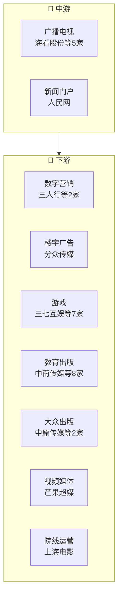

# 传媒产业链

> **群组**: 传媒 L1 下 **28家** 上市公司，覆盖 6 个二级行业 / 9 个三级行业。

## 产业链全景

## 产业群组

### 上游：原材料与基础件

| 细分（L2/L3） | 公司数 | 代表公司 |
|----------|--------|---------|
| — | — | (暂无) |

### 中游：制造与加工

| 细分（L2/L3） | 公司数 | 代表公司 |
|----------|--------|---------|
| [[广播电视]] / [[广播电视]] | 5家 | [[海看股份]] · [[新媒股份]] · [[东方明珠]] · [[歌华有线]] · [[江苏有线]] |
| [[数字媒体]] / [[新闻门户]] | 1家 | [[人民网]] |

### 下游：应用与服务

| 细分（L2/L3） | 公司数 | 代表公司 |
|----------|--------|---------|
| [[广告]] / [[数字营销]] | 2家 | [[三人行]] · [[蓝色光标]] |
| [[广告]] / [[楼宇广告]] | 1家 | [[分众传媒]] |
| [[游戏]] / [[游戏]] | 7家 | [[三七互娱]] · [[完美世界]] · [[宝通科技]] · [[巨人网络]] · [[吉比特]] · [[浙数文化]] · [[世纪华通]] |
| [[出版]] / [[教育出版]] | 8家 | [[中南传媒]] · [[长江传媒]] · [[山东出版]] · [[南方传媒]] · [[新华文轩]] · [[凤凰传媒]] · [[浙版传媒]] · [[世纪天鸿]] |
| [[出版]] / [[大众出版]] | 2家 | [[中原传媒]] · [[皖新传媒]] |
| [[数字媒体]] / [[视频媒体]] | 1家 | [[芒果超媒]] |
| [[电影]] / [[院线运营]] | 1家 | [[上海电影]] |

---

## 公司关联表

> 四类关联（人事/股权/业务/竞争）在此统一维护。

| 公司A | 公司B | 关联类型 | 说明 | 来源 |
|-------|-------|---------|------|------|
| — | — | — | (待补充) | — |

---

## 竞争格局

| L3 细分 | 竞争公司 |
|---------|---------|
| [[数字营销]] | [[三人行]] vs [[蓝色光标]] |
| [[游戏]] | [[三七互娱]] vs [[完美世界]] vs [[宝通科技]] vs [[巨人网络]] vs [[吉比特]] |
| [[广播电视]] | [[海看股份]] vs [[新媒股份]] vs [[东方明珠]] vs [[歌华有线]] vs [[江苏有线]] |
| [[教育出版]] | [[中南传媒]] vs [[长江传媒]] vs [[山东出版]] vs [[南方传媒]] vs [[新华文轩]] |
| [[大众出版]] | [[中原传媒]] vs [[皖新传媒]] |

---

## Related Pages

- [[行业分类全景]]
