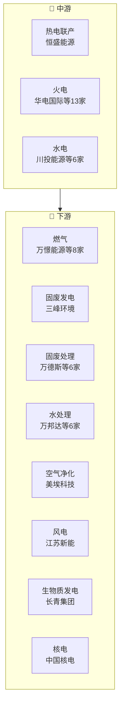

# 公用事业产业链

> **群组**: 公用事业 L1 下 **49家** 上市公司，覆盖 5 个二级行业 / 13 个三级行业。

## 产业链全景

## 产业群组

### 上游：原材料与基础件

| 细分（L2/L3） | 公司数 | 代表公司 |
|----------|--------|---------|
| — | — | (暂无) |

### 中游：制造与加工

| 细分（L2/L3） | 公司数 | 代表公司 |
|----------|--------|---------|
| [[热电]] / [[热电联产]] | 1家 | [[恒盛能源]] |
| [[电力]] / [[火电]] | 13家 | [[华电国际]] · [[华能国际]] · [[建投能源]] · [[国电电力]] · [[申能股份]] · [[通宝能源]] · [[上海电力]] · [[京能电力]] · ...(13家) |
| [[电力]] / [[水电]] | 6家 | [[川投能源]] · [[国投电力]] · [[黔源电力]] · [[湖北能源]] · [[长江电力]] · [[华能水电]] |

### 下游：应用与服务

| 细分（L2/L3） | 公司数 | 代表公司 |
|----------|--------|---------|
| [[燃气]] / [[燃气]] | 8家 | [[万憬能源]] · [[九丰能源]] · [[皖天然气]] · [[深圳燃气]] · [[首华燃气]] · [[新天然气]] · [[新奥股份]] · [[陕天然气]] |
| [[环保]] / [[固废发电]] | 1家 | [[三峰环境]] |
| [[环保]] / [[固废处理]] | 6家 | [[万德斯]] · [[大地海洋]] · [[瀚蓝环境]] · [[永兴股份]] · [[城发环境]] · [[上海环境]] |
| [[环保]] / [[水处理]] | 6家 | [[万邦达]] · [[江南水务]] · [[创业环保]] · [[中山公用]] · [[重庆水务]] · [[上海洗霸]] |
| [[环保]] / [[空气净化]] | 1家 | [[美埃科技]] |
| [[新能源发电]] / [[风电]] | 1家 | [[江苏新能]] |
| [[新能源发电]] / [[生物质发电]] | 1家 | [[长青集团]] |
| [[电力]] / [[核电]] | 1家 | [[中国核电]] |
| [[电力]] / [[配电服务]] | 2家 | [[涪陵电力]] · [[福能股份]] |
| [[电力]] / [[新能源发电]] | 2家 | [[云南能投]] · [[新天绿能]] |

---

## 公司关联表

> 四类关联（人事/股权/业务/竞争）在此统一维护。

| 公司A | 公司B | 关联类型 | 说明 | 来源 |
|-------|-------|---------|------|------|
| — | — | — | (待补充) | — |

---

## 竞争格局

| L3 细分 | 竞争公司 |
|---------|---------|
| [[燃气]] | [[万憬能源]] vs [[九丰能源]] vs [[皖天然气]] vs [[深圳燃气]] vs [[首华燃气]] |
| [[固废处理]] | [[万德斯]] vs [[大地海洋]] vs [[瀚蓝环境]] vs [[永兴股份]] vs [[城发环境]] |
| [[水处理]] | [[万邦达]] vs [[江南水务]] vs [[创业环保]] vs [[中山公用]] vs [[重庆水务]] |
| [[火电]] | [[华电国际]] vs [[华能国际]] vs [[建投能源]] vs [[国电电力]] vs [[申能股份]] |
| [[水电]] | [[川投能源]] vs [[国投电力]] vs [[黔源电力]] vs [[湖北能源]] vs [[长江电力]] |
| [[配电服务]] | [[涪陵电力]] vs [[福能股份]] |
| [[新能源发电]] | [[云南能投]] vs [[新天绿能]] |

---

## Related Pages

- [[行业分类全景]]
