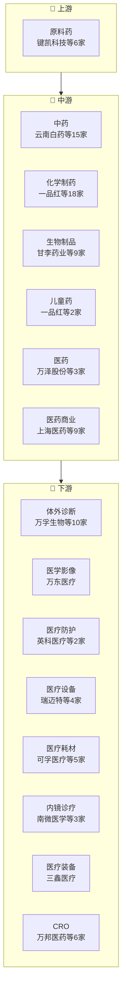

# 医药生物产业链

> **群组**: 医药生物 L1 下 **99家** 上市公司，覆盖 5 个二级行业 / 18 个三级行业。

## 产业链全景

## 产业群组

### 上游：原材料与基础件

| 细分（L2/L3） | 公司数 | 代表公司 |
|----------|--------|---------|
| [[医药]] / [[原料药]] | 6家 | [[键凯科技]] · [[新诺威]] · [[天宇股份]] · [[威尔药业]] · [[永安药业]] · [[同和药业]] |

### 中游：制造与加工

| 细分（L2/L3） | 公司数 | 代表公司 |
|----------|--------|---------|
| [[医药]] / [[中药]] | 15家 | [[云南白药]] · [[三力制药]] · [[寿仙谷]] · [[佐力药业]] · [[千金药业]] · [[同仁堂]] · [[昆药集团]] · [[片仔癀]] · ...(15家) |
| [[医药]] / [[化学制药]] | 18家 | [[一品红]] · [[福元医药]] · [[恩华药业]] · [[广生堂]] · [[信立泰]] · [[恒瑞医药]] · [[复星医药]] · [[华东医药]] · ...(18家) |
| [[医药]] / [[生物制品]] | 9家 | [[甘李药业]] · [[康辰药业]] · [[我武生物]] · [[奥浦迈]] · [[沃森生物]] · [[智飞生物]] · [[东宝生物]] · [[长春高新]] · ...(9家) |
| [[医药]] / [[儿童药]] | 2家 | [[一品红]] · [[华特达因]] |
| [[医药]] / [[医药]] | 3家 | [[万泽股份]] · [[三圣股份]] · [[哈药股份]] |
| [[医药商业]] / [[医药商业]] | 9家 | [[上海医药]] · [[柳药集团]] · [[国药股份]] · [[九州通]] · [[中国医药]] · [[嘉事堂]] · [[国药一致]] · [[白云山]] · ...(9家) |

### 下游：应用与服务

| 细分（L2/L3） | 公司数 | 代表公司 |
|----------|--------|---------|
| [[医疗器械]] / [[体外诊断]] | 10家 | [[万孚生物]] · [[万泰生物]] · [[艾德生物]] · [[亚辉龙]] · [[达安基因]] · [[普门科技]] · [[新产业]] · [[迪瑞医疗]] · ...(10家) |
| [[医疗器械]] / [[医学影像]] | 1家 | [[万东医疗]] |
| [[医疗器械]] / [[医疗防护]] | 2家 | [[英科医疗]] · [[奥美医疗]] |
| [[医疗器械]] / [[医疗设备]] | 4家 | [[瑞迈特]] · [[鱼跃医疗]] · [[迈瑞医疗]] · [[开立医疗]] |
| [[医疗器械]] / [[医疗耗材]] | 5家 | [[可孚医疗]] · [[天益医疗]] · [[维力医疗]] · [[三友医疗]] · [[拱东医疗]] |
| [[医疗器械]] / [[内镜诊疗]] | 3家 | [[南微医学]] · [[澳华内镜]] · [[海泰新光]] |
| [[医疗器械]] / [[医疗装备]] | 1家 | [[三鑫医疗]] |
| [[医疗服务]] / [[CRO]] | 6家 | [[万邦医药]] · [[凯莱英]] · [[诺思格]] · [[泰格医药]] · [[博腾股份]] · [[普蕊斯]] |
| [[医疗服务]] / [[专科医疗]] | 2家 | [[三博脑科]] · [[爱尔眼科]] |
| [[医疗服务]] / [[体检服务]] | 1家 | [[美年健康]] |
| [[医药流通]] / [[医药零售]] | 2家 | [[一心堂]] · [[大参林]] |

---

## 公司关联表

> 四类关联（人事/股权/业务/竞争）在此统一维护。

| 公司A | 公司B | 关联类型 | 说明 | 来源 |
|-------|-------|---------|------|------|
| — | — | — | (待补充) | — |

---

## 竞争格局

| L3 细分 | 竞争公司 |
|---------|---------|
| [[体外诊断]] | [[万孚生物]] vs [[万泰生物]] vs [[艾德生物]] vs [[亚辉龙]] vs [[达安基因]] |
| [[医疗防护]] | [[英科医疗]] vs [[奥美医疗]] |
| [[医疗设备]] | [[瑞迈特]] vs [[鱼跃医疗]] vs [[迈瑞医疗]] vs [[开立医疗]] |
| [[医疗耗材]] | [[可孚医疗]] vs [[天益医疗]] vs [[维力医疗]] vs [[三友医疗]] vs [[拱东医疗]] |
| [[内镜诊疗]] | [[南微医学]] vs [[澳华内镜]] vs [[海泰新光]] |
| [[CRO]] | [[万邦医药]] vs [[凯莱英]] vs [[诺思格]] vs [[泰格医药]] vs [[博腾股份]] |
| [[专科医疗]] | [[三博脑科]] vs [[爱尔眼科]] |
| [[中药]] | [[云南白药]] vs [[三力制药]] vs [[寿仙谷]] vs [[佐力药业]] vs [[千金药业]] |
| [[化学制药]] | [[一品红]] vs [[福元医药]] vs [[恩华药业]] vs [[广生堂]] vs [[信立泰]] |
| [[原料药]] | [[键凯科技]] vs [[新诺威]] vs [[天宇股份]] vs [[威尔药业]] vs [[永安药业]] |
| [[生物制品]] | [[甘李药业]] vs [[康辰药业]] vs [[我武生物]] vs [[奥浦迈]] vs [[沃森生物]] |
| [[儿童药]] | [[一品红]] vs [[华特达因]] |
| [[医药]] | [[万泽股份]] vs [[三圣股份]] vs [[哈药股份]] |
| [[医药商业]] | [[上海医药]] vs [[柳药集团]] vs [[国药股份]] vs [[九州通]] vs [[中国医药]] |
| [[医药零售]] | [[一心堂]] vs [[大参林]] |

---

## Related Pages

- [[行业分类全景]]
