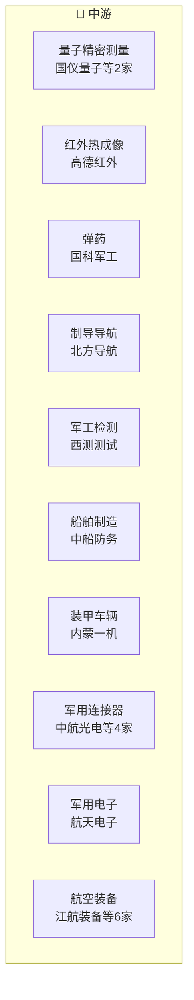

# 国防军工产业链

> **群组**: 国防军工 L1 下 **21家** 上市公司，覆盖 4 个二级行业 / 12 个三级行业。

## 产业链全景

## 产业群组

### 上游：原材料与基础件

| 细分（L2/L3） | 公司数 | 代表公司 |
|----------|--------|---------|
| — | — | (暂无) |

### 中游：制造与加工

| 细分（L2/L3） | 公司数 | 代表公司 |
|----------|--------|---------|
| [[量子科技]] / [[量子精密测量]] | 2家 | [[国仪量子]] · [[频准激光]] |
| [[兵器装备]] / [[红外热成像]] | 1家 | [[高德红外]] |
| [[兵器装备]] / [[弹药]] | 1家 | [[国科军工]] |
| [[兵器装备]] / [[制导导航]] | 1家 | [[北方导航]] |
| [[兵器装备]] / [[军工检测]] | 1家 | [[西测测试]] |
| [[兵器装备]] / [[船舶制造]] | 1家 | [[中船防务]] |
| [[兵器装备]] / [[装甲车辆]] | 1家 | [[内蒙一机]] |
| [[军工电子]] / [[军用连接器]] | 4家 | [[中航光电]] · [[航天电器]] · [[振华科技]] · [[奥普光电]] |
| [[军工电子]] / [[军用电子]] | 1家 | [[航天电子]] |
| [[航空装备]] / [[航空装备]] | 6家 | [[江航装备]] · [[派克新材]] · [[中航西飞]] · [[西部超导]] · [[中直股份]] · [[中航高科]] |
| [[航空装备]] / [[航空发动机]] | 1家 | [[航发动力]] |
| [[航空装备]] / [[航空锻件]] | 1家 | [[中航重机]] |

### 下游：应用与服务

| 细分（L2/L3） | 公司数 | 代表公司 |
|----------|--------|---------|
| — | — | (暂无) |

---

## 公司关联表

> 四类关联（人事/股权/业务/竞争）在此统一维护。

| 公司A | 公司B | 关联类型 | 说明 | 来源 |
|-------|-------|---------|------|------|
| — | — | — | (待补充) | — |

---

## 竞争格局

| L3 细分 | 竞争公司 |
|---------|---------|
| [[量子精密测量]] | [[国仪量子]] vs [[频准激光]] |
| [[军用连接器]] | [[中航光电]] vs [[航天电器]] vs [[振华科技]] vs [[奥普光电]] |
| [[航空装备]] | [[江航装备]] vs [[派克新材]] vs [[中航西飞]] vs [[西部超导]] vs [[中直股份]] |

---

## Related Pages

- [[行业分类全景]]
