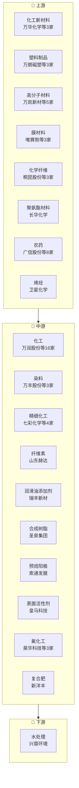

# 基础化工产业链

> **群组**: 基础化工 L1 下 **104家** 上市公司，覆盖 4 个二级行业 / 52 个三级行业。

## 产业链全景

## 产业群组

### 上游：原材料与基础件

| 细分（L2/L3） | 公司数 | 代表公司 |
|----------|--------|---------|
| [[化工]] / [[化工新材料]] | 3家 | [[万华化学]] · [[东岳硅材]] · [[东方盛虹]] |
| [[化工]] / [[塑料制品]] | 3家 | [[万朗磁塑]] · [[祥源新材]] · [[英科再生]] |
| [[化工]] / [[高分子材料]] | 5家 | [[万凯新材]] · [[键邦股份]] · [[聚赛龙]] · [[国恩股份]] · [[三联虹普]] |
| [[化工]] / [[膜材料]] | 3家 | [[唯赛勃]] · [[沃顿科技]] · [[瑞华泰]] |
| [[化工]] / [[化学纤维]] | 3家 | [[桐昆股份]] · [[新乡化纤]] · [[华峰化学]] |
| [[化工]] / [[润滑油添加剂]] | 1家 | [[瑞丰新材]] |
| [[化工]] / [[聚氨酯材料]] | 1家 | [[长华化学]] |
|| [[化工]] / [[农药]] | 8家 | [[广信股份]] · [[诺普信]] · [[中旗股份]] · [[江山股份]] · [[扬农化工]] · [[利尔化学]] · [[联化科技]] · [[中农联合]] |
| [[化工]] / [[预焙阳极]] | 1家 | [[索通发展]] |
| [[化工]] / [[表面活性剂]] | 1家 | [[皇马科技]] |
| [[化工]] / [[烯烃]] | 1家 | [[卫星化学]] |
| [[化工]] / [[工业气体]] | 1家 | [[杭氧股份]] |
| [[化工]] / [[民爆器材]] | 1家 | [[易普力]] |
| [[化工]] / [[生物柴油]] | 1家 | [[卓越新能]] |
| [[化工]] / [[钾肥]] | 3家 | [[亚钾国际]] · [[东方铁塔]] · [[盐湖股份]] |
| [[化工]] / [[科研试剂]] | 1家 | [[泰坦科技]] |
| [[化工]] / [[聚乙烯醇]] | 1家 | [[皖维高新]] |
| [[化工]] / [[维生素]] | 1家 | [[新和成]] |
| [[化工]] / [[铬盐]] | 1家 | [[振华股份]] |
| [[化工]] / [[吸附材料]] | 1家 | [[蓝晓科技]] |
| [[化工]] / [[钛白粉]] | 1家 | [[龙佰集团]] |
| [[化工]] / [[饲料添加剂]] | 1家 | [[安迪苏]] |
| [[化工]] / [[化肥]] | 1家 | [[潞化科技]] |
| [[橡胶]] / [[橡胶制品]] | 2家 | [[三力士]] · [[三维股份]] |
| [[橡胶]] / [[白炭黑]] | 1家 | [[确成股份]] |
| [[橡胶]] / [[炭黑]] | 1家 | [[龙星科技]] |
| [[玻璃纤维]] / [[玻璃纤维制造]] | 4家 | [[中国巨石]] · [[国际复材]] · [[宏和科技]] · [[长海股份]] |
| [[化学纤维]] / [[涤纶长丝]] | 1家 | [[新凤鸣]] |

### 中游：制造与加工

| 细分（L2/L3） | 公司数 | 代表公司 |
|----------|--------|---------|
| [[化工]] / [[化工]] | 16家 | [[万润股份]] · [[万盛股份]] · [[三友化工]] · [[三孚股份]] · [[三维化学]] · [[滨化股份]] · [[云图控股]] · [[嘉化能源]] · ...(16家) |
| [[化工]] / [[染料]] | 3家 | [[万丰股份]] · [[浙江龙盛]] · [[吉华集团]] |
| [[化工]] / [[精细化工]] | 4家 | [[七彩化学]] · [[红太阳]] · [[上海凯鑫]] · [[东方精工]] |
| [[化工]] / [[纤维素]] | 1家 | [[山东赫达]] |
| [[化工]] / [[合成树脂]] | 1家 | [[圣泉集团]] |
| [[化工]] / [[氟化工]] | 3家 | [[昊华科技]] · [[三美股份]] · [[多氟多]] |
| [[化工]] / [[复合肥]] | 1家 | [[新洋丰]] |
| [[化工]] / [[煤化工]] | 4家 | [[华鲁恒升]] · [[宝丰能源]] · [[鲁西化工]] · [[华谊集团]] |
| [[化工]] / [[贵金属催化剂]] | 1家 | [[凯立新材]] |
| [[化工]] / [[氯碱]] | 1家 | [[天原股份]] |
| [[化工]] / [[测量仪器]] | 1家 | [[鼎阳科技]] |
| [[化工]] / [[重型装备]] | 3家 | [[蓝科高新]] · [[中国一重]] · [[中信重工]] |
| [[化工]] / [[聚氨酯]] | 1家 | [[同大股份]] |
| [[化工]] / [[食品添加剂]] | 1家 | [[安琪酵母]] |
| [[化工]] / [[油墨涂料]] | 1家 | [[东方材料]] |
| [[化工]] / [[纺织助剂]] | 1家 | [[德美化工]] |
| [[化工]] / [[炼化]] | 2家 | [[荣盛石化]] · [[恒力石化]] |
| [[化工]] / [[磷化工]] | 1家 | [[云天化]] |
| [[化工]] / [[铁合金]] | 1家 | [[鄂尔多斯]] |
| [[化工]] / [[氨基酸]] | 1家 | [[梅花生物]] |
| [[化工]] / [[非金属冶炼]] | 1家 | [[合盛硅业]] |
| [[化工]] / [[炼焦]] | 1家 | [[金能科技]] |
| [[化工]] / [[合成生物学]] | 1家 | [[星湖科技]] |

### 下游：应用与服务

| 细分（L2/L3） | 公司数 | 代表公司 |
|----------|--------|---------|
| [[化工]] / [[水处理]] | 1家 | [[兴蓉环境]] |

---

## 公司关联表

> 四类关联（人事/股权/业务/竞争）在此统一维护。

| 公司A | 公司B | 关联类型 | 说明 | 来源 |
|-------|-------|---------|------|------|
| — | — | — | (待补充) | — |

---

## 竞争格局

| L3 细分 | 竞争公司 |
|---------|---------|
| [[化工]] | [[万润股份]] vs [[万盛股份]] vs [[三友化工]] vs [[三孚股份]] vs [[三维化学]] |
| [[化工新材料]] | [[万华化学]] vs [[东岳硅材]] vs [[东方盛虹]] |
| [[塑料制品]] | [[万朗磁塑]] vs [[祥源新材]] vs [[英科再生]] |
| [[染料]] | [[万丰股份]] vs [[浙江龙盛]] vs [[吉华集团]] |
| [[精细化工]] | [[七彩化学]] vs [[红太阳]] vs [[上海凯鑫]] vs [[东方精工]] |
| [[高分子材料]] | [[万凯新材]] vs [[键邦股份]] vs [[聚赛龙]] vs [[国恩股份]] vs [[三联虹普]] |
| [[膜材料]] | [[唯赛勃]] vs [[沃顿科技]] vs [[瑞华泰]] |
| [[化学纤维]] | [[桐昆股份]] vs [[新乡化纤]] vs [[华峰化学]] |
|| [[农药]] | [[广信股份]] vs [[诺普信]] vs [[中旗股份]] vs [[江山股份]] vs [[扬农化工]] vs [[利尔化学]] vs [[联化科技]] vs [[中农联合]] |
| [[氟化工]] | [[昊华科技]] vs [[三美股份]] vs [[多氟多]] |
| [[钾肥]] | [[亚钾国际]] vs [[东方铁塔]] |
| [[煤化工]] | [[华鲁恒升]] vs [[宝丰能源]] vs [[鲁西化工]] vs [[华谊集团]] |
| [[重型装备]] | [[蓝科高新]] vs [[中国一重]] vs [[中信重工]] |
| [[炼化]] | [[荣盛石化]] vs [[恒力石化]] |
| [[橡胶制品]] | [[三力士]] vs [[三维股份]] |
| [[玻璃纤维制造]] | [[中国巨石]] vs [[国际复材]] vs [[宏和科技]] vs [[长海股份]] |

---

## Related Pages

- [[行业分类全景]]
