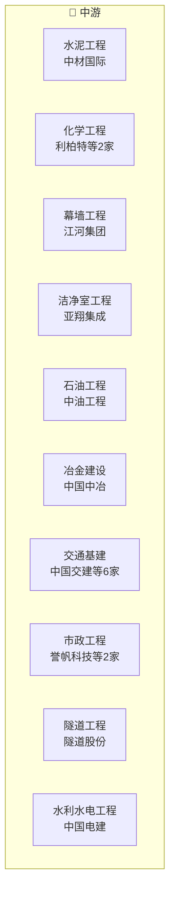

# 建筑装饰产业链

> **群组**: 建筑装饰 L1 下 **30家** 上市公司，覆盖 5 个二级行业 / 18 个三级行业。

## 产业链全景

## 产业群组

### 上游：原材料与基础件

| 细分（L2/L3） | 公司数 | 代表公司 |
|----------|--------|---------|
| [[专业工程]] / [[水泥工程]] | 1家 | [[中材国际]] |
| [[专业工程]] / [[石油工程]] | 1家 | [[中油工程]] |

### 中游：制造与加工

| 细分（L2/L3） | 公司数 | 代表公司 |
|----------|--------|---------|
| [[专业工程]] / [[化学工程]] | 2家 | [[利柏特]] · [[中国化学]] |
| [[专业工程]] / [[幕墙工程]] | 1家 | [[江河集团]] |
| [[专业工程]] / [[洁净室工程]] | 1家 | [[亚翔集成]] |
| [[冶金工程]] / [[冶金建设]] | 1家 | [[中国中冶]] |
| [[基建]] / [[交通基建]] | 6家 | [[中国交建]] · [[中国中铁]] · [[中国铁建]] · [[山东路桥]] · [[天健集团]] · [[四川路桥]] |
| [[基建]] / [[市政工程]] | 2家 | [[誉帆科技]] · [[浦东建设]] |
| [[基建]] / [[隧道工程]] | 1家 | [[隧道股份]] |
| [[基建]] / [[水利水电工程]] | 1家 | [[中国电建]] |
| [[基建]] / [[能源工程]] | 2家 | [[中国能建]] · [[中国核建]] |
| [[基建]] / [[园林工程]] | 1家 | [[汇绿生态]] |
| [[基建]] / [[水利水电工程]] | 1家 | [[广东建工]] |
| [[建筑施工]] / [[房屋建筑]] | 1家 | [[中国建筑]] |
| [[建筑施工]] / [[钢结构]] | 1家 | [[东南网架]] |
| [[建筑施工]] / [[房屋施工]] | 2家 | [[上海建工]] · [[陕建股份]] |
| [[建筑施工]] / [[地基工程]] | 1家 | [[上海港湾]] |
| [[工程咨询]] / [[工程设计]] | 4家 | [[设计总院]] · [[上海建科]] · [[东华科技]] · [[中交设计]] |

### 下游：应用与服务

| 细分（L2/L3） | 公司数 | 代表公司 |
|----------|--------|---------|
| — | — | (暂无) |

---

## 公司关联表

> 四类关联（人事/股权/业务/竞争）在此统一维护。

| 公司A | 公司B | 关联类型 | 说明 | 来源 |
|-------|-------|---------|------|------|
| — | — | — | (待补充) | — |

---

## 竞争格局

| L3 细分 | 竞争公司 |
|---------|---------|
| [[化学工程]] | [[利柏特]] vs [[中国化学]] |
| [[交通基建]] | [[中国交建]] vs [[中国中铁]] vs [[中国铁建]] vs [[山东路桥]] vs [[天健集团]] |
| [[市政工程]] | [[誉帆科技]] vs [[浦东建设]] |
| [[能源工程]] | [[中国能建]] vs [[中国核建]] |
| [[房屋施工]] | [[上海建工]] vs [[陕建股份]] |
| [[工程设计]] | [[设计总院]] vs [[上海建科]] vs [[东华科技]] vs [[中交设计]] |

---

## Related Pages

- [[行业分类全景]]
