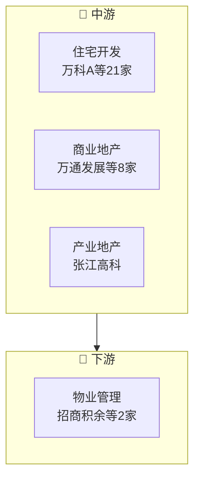

# 房地产产业链

> **群组**: 房地产 L1 下 **32家** 上市公司，覆盖 1 个二级行业 / 4 个三级行业。

## 产业链全景

## 产业群组

### 上游：原材料与基础件

| 细分（L2/L3） | 公司数 | 代表公司 |
|----------|--------|---------|
| — | — | (暂无) |

### 中游：制造与加工

| 细分（L2/L3） | 公司数 | 代表公司 |
|----------|--------|---------|
| [[房地产开发]] / [[住宅开发]] | 21家 | [[万科A]] · [[三湘印象]] · [[深振业A]] · [[深物业A]] · [[华发股份]] · [[顺发恒能]] · [[保利发展]] · [[南京高科]] · ...(21家) |
| [[房地产开发]] / [[商业地产]] | 8家 | [[万通发展]] · [[华联控股]] · [[华侨城A]] · [[新城控股]] · [[招商蛇口]] · [[金融街]] · [[陆家嘴]] · [[大悦城]] |
| [[房地产开发]] / [[产业地产]] | 1家 | [[张江高科]] |

### 下游：应用与服务

| 细分（L2/L3） | 公司数 | 代表公司 |
|----------|--------|---------|
| [[房地产开发]] / [[物业管理]] | 2家 | [[招商积余]] · [[中航善达]] |

---

## 公司关联表

> 四类关联（人事/股权/业务/竞争）在此统一维护。

| 公司A | 公司B | 关联类型 | 说明 | 来源 |
|-------|-------|---------|------|------|
| — | — | — | (待补充) | — |

---

## 竞争格局

| L3 细分 | 竞争公司 |
|---------|---------|
| [[住宅开发]] | [[万科A]] vs [[三湘印象]] vs [[深振业A]] vs [[深物业A]] vs [[华发股份]] |
| [[商业地产]] | [[万通发展]] vs [[华联控股]] vs [[华侨城A]] vs [[新城控股]] vs [[招商蛇口]] |
| [[物业管理]] | [[招商积余]] vs [[中航善达]] |

---

## Related Pages

- [[行业分类全景]]
