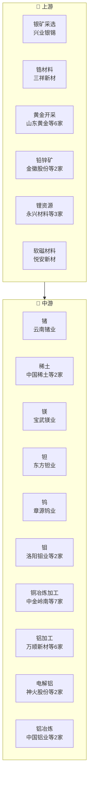

# 有色金属产业链

> **群组**: 有色金属 L1 下 **42家** 上市公司，覆盖 9 个二级行业 / 19 个三级行业。

## 产业链全景

## 产业群组

### 上游：原材料与基础件

| 细分（L2/L3） | 公司数 | 代表公司 |
|----------|--------|---------|
| [[白银]] / [[银矿采选]] | 1家 | [[兴业银锡]] |
| [[稀有小金属]] / [[锆材料]] | 1家 | [[三祥新材]] |
| [[铜]] / [[铜冶炼加工]] | 7家 | [[中金岭南]] · [[江西铜业]] · [[西部矿业]] · [[云南铜业]] · [[金田股份]] · [[铜陵有色]] · [[海亮股份]] |
| [[铝]] / [[铝加工]] | 6家 | [[万顺新材]] · [[南山铝业]] · [[华峰铝业]] · [[明泰铝业]] · [[鼎胜新材]] · [[中孚实业]] |
| [[铝]] / [[电解铝]] | 2家 | [[神火股份]] · [[云铝股份]] |
| [[铝]] / [[铝冶炼]] | 2家 | [[中国铝业]] · [[新疆众和]] |
| [[黄金]] / [[黄金开采]] | 6家 | [[山东黄金]] · [[紫金矿业]] · [[中金黄金]] · [[招金黄金]] · [[山金国际]] · [[西部黄金]] |
| [[铅锌]] / [[铅锌矿]] | 2家 | [[金徽股份]] · [[驰宏锌锗]] |
| [[锂]] / [[锂资源]] | 3家 | [[永兴材料]] · [[藏格矿业]] · [[天齐锂业]] |
| [[金属新材料]] / [[软磁材料]] | 1家 | [[云路股份]] |
| [[金属新材料]] / [[软磁材料]] | 1家 | [[悦安新材]] |

### 中游：制造与加工

| 细分（L2/L3） | 公司数 | 代表公司 |
|----------|--------|---------|
| [[稀有小金属]] / [[锗]] | 1家 | [[云南锗业]] |
| [[稀有小金属]] / [[稀土]] | 2家 | [[中国稀土]] · [[中稀有色]] |
| [[稀有小金属]] / [[镁]] | 1家 | [[宝武镁业]] |
| [[稀有小金属]] / [[钽]] | 1家 | [[东方钽业]] |
| [[稀有小金属]] / [[钨]] | 1家 | [[章源钨业]] |
| [[稀有小金属]] / [[钼]] | 2家 | [[洛阳钼业]] · [[金钼股份]] |
| [[锡]] / [[锡冶炼加工]] | 1家 | [[锡业股份]] |
| [[铅锌]] / [[铅冶炼]] | 1家 | [[豫光金铅]] |

### 下游：应用与服务

| 细分（L2/L3） | 公司数 | 代表公司 |
|----------|--------|---------|
| — | — | (暂无) |

---

## 公司关联表

> 四类关联（人事/股权/业务/竞争）在此统一维护。

| 公司A | 公司B | 关联类型 | 说明 | 来源 |
|-------|-------|---------|------|------|
| — | — | — | (待补充) | — |

---

## 竞争格局

| L3 细分 | 竞争公司 |
|---------|---------|
| [[稀土]] | [[中国稀土]] vs [[中稀有色]] |
| [[钼]] | [[洛阳钼业]] vs [[金钼股份]] |
| [[铜冶炼加工]] | [[中金岭南]] vs [[江西铜业]] vs [[西部矿业]] vs [[云南铜业]] vs [[金田股份]] |
| [[铝加工]] | [[万顺新材]] vs [[南山铝业]] vs [[华峰铝业]] vs [[明泰铝业]] vs [[鼎胜新材]] |
| [[电解铝]] | [[神火股份]] vs [[云铝股份]] |
| [[铝冶炼]] | [[中国铝业]] vs [[新疆众和]] |
| [[黄金开采]] | [[山东黄金]] vs [[紫金矿业]] vs [[中金黄金]] vs [[招金黄金]] vs [[山金国际]] |
| [[铅锌矿]] | [[金徽股份]] vs [[驰宏锌锗]] |
| [[锂资源]] | [[永兴材料]] vs [[藏格矿业]] vs [[天齐锂业]] |

---

## Related Pages

- [[行业分类全景]]
