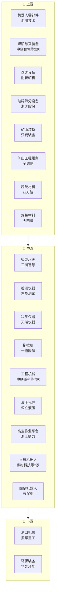

# 机械设备产业链

> **群组**: 机械设备 L1 下 **84家** 上市公司，覆盖 10 个二级行业 / 59 个三级行业。

## 产业链全景

## 产业群组

### 上游：原材料与基础件

| 细分（L2/L3） | 公司数 | 代表公司 |
|----------|--------|---------|
| [[机器人]] / [[机器人零部件]] | 1家 | [[汇川技术]] |
| [[矿山机械]] / [[煤矿综采装备]] | 2家 | [[中创智领]] · [[光力科技]] |
| [[矿山机械]] / [[选矿设备]] | 1家 | [[耐普矿机]] |
| [[矿山机械]] / [[破碎筛分设备]] | 1家 | [[浙矿股份]] |
| [[矿山机械]] / [[矿山装备]] | 1家 | [[江钨装备]] |
| [[矿山机械]] / [[矿山工程服务]] | 1家 | [[金诚信]] |
| [[专用设备]] / [[石油钻采设备]] | 2家 | [[德石股份]] · [[杰瑞股份]] |
| [[通用设备]] / [[超硬材料]] | 1家 | [[四方达]] |
| [[通用设备]] / [[焊接材料]] | 1家 | [[大西洋]] |

### 中游：制造与加工

| 细分（L2/L3） | 公司数 | 代表公司 |
|----------|--------|---------|
| [[仪器仪表]] / [[智能水表]] | 1家 | [[三川智慧]] |
| [[仪器仪表]] / [[检测仪器]] | 1家 | [[三德科技]] |
| [[仪器仪表]] / [[科学仪器]] | 1家 | [[天瑞仪器]] |
| [[仪器仪表]] / [[检测仪器]] | 1家 | [[东华测试]] |
| [[农用机械]] / [[拖拉机]] | 1家 | [[一拖股份]] |
| [[工程机械]] / [[工程机械]] | 7家 | [[中联重科]] · [[徐工机械]] · [[柳工]] · [[三一重工]] · [[建设机械]] · [[安徽合力]] · [[山推股份]] |
| [[工程机械]] / [[液压元件]] | 1家 | [[恒立液压]] |
| [[工程机械]] / [[高空作业平台]] | 1家 | [[浙江鼎力]] |
| [[机器人]] / [[人形机器人]] | 2家 | [[宇树科技]] · [[拓斯达]] |
| [[机器人]] / [[四足机器人]] | 1家 | [[云深处]] |
| [[机器人]] / [[工业机器人]] | 2家 | [[埃斯顿]] · [[机器人]] |
| [[专用设备]] / [[真空设备]] | 1家 | [[汇成真空]] |
| [[专用设备]] / [[数控装备]] | 1家 | [[大族数控]] |
| [[专用设备]] / [[质量检测装备]] | 1家 | [[中国电研]] |
| [[专用设备]] / [[纺织服装设备]] | 1家 | [[宏华数科]] |
| [[专用设备]] / [[电梯]] | 2家 | [[广日股份]] · [[康力电梯]] |
| [[专用设备]] / [[消防设备]] | 1家 | [[青鸟消防]] |
| [[专用设备]] / [[模具]] | 1家 | [[豪迈科技]] |
| [[专用设备]] / [[舞台灯光]] | 1家 | [[浩洋股份]] |
| [[专用设备]] / [[板式家具机械]] | 1家 | [[弘亚数控]] |
| [[专用设备]] / [[重型装备]] | 2家 | [[大连重工]] · [[润邦股份]] |
| [[专用设备]] / [[金属包装设备]] | 1家 | [[斯莱克]] |
| [[专用设备]] / [[色选设备]] | 1家 | [[美亚光电]] |
| [[专用设备]] / [[轮胎装备]] | 1家 | [[软控股份]] |
| [[专用设备]] / [[过滤装备]] | 1家 | [[景津装备]] |
| [[专用设备]] / [[焊接设备]] | 1家 | [[上海沪工]] |
| [[专用设备]] / [[制药装备]] | 1家 | [[东富龙]] |
| [[专用设备]] / [[光伏边框]] | 1家 | [[永臻股份]] |
| [[专用设备]] / [[透平机械]] | 1家 | [[陕鼓动力]] |
| [[自动化]] / [[智能装备]] | 4家 | [[三丰智能]] · [[三瑞智能]] · [[安达智能]] · [[佰奥智能]] |
| [[自动化]] / [[自动化]] | 3家 | [[万讯自控]] · [[正弦电气]] · [[怡合达]] |
| [[自动化]] / [[输送设备]] | 1家 | [[运机集团]] |
| [[风电设备]] / [[风电叶片]] | 1家 | [[中材科技]] |
| [[风电设备]] / [[风电整机]] | 3家 | [[运达股份]] · [[三一重能]] · [[明阳智能]] |
| [[风电设备]] / [[风电塔筒]] | 2家 | [[大金重工]] · [[天顺风能]] |
| [[风电设备]] / [[风电轴承]] | 1家 | [[新强联]] |
| [[激光加工设备]] / [[激光焊接]] | 1家 | [[联赢激光]] |
| [[激光加工设备]] / [[激光器]] | 1家 | [[金橙子]] |
| [[通用设备]] / [[机床]] | 2家 | [[浙海德曼]] · [[宇晶股份]] |
| [[通用设备]] / [[手工具]] | 1家 | [[巨星科技]] |
| [[通用设备]] / [[制冷设备]] | 5家 | [[冰轮环境]] · [[汉钟精机]] · [[儒竞科技]] · [[开山股份]] · [[银都股份]] |
| [[通用设备]] / [[3D打印设备]] | 1家 | [[华曙高科]] |
| [[通用设备]] / [[阀门]] | 1家 | [[伟隆股份]] |
| [[通用设备]] / [[关节轴承]] | 1家 | [[龙溪股份]] |
| [[通用设备]] / [[精密金属件]] | 1家 | [[恒工精密]] |
| [[通用设备]] / [[泵]] | 1家 | [[凌霄泵业]] |
| [[通用设备]] / [[密封件]] | 1家 | [[中密控股]] |
| [[通用设备]] / [[电机制造]] | 1家 | [[海立股份]] |

### 下游：应用与服务

| 细分（L2/L3） | 公司数 | 代表公司 |
|----------|--------|---------|
| [[专用设备]] / [[港口机械]] | 1家 | [[振华重工]] |
| [[专用设备]] / [[环保装备]] | 1家 | [[华光环能]] |

---

## 公司关联表

> 四类关联（人事/股权/业务/竞争）在此统一维护。

| 公司A | 公司B | 关联类型 | 说明 | 来源 |
|-------|-------|---------|------|------|
| — | — | — | (待补充) | — |

---

## 竞争格局

| L3 细分 | 竞争公司 |
|---------|---------|
| [[工程机械]] | [[中联重科]] vs [[徐工机械]] vs [[柳工]] vs [[三一重工]] vs [[建设机械]] |
| [[人形机器人]] | [[宇树科技]] vs [[拓斯达]] |
| [[工业机器人]] | [[埃斯顿]] vs [[机器人]] |
| [[煤矿综采装备]] | [[中创智领]] vs [[光力科技]] |
| [[石油钻采设备]] | [[德石股份]] vs [[杰瑞股份]] |
| [[电梯]] | [[广日股份]] vs [[康力电梯]] |
| [[重型装备]] | [[大连重工]] vs [[润邦股份]] |
| [[智能装备]] | [[三丰智能]] vs [[三瑞智能]] vs [[安达智能]] vs [[佰奥智能]] |
| [[自动化]] | [[万讯自控]] vs [[正弦电气]] vs [[怡合达]] |
| [[风电整机]] | [[运达股份]] vs [[三一重能]] vs [[明阳智能]] |
| [[风电塔筒]] | [[大金重工]] vs [[天顺风能]] |
| [[机床]] | [[浙海德曼]] vs [[宇晶股份]] |
| [[制冷设备]] | [[冰轮环境]] vs [[汉钟精机]] vs [[儒竞科技]] vs [[开山股份]] vs [[银都股份]] |

---

## Related Pages

- [[行业分类全景]]
