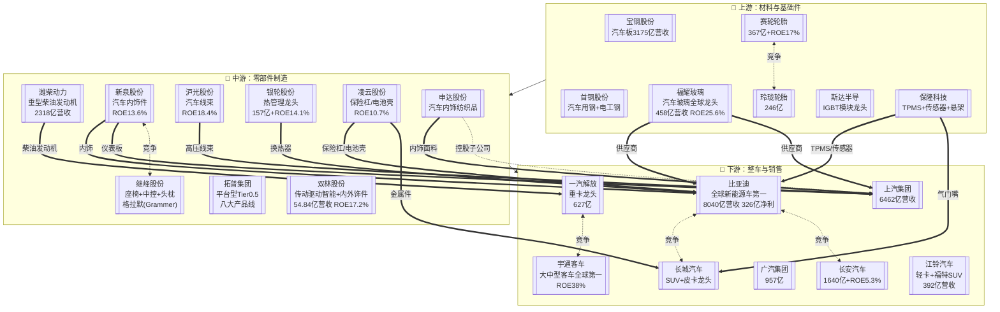

# 汽车产业链

> **群组**: 汽车 L1 下 130 家上市公司，覆盖整车→零部件→上游材料全链。

## 产业链全景

## 产业群组（按价值链位置）

### 上游：材料与基础件

| 细分 | 公司 |
|------|------|
| 汽车钢铁 | [[宝钢股份]] · [[首钢股份]] · [[河钢股份]] · [[鞍钢股份]] · [[马钢股份]] |
| 汽车玻璃 | [[福耀玻璃]] |
| 汽车铝材 | [[南山铝业]] · [[明泰铝业]] · [[华峰铝业]] · [[鼎胜新材]] |
| 轮胎橡胶 | [[赛轮轮胎]] · [[玲珑轮胎]] · [[贵州轮胎]] · [[通用股份]] · [[S佳通]] |
| 汽车芯片 | [[斯达半导]] (IGBT) · [[新洁能]] (MOSFET) |
| 传感器 | [[保隆科技]] (TPMS) · [[安培龙]] (NTC/压力) |
| 汽车电子 | [[云意电气]] · [[均胜电子]] |

### 中游：零部件制造

| 细分 | 公司 |
|------|------|
| 发动机/动力 | [[潍柴动力]] · [[威孚高科]] · [[中原内配]] · [[天润工业]] |
| 汽车内饰 | [[新泉股份]] · [[继峰股份]] · [[申达股份]] · [[一彬科技]] |
| 汽车座椅 | [[继峰股份]] · [[上海沿浦]] |
| 汽车线束 | [[沪光股份]] |
| 汽车金属件 | [[凌云股份]] · [[博俊科技]] · [[精锻科技]] · [[新坐标]] |
| 轻量化 | [[万丰奥威]] · [[新铝时代]] · [[拓普集团]] |
| 热管理 | [[银轮股份]] · [[三花智控]] |
| 制动系统 | [[万安科技]] · [[伯特利]] · [[亚太股份]] |
| 传动/变速 | [[万里扬]] · [[双环传动]] · [[铁流股份]] · [[双林股份]] |
| 转向系统 | [[北特科技]] |
| 底盘系统 | [[日盈电子]] |
| 轴承 | [[万向钱潮]] · [[兆丰股份]] |
| 车轮 | [[跃岭股份]] |
| 车灯 | [[星宇股份]] |
| 排放控制 | [[艾可蓝]] (尾气后处理) |
| 汽车电子件 | [[保隆科技]] · [[科博达]] |
| 燃油系统 | [[亚普股份]] |
| 平台型 | [[拓普集团]] · [[华域汽车]] |

### 下游：整车与销售

| 细分 | 公司 |
|------|------|
| 乘用车 | [[比亚迪]] · [[长城汽车]] · [[长安汽车]] · [[上汽集团]] · [[广汽集团]] · [[赛力斯]] · [[千里科技]] |
| 商用车 | [[一汽解放]] · [[福田汽车]] · [[宇通客车]] · [[金龙汽车]] · [[江铃汽车]] · [[江淮汽车]] |
| 新能源车 | [[比亚迪]] · [[北汽蓝谷]] |
| 摩托车 | [[春风动力]] · [[隆鑫通用]] |
| 汽车销售 | [[国机汽车]] |
| 汽车电子 | [[万通智控]] (TPMS) |

---

## 公司关联表

> 四类关联（人事/股权/业务/竞争）统一在此维护，公司页面只需要链到本页。

| 公司A | 公司B | 关联类型 | 说明 | 来源 |
|-------|-------|---------|------|------|
| [[福耀玻璃]] | [[比亚迪]] | 业务-供应商 | 福耀供应汽车玻璃给比亚迪 | 福耀2025年报 |
| [[凌云股份]] | [[比亚迪]] | 业务-供应商 | 凌云供应保险杠/电池壳给比亚迪 | 凌云2025年报 |
| [[凌云股份]] | [[长城汽车]] | 业务-供应商 | 凌云供应金属零部件 | 凌云2025年报 |
| [[凌云股份]] | [[宝马]] | 业务-供应商 | 凌云供应车门防撞梁 | 凌云2025年报(海外) |
| [[保隆科技]] | [[比亚迪]] | 业务-供应商 | 保隆供应TPMS/传感器 | 保隆2025年报客户列表 |
| [[保隆科技]] | [[长城汽车]] | 业务-供应商 | 保隆供应气门嘴/TPMS | 保隆2025年报客户列表 |
| [[保隆科技]] | [[长安汽车]] | 业务-供应商 | 保隆供应传感器 | 保隆2025年报客户列表 |
| [[潍柴动力]] | [[一汽解放]] | 业务-供应商 | 潍柴供应重型柴油发动机 | 潍柴2025年报 |
| [[华域汽车]] | [[上汽集团]] | 股权-母公司 | 华域汽车为上汽集团控股子公司 | 华域2025年报 |
| [[申达股份]] | [[上汽集团]] | 股权-母公司 | 申达股份为上汽集团旗下 | 申达2025年报 |
| [[江铃汽车]] | [[福特]] | 股权-参股 | 福特持有江铃汽车股份 | 江铃2025年报 |
| [[亚普股份]] | [[上汽集团]] | 业务-供应商 | 亚普供应燃油箱给上汽 | 亚普2025年报 |
| [[沪光股份]] | [[赛力斯]] | 业务-供应商 | 沪光供应高压线束(问界) | 沪光2025年报 |
| [[新泉股份]] | [[特斯拉]] | 业务-供应商 | 新泉供应内饰件 | 新泉2025年报(海外) |
| [[新泉股份]] | [[比亚迪]] | 业务-供应商 | 新泉供应仪表板/门板 | 新泉2025年报 |

---

## 竞争格局（同 L3 视为竞争者）

| L3 细分 | 竞争公司 |
|---------|---------|
| 乘用车 | [[比亚迪]] vs [[长城汽车]] vs [[长安汽车]] vs [[上汽集团]] vs [[广汽集团]] |
| 商用车 | [[一汽解放]] vs [[福田汽车]] vs [[宇通客车]] vs [[金龙汽车]] |
| 轮胎 | [[赛轮轮胎]] vs [[玲珑轮胎]] vs [[贵州轮胎]] |
| 汽车玻璃 | [[福耀玻璃]] (单一龙头) |
| 汽车内饰 | [[新泉股份]] vs [[继峰股份]] vs [[申达股份]] |
| 制动系统 | [[万安科技]] vs [[伯特利]] vs [[亚太股份]] |
| IGBT | [[斯达半导]] vs [[时代电气]] |
| 热管理 | [[银轮股份]] vs [[三花智控]] |
| 传动/变速 | [[万里扬]] vs [[双环传动]] vs [[铁流股份]] vs [[双林股份]] |

---

## Related Pages

- [[行业分类全景]]
- [[汽车零部件]] — L2 行业页
- [[整车]] — L2 行业页
