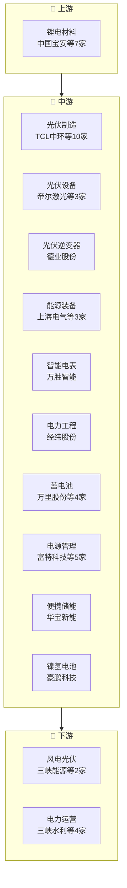

# 电力设备产业链

> **群组**: 电力设备 L1 下 **71家** 上市公司，覆盖 8 个二级行业 / 26 个三级行业。

## 产业链全景

## 产业群组

### 上游：原材料与基础件

| 细分（L2/L3） | 公司数 | 代表公司 |
|----------|--------|---------|
| [[电池]] / [[锂电材料]] | 7家 | [[中国宝安]] · [[尚太科技]] · [[璞泰来]] · [[厦钨新能]] · [[当升科技]] · [[容百科技]] · [[中伟新材]] |
| [[电池]] / [[锂电设备]] | 1家 | [[杭可科技]] |

### 中游：制造与加工

| 细分（L2/L3） | 公司数 | 代表公司 |
|----------|--------|---------|
| [[光伏]] / [[光伏制造]] | 10家 | [[TCL中环]] · [[福斯特]] · [[东方日升]] · [[隆基绿能]] · [[爱旭股份]] · [[晶澳科技]] · [[上能电气]] · [[东方新能]] · ...(10家) |
| [[光伏]] / [[光伏设备]] | 3家 | [[帝尔激光]] · [[高测股份]] · [[奥特维]] |
| [[光伏]] / [[光伏逆变器]] | 1家 | [[德业股份]] |
| [[能源装备]] / [[能源装备]] | 3家 | [[上海电气]] · [[上大股份]] · [[东方电气]] |
| [[智能电网]] / [[智能电表]] | 1家 | [[万胜智能]] |
| [[电力]] / [[电力工程]] | 1家 | [[经纬股份]] |
| [[电池]] / [[蓄电池]] | 4家 | [[万里股份]] · [[安孚科技]] · [[雄韬股份]] · [[骆驼股份]] |
| [[电池]] / [[电源管理]] | 5家 | [[富特科技]] · [[欧陆通]] · [[科士达]] · [[奥海科技]] · [[盛弘股份]] |
| [[电池]] / [[便携储能]] | 1家 | [[华宝新能]] |
| [[电池]] / [[镍氢电池]] | 1家 | [[豪鹏科技]] |
| [[输变电设备]] / [[变压器]] | 4家 | [[三变科技]] · [[顺钠股份]] · [[特变电工]] · [[明阳电气]] |
| [[输变电设备]] / [[电力仪表]] | 1家 | [[三晖电气]] |
| [[输变电设备]] / [[电磁线与电线电缆]] | 2家 | [[精达股份]] · [[金杯电工]] |
| [[输变电设备]] / [[电磁线]] | 1家 | [[长城科技]] |
| [[输变电设备]] / [[电线电缆]] | 5家 | [[万马股份]] · [[华通线缆]] · [[宝胜股份]] · [[远东股份]] · [[东方电缆]] |
| [[输变电设备]] / [[低压电器]] | 2家 | [[良信股份]] · [[正泰电器]] |
| [[输变电设备]] / [[电表]] | 3家 | [[三星电气]] · [[海兴电力]] · [[煜邦电力]] |
| [[输变电设备]] / [[继电器]] | 3家 | [[三友联众]] · [[许继电气]] · [[宏发股份]] |
| [[输变电设备]] / [[配电设备]] | 2家 | [[万控智造]] · [[平高电气]] |
| [[输变电设备]] / [[输配电设备]] | 1家 | [[思源电气]] |
| [[输变电设备]] / [[电网自动化]] | 2家 | [[国电南瑞]] · [[东方电子]] |
| [[电机]] / [[特种电机]] | 1家 | [[佳电股份]] |

### 下游：应用与服务

| 细分（L2/L3） | 公司数 | 代表公司 |
|----------|--------|---------|
| [[新能源发电]] / [[风电光伏]] | 2家 | [[三峡能源]] · [[节能风电]] |
| [[电力]] / [[电力运营]] | 4家 | [[三峡水利]] · [[桂冠电力]] · [[绿发电力]] · [[浙江新能]] |

---

## 公司关联表

> 四类关联（人事/股权/业务/竞争）在此统一维护。

| 公司A | 公司B | 关联类型 | 说明 | 来源 |
|-------|-------|---------|------|------|
| — | — | — | (待补充) | — |

---

## 竞争格局

| L3 细分 | 竞争公司 |
|---------|---------|
| [[光伏制造]] | [[TCL中环]] vs [[福斯特]] vs [[东方日升]] vs [[隆基绿能]] vs [[爱旭股份]] |
| [[光伏设备]] | [[帝尔激光]] vs [[高测股份]] vs [[奥特维]] |
| [[风电光伏]] | [[三峡能源]] vs [[节能风电]] |
| [[能源装备]] | [[上海电气]] vs [[上大股份]] vs [[东方电气]] |
| [[电力运营]] | [[三峡水利]] vs [[桂冠电力]] vs [[绿发电力]] vs [[浙江新能]] |
| [[蓄电池]] | [[万里股份]] vs [[安孚科技]] vs [[雄韬股份]] vs [[骆驼股份]] |
| [[锂电材料]] | [[中国宝安]] vs [[尚太科技]] vs [[璞泰来]] vs [[厦钨新能]] vs [[当升科技]] |
| [[电源管理]] | [[富特科技]] vs [[欧陆通]] vs [[科士达]] vs [[奥海科技]] vs [[盛弘股份]] |
| [[变压器]] | [[三变科技]] vs [[顺钠股份]] vs [[特变电工]] vs [[明阳电气]] |
| [[电磁线与电线电缆]] | [[精达股份]] vs [[金杯电工]] |
| [[电线电缆]] | [[万马股份]] vs [[华通线缆]] vs [[宝胜股份]] vs [[远东股份]] vs [[东方电缆]] |
| [[低压电器]] | [[良信股份]] vs [[正泰电器]] |
| [[电表]] | [[三星电气]] vs [[海兴电力]] vs [[煜邦电力]] |
| [[继电器]] | [[三友联众]] vs [[许继电气]] vs [[宏发股份]] |
| [[配电设备]] | [[万控智造]] vs [[平高电气]] |
| [[电网自动化]] | [[国电南瑞]] vs [[东方电子]] |

---

## Related Pages

- [[行业分类全景]]
