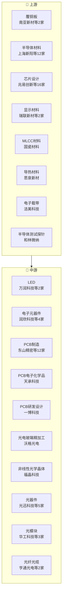

# 电子产业链

> **群组**: 电子 L1 下 **152家** 上市公司，覆盖 13 个二级行业 / 52 个三级行业。

## 产业链全景

## 产业群组

### 上游：原材料与基础件

| 细分（L2/L3） | 公司数 | 代表公司 |
|----------|--------|---------|
| [[PCB]] / [[覆铜板]] | 2家 | [[南亚新材]] · [[生益科技]] |
| [[光电子]] / [[光电玻璃精加工]] | 1家 | [[沃格光电]] |
| [[半导体]] / [[半导体材料]] | 12家 | [[上海新阳]] · [[安集科技]] · [[德邦科技]] · [[石英股份]] · [[神工股份]] · [[科能新材料]] · [[菲利华]] · [[南大光电]] · ...(12家) |
| [[半导体]] / [[芯片设计]] | 16家 | [[兆易创新]] · [[华太电子]] · [[寒武纪]] · [[摩尔线程]] · [[澜起科技]] · [[中颖电子]] · [[恒玄科技]] · [[龙迅股份]] · ...(16家) |
| [[显示器件]] / [[显示材料]] | 2家 | [[瑞联新材]] · [[翔腾新材]] |
| [[显示器件]] / [[液晶面板与基板玻璃]] | 1家 | [[彩虹股份]] |
| [[电子材料]] / [[MLCC材料]] | 1家 | [[国瓷材料]] |
| [[电子材料]] / [[导热材料]] | 1家 | [[思泉新材]] |
| [[电子材料]] / [[电子载带]] | 1家 | [[洁美科技]] |
| [[电子零部件]] / [[半导体测试探针]] | 1家 | [[和林微纳]] |
| [[电子零部件]] / [[传感器]] | 1家 | [[安培龙]] |
| [[电子零部件]] / [[电池Pack]] | 3家 | [[德赛电池]] · [[欣旺达]] · [[蔚蓝锂芯]] |
| [[电子零部件]] / [[微动开关]] | 1家 | [[东南电子]] |
| [[被动元器件]] / [[电容]] | 3家 | [[宏达电子]] · [[艾华集团]] · [[火炬电子]] |
| [[被动元器件]] / [[电感]] | 1家 | [[顺络电子]] |
| [[被动元器件]] / [[陶瓷元件]] | 1家 | [[三环集团]] |
| [[被动元器件]] / [[磁性元件]] | 1家 | [[可立克]] |

### 中游：制造与加工

| 细分（L2/L3） | 公司数 | 代表公司 |
|----------|--------|---------|
| [[LED]] / [[LED]] | 2家 | [[万润科技]] · [[三雄极光]] |
| [[电子元器件]] / [[电子元器件]] | 4家 | [[润欣科技]] · [[深圳华强]] · [[中电港]] · [[香农芯创]] |
| [[PCB]] / [[PCB制造]] | 12家 | [[东山精密]] · [[沪士电子]] · [[深南电路]] · [[胜宏科技]] · [[崇达技术]] · [[四会富仕]] · [[沪电股份]] · [[鹏鼎控股]] · ...(12家) |
| [[PCB]] / [[PCB电子化学品]] | 1家 | [[天承科技]] |
| [[PCB]] / [[PCB研发设计]] | 1家 | [[一博科技]] |
| [[光电子]] / [[非线性光学晶体]] | 1家 | [[福晶科技]] |
| [[光通信]] / [[光器件]] | 5家 | [[光迅科技]] · [[太辰光]] · [[永鼎股份]] · [[天孚通信]] · [[光库科技]] |
| [[光通信]] / [[光模块]] | 3家 | [[华工科技]] · [[中际旭创]] · [[新易盛]] |
| [[光通信]] / [[光纤光缆]] | 2家 | [[亨通光电]] · [[长飞光纤]] |
| [[光通信]] / [[光芯片]] | 1家 | [[源杰科技]] |
| [[光通信]] / [[特种光纤]] | 2家 | [[长盈通]] · [[长进光子]] |
| [[半导体]] / [[LED芯片]] | 1家 | [[三安光电]] |
| [[半导体]] / [[半导体封测]] | 5家 | [[华天科技]] · [[晶方科技]] · [[通富微电]] · [[长电科技]] · [[深科技]] |
| [[半导体]] / [[半导体设备]] | 8家 | [[三佳科技]] · [[中微公司]] · [[北方华创]] · [[华海清科]] · [[京仪装备]] · [[联动科技]] · [[芯源微]] · [[至纯科技]] |
| [[半导体]] / [[存储芯片]] | 6家 | [[佰维存储]] · [[大普微]] · [[德明利]] · [[朗科科技]] · [[江波龙]] · [[长鑫科技]] |
| [[半导体]] / [[晶圆代工]] | 1家 | [[中芯国际]] |
| [[半导体]] / [[GPU]] | 1家 | [[景嘉微]] |
| [[半导体]] / [[传感器芯片]] | 1家 | [[纳芯微]] |
| [[半导体]] / [[射频前端]] | 1家 | [[卓胜微]] |
| [[半导体]] / [[模拟芯片]] | 3家 | [[圣邦股份]] · [[杰华特]] · [[帝奥微]] |
| [[半导体]] / [[功率半导体]] | 2家 | [[新洁能]] · [[斯达半导]] |
| [[显示器件]] / [[偏光片]] | 1家 | [[三利谱]] |
| [[显示器件]] / [[显示面板]] | 4家 | [[TCL科技]] · [[京东方A]] · [[深天马A]] · [[八亿时空]] |
| [[显示器件]] / [[触控显示模组]] | 1家 | [[长信科技]] |
| [[消费电子]] / [[精密零组件]] | 18家 | [[万祥科技]] · [[安洁科技]] · [[易德龙]] · [[统联精密]] · [[信维通信]] · [[歌尔股份]] · [[捷邦科技]] · [[电连技术]] · ...(18家) |
| [[消费电子]] / [[品牌消费电子]] | 3家 | [[安克创新]] · [[绿联科技]] · [[传音控股]] |
| [[消费电子]] / [[显示面板]] | 1家 | [[冠捷科技]] |
| [[激光技术]] / [[光纤激光器]] | 2家 | [[锐科激光]] · [[杰普特]] |
| [[激光技术]] / [[激光控制系统]] | 1家 | [[柏楚电子]] |
| [[激光技术]] / [[激光设备]] | 1家 | [[海目星]] |
| [[电子制造]] / [[智能制造]] | 3家 | [[工业富联]] · [[上工申贝]] · [[上海机电]] |
| [[电子制造]] / [[洁净室]] | 1家 | [[正帆科技]] |
| [[电子制造]] / [[半导体工程]] | 1家 | [[太极实业]] |
| [[电子制造]] / [[ODM制造]] | 1家 | [[华勤技术]] |
| [[电子制造]] / [[EMS制造]] | 2家 | [[福日电子]] · [[共进股份]] |

### 下游：应用与服务

| 细分（L2/L3） | 公司数 | 代表公司 |
|----------|--------|---------|
| — | — | (暂无) |

---

## 公司关联表

> 四类关联（人事/股权/业务/竞争）在此统一维护。

| 公司A | 公司B | 关联类型 | 说明 | 来源 |
|-------|-------|---------|------|------|
| — | — | — | (待补充) | — |

---

## 竞争格局

| L3 细分 | 竞争公司 |
|---------|---------|
| [[LED]] | [[万润科技]] vs [[三雄极光]] |
| [[电子元器件]] | [[润欣科技]] vs [[深圳华强]] vs [[中电港]] vs [[香农芯创]] |
| [[PCB制造]] | [[东山精密]] vs [[沪士电子]] vs [[深南电路]] vs [[胜宏科技]] vs [[崇达技术]] |
| [[覆铜板]] | [[南亚新材]] vs [[生益科技]] |
| [[光器件]] | [[光迅科技]] vs [[太辰光]] vs [[永鼎股份]] vs [[天孚通信]] vs [[光库科技]] |
| [[光模块]] | [[华工科技]] vs [[中际旭创]] vs [[新易盛]] |
| [[光纤光缆]] | [[亨通光电]] vs [[长飞光纤]] |
| [[特种光纤]] | [[长盈通]] vs [[长进光子]] |
| [[半导体封测]] | [[华天科技]] vs [[晶方科技]] vs [[通富微电]] vs [[长电科技]] vs [[深科技]] |
| [[半导体材料]] | [[上海新阳]] vs [[安集科技]] vs [[德邦科技]] vs [[石英股份]] vs [[神工股份]] |
| [[半导体设备]] | [[三佳科技]] vs [[中微公司]] vs [[北方华创]] vs [[华海清科]] vs [[京仪装备]] |
| [[存储芯片]] | [[佰维存储]] vs [[大普微]] vs [[德明利]] vs [[朗科科技]] vs [[江波龙]] |
| [[芯片设计]] | [[兆易创新]] vs [[华太电子]] vs [[寒武纪]] vs [[摩尔线程]] vs [[澜起科技]] |
| [[模拟芯片]] | [[圣邦股份]] vs [[杰华特]] vs [[帝奥微]] |
| [[功率半导体]] | [[新洁能]] vs [[斯达半导]] |
| [[显示材料]] | [[瑞联新材]] vs [[翔腾新材]] |
| [[显示面板]] | [[TCL科技]] vs [[京东方A]] vs [[深天马A]] vs [[八亿时空]] |
| [[精密零组件]] | [[万祥科技]] vs [[安洁科技]] vs [[易德龙]] vs [[统联精密]] vs [[信维通信]] |
| [[品牌消费电子]] | [[安克创新]] vs [[绿联科技]] vs [[传音控股]] |
| [[光纤激光器]] | [[锐科激光]] vs [[杰普特]] |

---

## Related Pages

- [[行业分类全景]]
