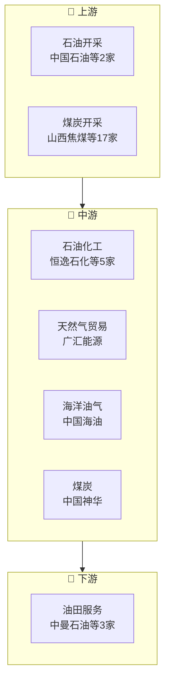

# 能源产业链

> **群组**: 能源 L1 下 **30家** 上市公司，覆盖 2 个二级行业 / 7 个三级行业。

## 产业链全景

## 产业群组

### 上游：原材料与基础件

| 细分（L2/L3） | 公司数 | 代表公司 |
|----------|--------|---------|
| [[石油天然气]] / [[石油开采]] | 2家 | [[中国石油]] · [[中国石化]] |
| [[石油天然气]] / [[石油化工]] | 5家 | [[恒逸石化]] · [[宇新股份]] · [[上海石化]] · [[东华能源]] · [[华锦股份]] |
| [[石油天然气]] / [[油田服务]] | 3家 | [[中曼石油]] · [[中海油服]] · [[海油发展]] |
| [[石油天然气]] / [[天然气贸易]] | 1家 | [[广汇能源]] |
| [[石油天然气]] / [[海洋油气]] | 1家 | [[中国海油]] |
| [[煤炭]] / [[煤炭]] | 1家 | [[中国神华]] |
| [[煤炭]] / [[煤炭开采]] | 17家 | [[山西焦煤]] · [[兖矿能源]] · [[潞安环能]] · [[永泰能源]] · [[陕西煤业]] · [[淮北矿业]] · [[晋控煤业]] · [[淮河能源]] · ...(17家) |

### 中游：制造与加工

| 细分（L2/L3） | 公司数 | 代表公司 |
|----------|--------|---------|
| — | — | (暂无) |

### 下游：应用与服务

| 细分（L2/L3） | 公司数 | 代表公司 |
|----------|--------|---------|
| — | — | (暂无) |

---

## 公司关联表

> 四类关联（人事/股权/业务/竞争）在此统一维护。

| 公司A | 公司B | 关联类型 | 说明 | 来源 |
|-------|-------|---------|------|------|
| — | — | — | (待补充) | — |

---

## 竞争格局

| L3 细分 | 竞争公司 |
|---------|---------|
| [[石油开采]] | [[中国石油]] vs [[中国石化]] |
| [[石油化工]] | [[恒逸石化]] vs [[宇新股份]] vs [[上海石化]] vs [[东华能源]] vs [[华锦股份]] |
| [[油田服务]] | [[中曼石油]] vs [[中海油服]] vs [[海油发展]] |
| [[煤炭开采]] | [[山西焦煤]] vs [[兖矿能源]] vs [[潞安环能]] vs [[永泰能源]] vs [[陕西煤业]] |

---

## Related Pages

- [[行业分类全景]]
