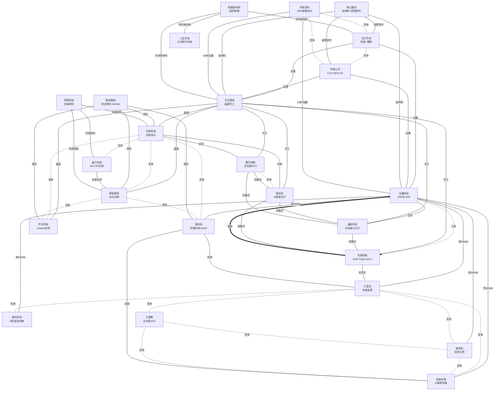
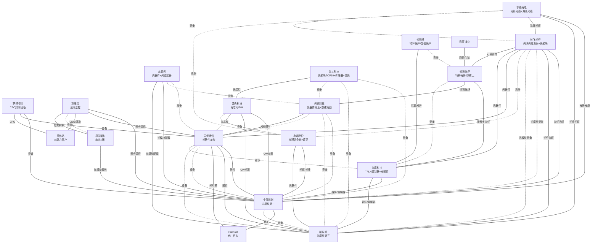
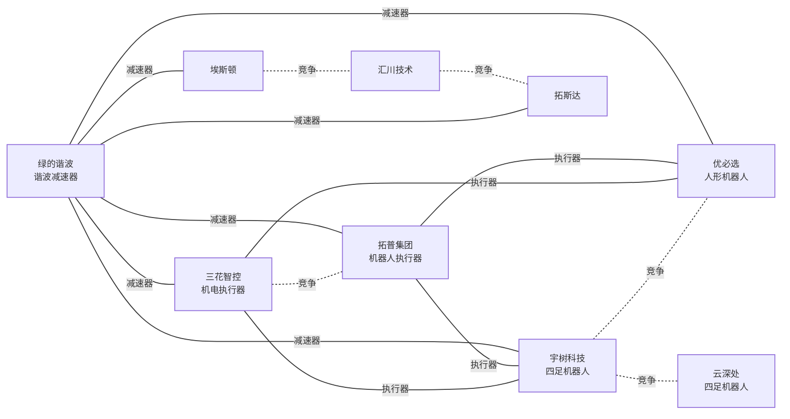
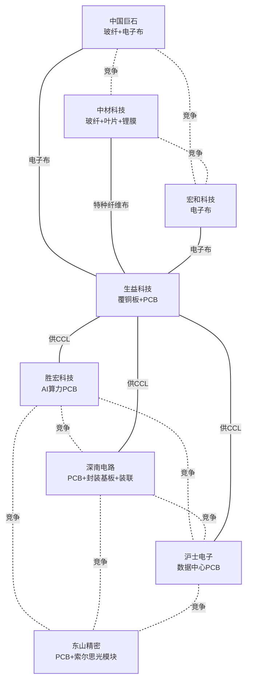
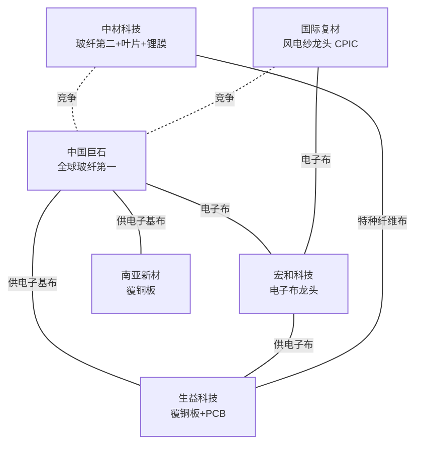
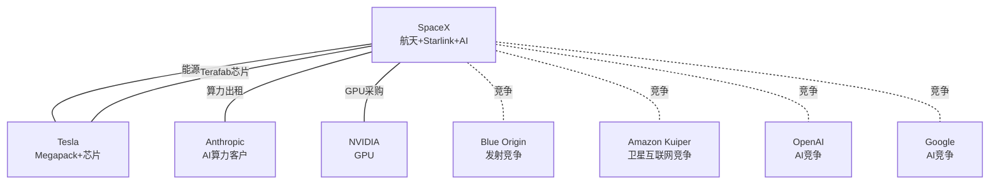
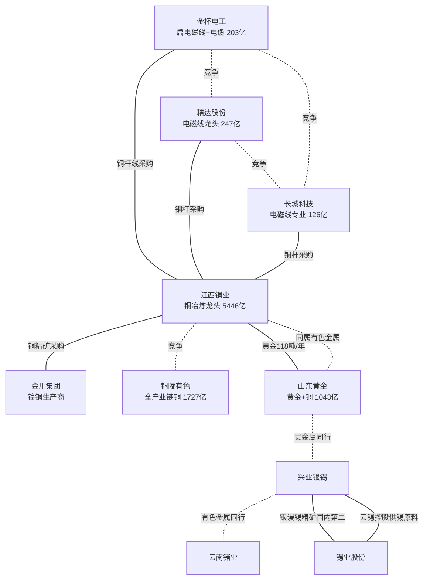
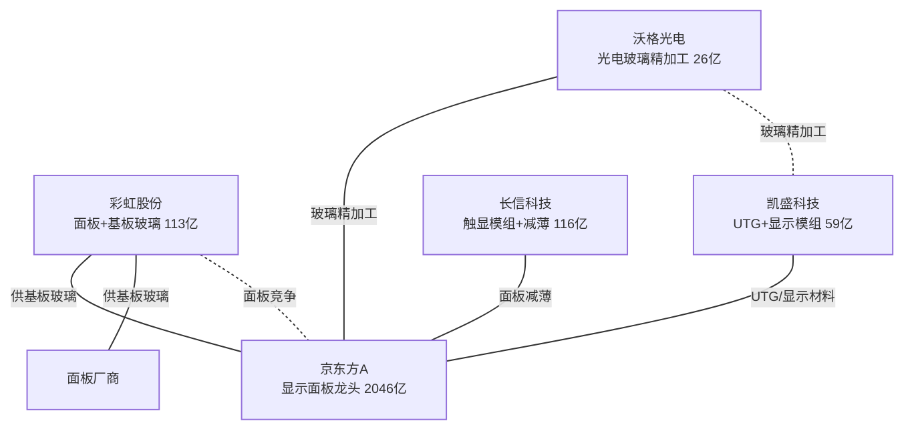

# 公司关联图谱

> 图例：**━人事  ┅股权  ─业务  ┈竞争**
>
> 提示：如果图显示不全，在 Obsidian 设置 → 外观 → CSS 代码片段中添加：
> ```css
> .mermaid svg { max-width: 100%; height: auto; }
> ```

## 半导体与存储



## 光通信产业



## 机器人产业



## PCB产业



## 玻璃纤维



## 航天 / AI 算力（美股）



## 铜 / 电磁线 / 输变电



## 显示面板 / 基板玻璃



### 人事关联

| 关联人 | 公司A | 角色 | 公司B | 角色 |
|--------|-------|------|-------|------|
| 朱一明 | [[长鑫科技]] | 董事长 | [[兆易创新]] | 创始人 |
| Elon Musk | [[SpaceX]] | CEO / 实控人 | Tesla | CEO |

### 股权关联

| 持股方 | 被持股方 | 金额/比例 | 备注 |
|--------|---------|----------|------|
| [[兆易创新]] | [[长鑫科技]] | ~8亿 | 招股书披露，分两轮投资 |
| 中国建材集团 | [[中国巨石]] | 控股 | 实际控制人（央企），通过中国建材股份控股 |
| 中国建材集团 | [[中材科技]] | 控股 | 实际控制人（央企），通过中国建材股份控股 |

### 业务关联（供应商-客户 / 技术互补）

| 上游 | 方向 | 下游 | 说明 |
|------|------|------|------|
| [[长鑫科技]] DRAM颗粒 | → | [[澜起科技]] 内存接口芯片 | 共同组成内存模组（MRDIMM方案） |
| [[长鑫科技]] DRAM颗粒 | → | [[江波龙]] 存储模组 | DRAM晶圆 → 品牌模组封装 |
| [[天孚通信]] 光器件/光引擎 | → | [[中际旭创]] [[新易盛]] [[光迅科技]] 光模块 | 上游器件供应商 |
| [[光迅科技]] 光器件/光模块 | → | 数据中心/电信运营商 | 全球光器件第五，数通光器件第四（5.9%） |
| [[天孚通信]] 光引擎 | → | [[Fabrinet]] 代工厂 | 核心客户，独占63%收入 |
| [[罗博特科]] (ficonTEC) | → | [[天孚通信]] [[中际旭创]] | 硅光/CPO封测设备 |
| [[光库科技]] 光通讯器件/铌酸锂调制器 | → | [[中际旭创]] [[新易盛]] | TFLN调制器+FAU等光器件 → 光模块集成 |
| [[罗博特科]] (ficonTEC) | → | [[英伟达]] | CPO设备核心供应商 |
| [[北方华创]] 半导体设备 | → | [[长鑫科技]] DRAM产线 | 刻蚀/薄膜/清洗设备 |
| [[中微公司]] 刻蚀/MOCVD设备 | → | [[长鑫科技]] [[中芯国际]]等晶圆厂 | CCP刻蚀设备已进入客户产线 |
| [[北方华创]] 半导体设备 | → | [[中芯国际]] 晶圆产线 | 刻蚀/薄膜/热处理/清洗设备 |
| [[中芯国际]] 晶圆代工 | → | [[兆易创新]] [[澜起科技]] | 芯片制造 → Fabless设计公司 |
| [[中芯国际]] 晶圆代工 | → | [[长电科技]] 封测 | 晶圆制造（前道）→ 封测（后道） |
| [[中芯国际]] 晶圆代工 | → | [[通富微电]] 封测 | 晶圆制造（前道）→ 封测（后道） |
| [[中芯国际]] 晶圆代工 | → | [[华天科技]] 封测 | 晶圆制造（前道）→ 封测（后道） |
| [[长鑫科技]] DRAM颗粒 | → | [[佰维存储]] 存储模组 | DRAM晶圆 → AI端侧存储/封测 |
| [[长鑫科技]] DRAM颗粒 | → | [[德明利]] 存储模组 | DRAM晶圆 → 自研主控+存储模组 |
| [[长鑫科技]] DRAM颗粒 | → | [[朗科科技]] 存储模组 | DRAM晶圆 → 存储品牌/模组 |
| [[兆易创新]] 存储芯片 | → | [[江波龙]] 存储模组 | 芯片设计商 → 品牌模组商 |
| [[三花智控]] 机电执行器 | → | [[宇树科技]] [[优必选]] | 上游执行器/热管理 → 机器人本体制造商 |
| [[拓普集团]] 机器人执行器 | → | [[宇树科技]] [[优必选]] | 直线/旋转执行器+灵巧手电机 → 机器人本体制造商 |
| [[汇川技术]] 伺服/电机/执行器 | → | [[宇树科技]] [[优必选]] | 伺服系统+无框电机+关节模组 → 机器人本体制造商 |
| [[绿的谐波]] 谐波减速器/行星滚柱丝杠 | → | [[宇树科技]] [[优必选]] [[三花智控]] [[拓普集团]] | 上游精密传动部件 → 机器人本体/执行器制造商 |
| [[长鑫科技]] DRAM颗粒 | → | [[深科技]] 存储封测 | DRAM晶圆 → 高端存储芯片封测（深圳沛顿+合肥沛顿双基地） |
| [[深科技]] 存储芯片封测 | → | [[江波龙]] [[佰维存储]] | 封测成品 → 存储模组品牌商 |
| [[神工股份]] 大直径硅材料/硅零部件 | → | [[长鑫科技]] [[中芯国际]] | 刻蚀用硅材料/硅零部件 → 存储芯片/晶圆厂 |
| [[神工股份]] 硅零部件 | → | [[北方华创]] [[中微公司]] | 硅零部件 → 刻蚀设备厂（耗材） |
| [[和林微纳]] 半导体测试探针 | → | [[长电科技]] [[通富微电]] [[华天科技]] [[深科技]] | 测试探针 → 封测厂 |
| [[中芯国际]] 晶圆代工 | → | [[寒武纪]] AI智能芯片 | 晶圆制造 → Fabless设计公司（云端AI芯片） |
| [[长电科技]] 封装测试 | → | [[寒武纪]] AI智能芯片 | 晶圆封测 → Fabless设计公司 |
| [[中芯国际]] 晶圆代工 | → | [[摩尔线程]] GPU芯片 | 晶圆制造 → Fabless设计公司（全功能GPU） |
| [[长电科技]] 封装测试 | → | [[摩尔线程]] GPU芯片 | 晶圆封测 → Fabless设计公司 |
| [[德邦科技]] IC封装材料 | → | [[长电科技]] [[通富微电]] [[晶方科技]] | 上游封装材料（固晶/底填/导热） → 封测厂 |
| [[华海清科]] CMP/减薄/离子注入装备 | → | [[中芯国际]] [[长鑫科技]] | CMP装备/减薄/离子注入 → 晶圆制造/封测厂 |
| [[中芯国际]] 晶圆代工 | → | [[晶方科技]] WLCSP | 晶圆制造 → 传感器封装（CIS封测全球领先） |
| [[寒武纪]] AI算力芯片 | → | [[中际旭创]] [[天孚通信]] | 同属AI算力产业链，下游需求共同驱动 |
| [[英维克]] 液冷温控设备 | → | [[中际旭创]] [[天孚通信]] [[寒武纪]] | 数据中心液冷散热 → AI算力设备/光模块 |
| [[英维克]] CDU/液冷方案 | → | [[英伟达]] | MGX生态合作伙伴，为Google定制Deschutes 5 CDU |
| [[三花智控]] 热管理 | → | [[英维克]] | 同属热管理赛道（不同应用领域：汽车/机器人 vs 数据中心/储能） |
| [[源杰科技]] CW激光器芯片 | → | [[中际旭创]] [[新易盛]] 光模块 | 硅光模块核心光源（70mW/100mW大功率DFB） → 光模块制造商 |
| [[源杰科技]] CW激光器芯片 | → | [[华工科技]] 光模块 | 光芯片 → 光模块（华工自研硅光+薄膜铌酸锂芯片，同时外购CW光源） |
| [[源杰科技]] 光芯片 | → | [[天孚通信]] 光器件 | 上游光芯片 → 光器件/光引擎供应商 |
| [[思泉新材]] 散热材料 | → | [[英维克]] 温控设备 | 散热材料（石墨膜/VC/热管）→ 温控设备集成 |
| [[思泉新材]] 散热方案 | → | [[中际旭创]] [[新易盛]] 光模块 | 光模块散热材料/模组（样品阶段） |
| [[生益科技]] 覆铜板 | → | [[胜宏科技]] [[深南电路]] [[沪士电子]] [[东山精密]] PCB | 上游覆铜板材料 → PCB制造商（覆铜板全球第二） |
| [[绿的谐波]] 谐波减速器 | → | [[拓斯达]] [[埃斯顿]] 工业机器人 | 机器人核心零部件 → 机器人本体制造商（埃斯顿出货量中国第一） |
| [[永鼎股份]] 光纤光缆/光器件 | → | [[中际旭创]] [[新易盛]] | 光纤光缆/光器件 → 光模块制造 |
| [[永鼎股份]] 光芯片 | → | [[中际旭创]] [[新易盛]] | IDM激光器芯片（CW-DFB/EML）→ 光模块 |
| [[顺络电子]] 电源管理电感/TLVR | → | [[寒武纪]] AI芯片 | AI服务器GPU/CPU/ASIC供电模组核心器件 |
| [[顺络电子]] 车规电感/陶瓷 | → | [[拓普集团]] [[三花智控]] | 汽车电子元器件 → 汽车零部件供应商 |
| [[SpaceX]] COLOSSUS 算力集群 | → | Anthropic | $12.5亿/月云算力合同，租用 AI 训练集群（2029年到期） |
| [[SpaceX]] Starlink 卫星互联网 | → | 全球用户 | ~740万月活设备，覆盖 ~30 个国家 |
| Teslagapack 储能 | → | [[SpaceX]] 发射场/数据中心 | 发射场及 AI 数据中心储能系统 |
| [[SpaceX]] Falcon/Starship 发射 | → | NASA / NRO / SES 等 | 商业+政府发射服务（NASA 载人/货运合同） |
| [[思必驰]] 对话式AI技术 | → | [[智元]] / 银河通用 / 魔法原子 | AI语音交互 → 具身机器人（人机交互入口） |
| [[国仪量子]] 电镜/科学仪器 | → | [[中芯国际]] / [[长鑫科技]] | 高端科学仪器（SEM/EPR）→ 半导体制造检测 |
| [[国际复材]] 玻纤电子布 | → | [[生益科技]] [[南亚新材]] 覆铜板 | 玻纤电子布 → 覆铜板增强材料 |
| [[中国巨石]] 电子基布 | → | [[生益科技]] [[南亚新材]] 覆铜板 | 玻纤电子基布 → 覆铜板增强材料 |
| [[国际复材]] 玻纤细纱/电子布 | → | [[宏和科技]] | 同属电子布赛道，国际复材为玻纤纱→布一体化，宏和科技聚焦高端特种电子布 |
| [[太辰光]] 光模块配套产品 | → | [[中际旭创]] [[新易盛]] 光模块 | MTP/MPO连接器、光模块内部连接器 → 光模块厂商 |
| [[云南锗业]] 磷化铟晶片 | → | [[中际旭创]] [[新易盛]] 光模块 | 化合物半导体衬底 → 光通讯激光器/探测器 → 光模块 |
| [[云南锗业]] 光纤级四氯化锗 | → | [[长飞光纤]] [[亨通光电]] | 光纤预制棒关键原材料 → 光纤光缆制造 |
| [[中材科技]] 泰山玻纤特种纤维布 | → | [[生益科技]] 覆铜板 | 低介电/低膨胀特种纤维布 → 覆铜板核心材料 |
| [[长进光子]] 掺稀土光纤 | → | [[光库科技]] 光纤激光器件 | 掺稀土光纤 → 光纤激光器核心器件 |
| [[光库科技]] 光纤激光器件 | → | [[锐科激光]] 光纤激光器 | 光纤激光器件（泵浦源/隔离器/合束器） → 光纤激光器整机 |
| [[长进光子]] 掺铒光纤 | → | [[光迅科技]] 光放大器 | 掺铒光纤 → EDFA光放大器核心材料 |
| [[长飞光纤]] 石英管材（长飞石英） | → | [[长进光子]] 特种光纤 | 石英管材 → 特种光纤预制棒制备 |
| [[云南锗业]] 四氯化锗 | → | [[长进光子]] 特种光纤 | 光纤预制棒关键原材料 → 特种光纤制造 |
| [[江西铜业]] 铜杆线/电解铜 | → | [[金杯电工]] 电磁线+电缆 | 上游铜材 → 扁电磁线/电线电缆制造 |
| [[江西铜业]] 铜杆/电解铜 | → | [[精达股份]] 电磁线 | 上游铜材 → 漆包线/特种导体制造 |
| [[江西铜业]] 铜杆/电解铜 | → | [[长城科技]] 电磁线 | 上游铜材 → 电磁线制造 |
| [[江西铜业]] 铜精矿 | → | [[金川集团]] 铜镍生产 | 江西铜业第一大供应商 |
| [[彩虹股份]] G8.5+基板玻璃 | → | [[京东方A]] 液晶面板 | 基板玻璃 → 面板制造核心材料 |
| [[彩虹股份]] 基板玻璃 | → | 面板厂商 | 基板玻璃广泛供应知名面板厂商 |
| [[沃格光电]] 玻璃精加工 | → | [[京东方A]] 面板 | 薄化/镀膜/切割 → 面板制造 |
| [[凯盛科技]] UTG/显示材料 | → | [[京东方A]] 面板 | UTG超薄柔性玻璃 → 显示终端 |
| [[长信科技]] 面板减薄 | → | [[京东方A]] 面板 | 超薄液晶面板减薄 → 苹果认证供应商 |

### 竞争关联（同一赛道）

| 公司A      | 公司B                | 竞争领域           |
| -------- | ------------------ | -------------- |
| [[中际旭创]] | [[新易盛]]            | 光模块（800G/1.6T） |
| [[光迅科技]] | [[中际旭创]] / [[新易盛]] | 光器件/光模块（数通光器件第四 vs 第一/第三） |
| [[江波龙]]   | [[佰维存储]]           | 存储品牌/模组（国内双龙头） |
| [[江波龙]]   | [[德明利]]             | 存储品牌/模组 |
| [[德明利]]   | [[佰维存储]]           | 存储品牌/模组 |
| [[江波龙]]   | [[朗科科技]]           | 存储品牌/模组 |
| [[江波龙]]   | [[大普微]]            | 企业级SSD（重叠） |
| [[大普微]]   | [[佰维存储]]           | 企业级SSD（重叠） |
| [[大普微]]   | [[德明利]]             | SSD+自研主控 |
| [[宇树科技]] | [[优必选]]            | 人形机器人          |
| [[长电科技]] | [[通富微电]]           | 半导体封测（国内双雄） |
| [[长电科技]] | [[华天科技]]           | 半导体封测 |
| [[通富微电]] | [[华天科技]]           | 半导体封测 |
| [[北方华创]] | [[中微公司]]           | 半导体刻蚀设备        |
| [[天孚通信]] | [[中际旭创]] / [[新易盛]] | 有源光器件（局部重叠）    |
| [[三花智控]] | [[拓普集团]] | 机器人执行器 |
| [[长电科技]] | [[深科技]] | 存储封测（通用封测龙头 vs 存储封测专注） |
| [[通富微电]] | [[深科技]] | 存储封测 |
| [[三花智控]] | [[汇川技术]] | 机器人执行器/伺服 |
| [[拓普集团]] | [[汇川技术]] | 机器人执行器 |
| [[胜宏科技]] | [[深南电路]] | PCB（AI算力/通信） |
| [[胜宏科技]] | [[沪士电子]] | PCB（AI数据中心） |
| [[深南电路]] | [[沪士电子]] | PCB（数据中心/通信） |
| [[胜宏科技]] | [[东山精密]] | PCB（AI算力/HDI） |
| [[深南电路]] | [[东山精密]] | PCB（数据中心/通信） |
| [[沪士电子]] | [[东山精密]] | PCB（AI数据中心） |
| [[华海清科]] | [[北方华创]] / [[中微公司]] | 半导体设备（技术路径不同，CMP vs 刻蚀/薄膜，局部重叠） |
| [[寒武纪]] | [[澜起科技]] | 芯片设计（Fabless，同属AI算力产业链） |
| [[摩尔线程]] | [[寒武纪]] | GPU/AI芯片（全功能GPU vs AI智能芯片，同属国产GPU赛道） |
| [[寒武纪]] | [[兆易创新]] | 芯片设计（Fabless模式） |
| [[英维克]] | [[三花智控]] | 热管理（数据中心液冷 vs 汽车/机器人热管理） |
| [[晶方科技]] | [[长电科技]] | 半导体封装（WLCSP vs 传统封测+先进封装） |
| [[晶方科技]] | [[通富微电]] | 半导体封装测试 |
| [[拓斯达]] | [[汇川技术]] | 工业自动化/机器人 |
| [[埃斯顿]] | [[汇川技术]] | 工业自动化/机器人 |
| [[埃斯顿]] | [[拓斯达]] | 工业机器人 |
| [[天孚通信]] | [[光库科技]] | 光器件（光引擎龙头 vs TFLN调制器+多元光器件） |
| [[太辰光]] | [[天孚通信]] / [[光迅科技]] | 光器件（光连接器/高密度连接器 vs 光引擎/光器件，同一赛道差异化竞争） |
| [[太辰光]] | [[光库科技]] | 光器件（光连接器 vs TFLN调制器+多元器件，局部重叠） |
| [[国际复材]] | [[中国巨石]] | 玻璃纤维（全球风电纱龙头 vs 全球玻纤龙头） |
| [[英维克]] | [[思泉新材]] | 热管理（温控设备龙头 vs 散热材料供应商，材料端 vs 设备端） |
| [[源杰科技]] | [[永鼎股份]] | 光芯片IDM（CW激光器芯片） |
| [[永鼎股份]] | [[中际旭创]] [[新易盛]] | 光通信（光缆/光器件/光芯片，部分重叠） |
| [[SpaceX]] | Blue Origin / ULA / Arianespace | 商业发射（全球唯一可复用火箭 vs 传统一次性火箭） |
| [[SpaceX]] Starlink | Amazon Kuiper / Eutelsat OneWeb | 卫星互联网（LEO 宽带星座竞争） |
| [[SpaceX]] Grok | OpenAI / Anthropic / Google | AI 大模型（同时 Anthropic 也是 SpaceX 算力客户） |
| [[中材科技]] | [[中国巨石]] | 玻璃纤维（全球第二 vs 全球第一，同属中国建材集团） |
| [[中材科技]] | [[宏和科技]] | 特种纤维布/电子布（低介电/低膨胀特种纤维布） |
| [[思必驰]] | [[科大讯飞]] / 赛轮思(Cerence) | 对话式AI/车载语音（22.0% vs 41.9% vs 12.8%） |
| [[MiniMax]] | [[智谱华章]] | 大语言模型/AI产品（海外C端 vs 国内B端） |
| [[长进光子]] | [[光库科技]] / [[长盈通]] | 特种光纤（掺稀土光纤 vs TFLN调制器+光器件 vs 保偏光纤） |
| [[长盈通]] | [[长进光子]] | 特种光纤（保偏光纤 vs 掺稀土光纤，不同细分方向） |
| [[锐科激光]] | [[频准激光]] | 激光器（工业光纤激光器 vs 量子/半导体科研用精准激光器，不同细分） |
| [[华工科技]] | [[中际旭创]] / [[新易盛]] / [[光迅科技]] | 光模块（全球TOP10，自研硅光芯片+薄膜铌酸锂，联接+感知+激光多业务） |
| [[江西铜业]] | [[铜陵有色]] | 铜冶炼加工（中国最大 vs 全产业链铜企） |
| [[金杯电工]] | [[精达股份]] | 电磁线（扁电磁线全球龙头 vs 电磁线行业龙头） |
| [[金杯电工]] | [[长城科技]] | 电磁线（扁电磁线+电缆 vs 100%电磁线） |
| [[精达股份]] | [[长城科技]] | 电磁线（漆包线+特种导体 vs 纯电磁线） |
| [[彩虹股份]] | [[京东方A]] | 显示面板（面板+基板一体化 vs 全球面板龙头） |
| [[沃格光电]] | [[凯盛科技]] | 光电玻璃精加工（玻璃基MiniLED/MicroLED vs UTG+显示模组） |
| [[江西铜业]] | [[山东黄金]] | 有色金属（铜+黄金 vs 黄金+铜，产量规模相当） |
| [[山东黄金]] | [[兴业银锡]] | 贵金属（黄金开采 vs 银锡多金属采选） |
| [[兴业银锡]] | [[云南锗业]] | 有色金属同行（银锡 vs 锗） |
| [[兴业银锡]] | [[锡业股份]] | 锡产业链（银漫锡精矿国内第二 vs 全球锡业霸主，云锡控股是兴业银锡第三大客户） |
| [[锡业股份]] | [[江西铜业]] | 有色金属同行（锡+铜 vs 铜） |

## 产业群组

```
半导体设备/材料群组                 半导体设备群组
┌─────────────────────┐
│  华海清科（CMP龙头）   │
│  北方华创（刻蚀/薄膜）  │
│  中微公司（CCP/MOCVD） │
│     ↕ 竞争 ↓ 设备      │
│  中芯国际（晶圆代工）    │
│  长鑫科技（DRAM IDM）  │
│     ↓ 耗材              │
│  安集科技（CMP抛光液）   │
│  德邦科技（封装材料）    │
│  神工股份（硅材料）     │
│  菲利华（石英玻璃材料）  │
│   → TEL/Lam/AMAT认证   │
│  石英股份（高纯石英砂）  │
│   → 光伏周期底部转型半导体│
│  国仪量子（科学仪器）    │
│   → 电镜/EPR检测       │
└─────────────────────┘

存储芯片群组                      光通信群组
┌─────────────────────┐      ┌─────────────────────────┐
│  北方华创（设备）      │      │  罗博特科（封测设备）      │
│      ↓ 设备           │      │      ↓ 设备              │
│  长鑫科技（DRAM）      │      │  天孚通信（光器件）        │
│  光库科技（TFLN+光器件）   │      │                           │
│  ↙ 互补 ↓ 模组 ↘      │      │   ↙ 供应商  ↘ 供应商      │
│ 澜起科技 江波龙 佰维存储 │      │ 中际旭创 ←→ 新易盛        │
│    ↖ Fabless       │      │     ↓ 竞争              │
│  兆易创新（存储/MCU）   │      │  Fabrinet（代工）         │
│                     │      │  英维克（液冷温控）        │
│                     │      │  亨通光电（光纤+海底光缆） │
│  英伟达（终端客户）        │
│ 江波龙 ←→ 佰维存储     │
│                     │      │  光迅科技（光器件第五）    │
│ 寒武纪（AI芯片Fabless）│      │   → 数通第四+传输+接入     │
│ 摩尔线程（全功能GPU）    │      └─────────────────────────┘
│    ↓ 竞争              │
│ 德明利/朗科/大普微      │
└─────────────────────┘

机器人群组
┌──────────────────────┐
│ 绿的谐波（减速器/丝杠）  │
│     ↓ 供应             │
│ 三花智控 ←→ 拓普集团   │
│     ↓ 执行器      ↓    │
│ 宇树科技 ←→ 优必选     │
│     ↓ 竞争              │
│ 智元 / 越疆 / 乐聚     │
│     ↑ AI交互           │
│ 思必驰（对话式AI）      │
│  → 智元/银河通用/魔法原子 │
│ 智谱华章（大语言模型）   │
│  → Agent赋能机器人交互   │
└──────────────────────┘

玻璃纤维/电子布群组
┌──────────────────────┐
│ 中国巨石（全球玻纤第一） │
│     ↓ 竞争              │
│ 中材科技（玻纤第二）    │
│ 泰山玻纤特种纤维布      │
│     ↓ 竞争              │
│ 国际复材（风电纱龙头）   │
│     ↓ 电子布            │
│ 宏和科技（电子布龙头）   │
│     ↓ 供应              │
│ 生益科技/南亚新材（覆铜板）│
│  同属中国建材集团：      │
│  中国巨石 ←→ 中材科技   │
└──────────────────────┘

电子元器件群组
┌──────────────────────┐
│ 顺络电子（被动元器件）   │
│ 电感/钽电容/滤波器/陶瓷  │
│     ↓ 供应              │
│ 汽车电子 → 拓普/三花     │
│ AI服务器 → 寒武纪       │
│ 数据中心 → 英维克       │
└──────────────────────┘

AI大模型群组
┌──────────────────────┐
│ MiniMax（全模态AI）    │
│ 海外C端+开放平台       │
│     ↓ 竞争             │
│ 智谱华章（大语言模型）   │
│ 国内B端企业服务        │
│     ↓ 竞争             │
│ DeepSeek / 百度 / 字节  │
│     ↑ 算力             │
│ 寒武纪（AI芯片）       │
└──────────────────────┘

航天/AI群组（美股）
┌──────────────────────┐
│ SpaceX（复用火箭+Starlink+Grok） │
│     ↓ 竞争              │
│ Blue Origin / ULA（发射） │
│ Amazon Kuiper（卫星网）   │
│ OpenAI / Google（AI）   │
│     ↓ 供应              │
│ NVIDIA GPU → AI训练     │
│ Tesla Megapack → 储能   │
│     ↓ 客户              │
│ Anthropic $1.25亿/月算力 │
│ NASA / NRO 发射服务     │
│ Starlink ~740万终端用户 │
└──────────────────────┘

铜 / 电磁线 / 输变电群组
┌──────────────────────────┐
│ 江西铜业（铜冶炼龙头 5446亿）  │
│     ↓ 竞争                    │
│ 铜陵有色（全产业链铜 1727亿）  │
│     ↓ 铜杆线/电解铜            │
│ 金杯电工 ←→ 精达股份 ←→ 长城科技 │
│ 扁电磁线+电缆  电磁线龙头  纯电磁线 │
│     ↓ 竞争（电磁线三巨头）     │
│ 同供铜杆：江西铜业            │
│ 同属有色金属：山东黄金（黄金+铜） │
│   贵金属同行：兴业银锡（银+锡）  │
│ 有色金属同行：云南锗业（锗产品）  │
│ 江西铜业第一大供应商：金川集团   │
└──────────────────────────┘

显示面板 / 基板玻璃群组
┌──────────────────────────┐
│ 京东方A（显示面板龙头 2046亿）  │
│ LCD全球第一 + OLED增长         │
│     ↑ 基板玻璃                 │
│ 彩虹股份（面板+基板 113亿）     │
│ G8.5+基板玻璃国产化             │
│     ↑ 玻璃精加工               │
│ 沃格光电 ←→ 凯盛科技           │
│ 玻璃基MiniLED  UTG+显示模组     │
│     ↑ 面板减薄/触显模组         │
│ 长信科技（车载触显 116亿）      │
│ 面板减薄苹果认证 + VR模组       │
└──────────────────────────┘
```

---

## 金融板块关联（2026-06-07 新增）

### 股权关联
- **中国平安 → 平安银行**（母公司-子公司，控股关系）

### 竞争关联
- **五大国有银行**：[[工商银行]] ↔ [[农业银行]] ↔ [[建设银行]] ↔ [[中国银行]] ↔ [[交通银行]]（同属国有大行赛道）
- **保险集团**：[[中国平安]] ↔ [[中国人保]] ↔ [[中国太保]] ↔ [[新华保险]]（综合保险竞争）

### 股份制银行
- [[平安银行]] ↔ [[兴业银行]]（同属股份制银行赛道）

## 基建与建筑关联（2026-06-07 新增）

### 竞争关联
- **铁路基建双寡头**：[[中国中铁]] ↔ [[中国铁建]]
- **基建集群**：[[中国交建]] · [[中国建筑]] · [[中国中冶]]

## 能源关联（2026-06-07 新增）

### 竞争关联
- **煤炭**：[[中国神华]] ↔ [[陕西煤业]] ↔ [[中煤能源]]
- **黄金开采**：[[山东黄金]] ↔ [[紫金矿业]]

## 汽车关联（2026-06-07 新增）

### 竞争关联
- **乘用车**：[[长城汽车]] ↔ [[广汽集团]] ↔ [[赛力斯]]

## Related Pages

- [[光模块三强对比]] — 光通信公司竞争分析
- [[DRAM产业]] — 存储芯片产业链
- [[互连芯片]] — 澜起科技所在赛道
- [[芯片设计产业]] — 兆易创新/澜起科技所在赛道
- [[光通信产业链]] — 光通信全产业链
- [[半导体材料与设备]] — 北方华创所在赛道

---

## 数据洪峰更新（2026-06-07）

随着 cninfo 数据修复，wiki 从 672 增长至 1195 个公司页面（+523）。910 家已完成 sector 分类。以下为新增主要关联：

### 电子/半导体扩展
- 深科技（半导体封测）→ 与 [[长电科技]]·[[通富微电]]·[[华天科技]] 同赛道

### 有色金属扩展
- 铜陵有色 → 与 [[江西铜业]]·[[西部矿业]] 同赛道（铜冶炼加工）
- 中金岭南 → 同属铜冶炼加工

### 显示面板扩展
- 深天马A → 与 [[京东方A]]·[[彩虹股份]] 同赛道

### 新增 L1 行业
- **综合**：全新好（多元化：物业+汽车+日用品）

> 更多细节关系将在后续 cycles 中逐步完善。

---

## Batch 1 新增关联（2026-06-09）

### 汽车零部件
- [[S佳通]] · [[赛轮轮胎]] · [[三角轮胎]] · [[玲珑轮胎]]（轮胎赛道竞争关联）
- [[万丰奥威]] · [[拓普集团]]（汽车零部件，轻量化部件）

### 光伏
- [[TCL中环]] · [[隆基绿能]]（光伏硅片赛道竞争关联）

### 家电
- [[TCL智家]] · [[海尔智家]] · [[美的集团]]（白电赛道竞争关联）

### PCB
- [[一博科技]] · [[深南电路]] · [[胜宏科技]]（PCB赛道）

---

## Batch 2 新增关联（2026-06-09）

### 显示面板
- [[TCL科技]] · [[京东方A]]（显示面板竞争）

### 医药
- [[一品红]] · [[健民集团]] · [[福元医药]]（化学制药赛道）
- [[一心堂]]（医药零售连锁）

### 汽车零部件
- [[一彬科技]] · [[拓普集团]] · [[万丰奥威]]（汽车零部件赛道）

### 农机
- [[一拖股份]]（农用机械/拖拉机）

---

## Batch 3 新增关联（2026-06-09）

### 商用车
- [[一汽解放]] · [[中国重汽]]（商用车/卡车赛道竞争关联）

### 食品饮料
- [[一鸣食品]]（奶吧连锁，乳品+烘焙）

### 通信设备
- [[七一二]] · [[海格通信]]（军用专网通信赛道）

### 纺织服装
- [[七匹狼]] · [[九牧王]]（男装品牌赛道竞争关联）

### 化工
- [[七彩化学]]（精细化工）
