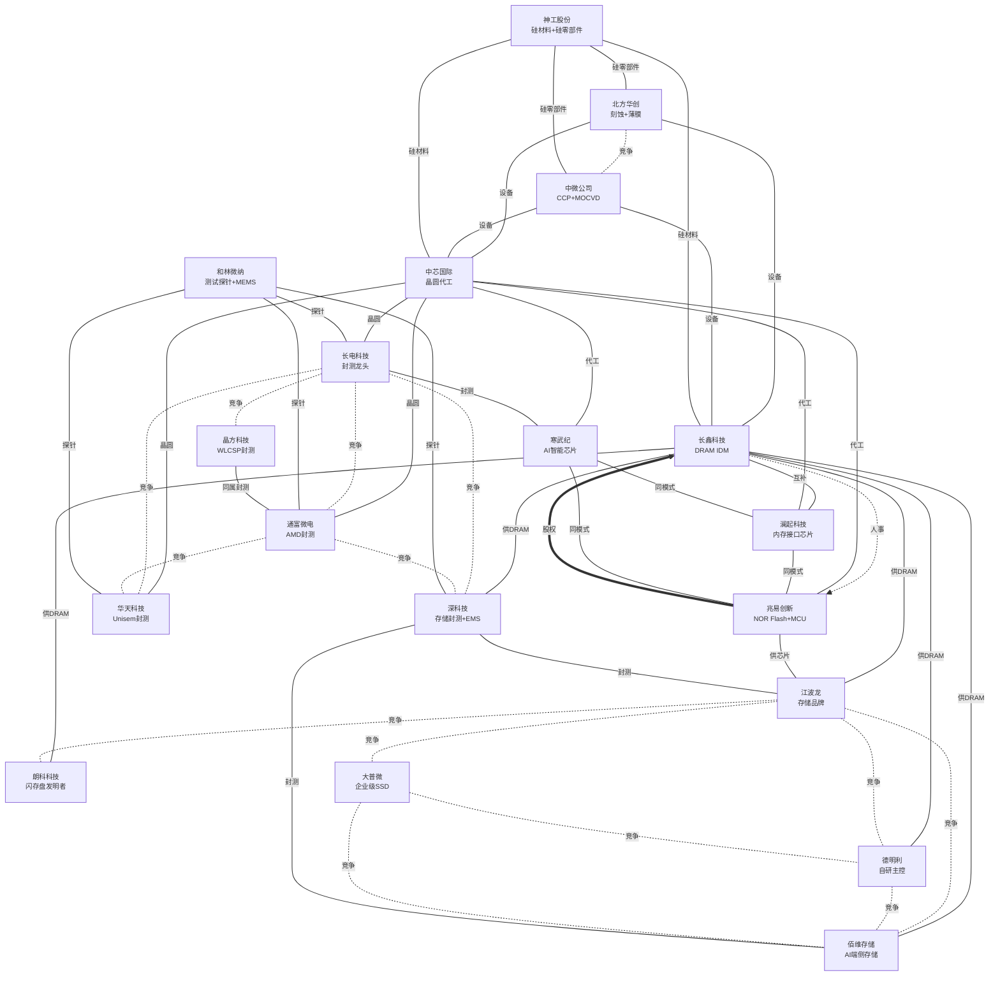
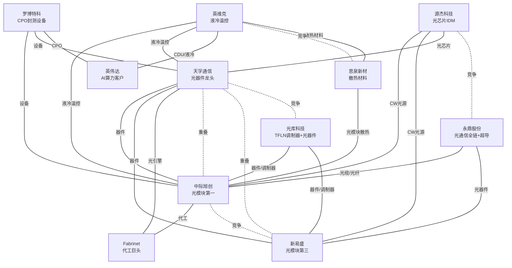
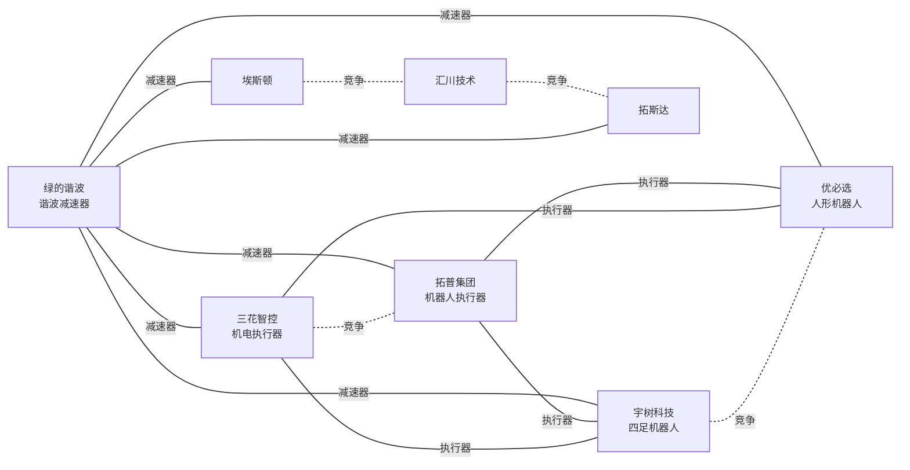
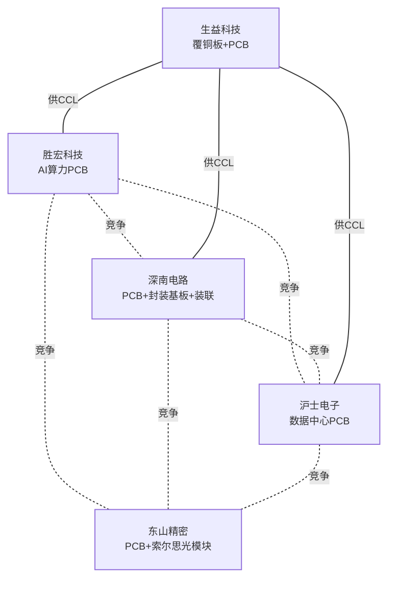
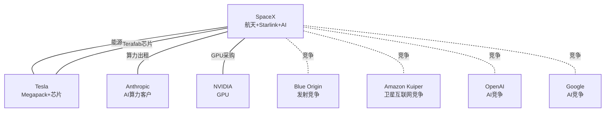

# 公司关联图谱

> 图例：**━人事  ┅股权  ─业务  ┈竞争**
>
> 提示：如果图显示不全，在 Obsidian 设置 → 外观 → CSS 代码片段中添加：
> ```css
> .mermaid svg { max-width: 100%; height: auto; }
> ```

## 半导体与存储



## 光通信产业



## 机器人产业



## PCB产业



## 航天 / AI 算力（美股）



## 关联汇总

### 人事关联

| 关联人 | 公司A | 角色 | 公司B | 角色 |
|--------|-------|------|-------|------|
| 朱一明 | [[长鑫科技]] | 董事长 | [[兆易创新]] | 创始人 |
| Elon Musk | [[SpaceX]] | CEO / 实控人 | Tesla | CEO |

### 股权关联

| 持股方 | 被持股方 | 金额/比例 | 备注 |
|--------|---------|----------|------|
| [[兆易创新]] | [[长鑫科技]] | ~8亿 | 招股书披露，分两轮投资 |

### 业务关联（供应商-客户 / 技术互补）

| 上游 | 方向 | 下游 | 说明 |
|------|------|------|------|
| [[长鑫科技]] DRAM颗粒 | → | [[澜起科技]] 内存接口芯片 | 共同组成内存模组（MRDIMM方案） |
| [[长鑫科技]] DRAM颗粒 | → | [[江波龙]] 存储模组 | DRAM晶圆 → 品牌模组封装 |
| [[天孚通信]] 光器件/光引擎 | → | [[中际旭创]] [[新易盛]] 光模块 | 上游器件供应商 |
| [[天孚通信]] 光引擎 | → | [[Fabrinet]] 代工厂 | 核心客户，独占63%收入 |
| [[罗博特科]] (ficonTEC) | → | [[天孚通信]] [[中际旭创]] | 硅光/CPO封测设备 |
| [[光库科技]] 光通讯器件/铌酸锂调制器 | → | [[中际旭创]] [[新易盛]] | TFLN调制器+FAU等光器件 → 光模块集成 |
| [[罗博特科]] (ficonTEC) | → | [[英伟达]] | CPO设备核心供应商 |
| [[北方华创]] 半导体设备 | → | [[长鑫科技]] DRAM产线 | 刻蚀/薄膜/清洗设备 |
| [[中微公司]] 刻蚀/MOCVD设备 | → | [[长鑫科技]] [[中芯国际]]等晶圆厂 | CCP刻蚀设备已进入客户产线 |
| [[北方华创]] 半导体设备 | → | [[中芯国际]] 晶圆产线 | 刻蚀/薄膜/热处理/清洗设备 |
| [[中芯国际]] 晶圆代工 | → | [[兆易创新]] [[澜起科技]] | 芯片制造 → Fabless设计公司 |
| [[中芯国际]] 晶圆代工 | → | [[长电科技]] 封测 | 晶圆制造（前道）→ 封测（后道） |
| [[中芯国际]] 晶圆代工 | → | [[通富微电]] 封测 | 晶圆制造（前道）→ 封测（后道） |
| [[中芯国际]] 晶圆代工 | → | [[华天科技]] 封测 | 晶圆制造（前道）→ 封测（后道） |
| [[长鑫科技]] DRAM颗粒 | → | [[佰维存储]] 存储模组 | DRAM晶圆 → AI端侧存储/封测 |
| [[长鑫科技]] DRAM颗粒 | → | [[德明利]] 存储模组 | DRAM晶圆 → 自研主控+存储模组 |
| [[长鑫科技]] DRAM颗粒 | → | [[朗科科技]] 存储模组 | DRAM晶圆 → 存储品牌/模组 |
| [[兆易创新]] 存储芯片 | → | [[江波龙]] 存储模组 | 芯片设计商 → 品牌模组商 |
| [[三花智控]] 机电执行器 | → | [[宇树科技]] [[优必选]] | 上游执行器/热管理 → 机器人本体制造商 |
| [[拓普集团]] 机器人执行器 | → | [[宇树科技]] [[优必选]] | 直线/旋转执行器+灵巧手电机 → 机器人本体制造商 |
| [[汇川技术]] 伺服/电机/执行器 | → | [[宇树科技]] [[优必选]] | 伺服系统+无框电机+关节模组 → 机器人本体制造商 |
| [[绿的谐波]] 谐波减速器/行星滚柱丝杠 | → | [[宇树科技]] [[优必选]] [[三花智控]] [[拓普集团]] | 上游精密传动部件 → 机器人本体/执行器制造商 |
| [[长鑫科技]] DRAM颗粒 | → | [[深科技]] 存储封测 | DRAM晶圆 → 高端存储芯片封测（深圳沛顿+合肥沛顿双基地） |
| [[深科技]] 存储芯片封测 | → | [[江波龙]] [[佰维存储]] | 封测成品 → 存储模组品牌商 |
| [[神工股份]] 大直径硅材料/硅零部件 | → | [[长鑫科技]] [[中芯国际]] | 刻蚀用硅材料/硅零部件 → 存储芯片/晶圆厂 |
| [[神工股份]] 硅零部件 | → | [[北方华创]] [[中微公司]] | 硅零部件 → 刻蚀设备厂（耗材） |
| [[和林微纳]] 半导体测试探针 | → | [[长电科技]] [[通富微电]] [[华天科技]] [[深科技]] | 测试探针 → 封测厂 |
| [[中芯国际]] 晶圆代工 | → | [[寒武纪]] AI智能芯片 | 晶圆制造 → Fabless设计公司（云端AI芯片） |
| [[长电科技]] 封装测试 | → | [[寒武纪]] AI智能芯片 | 晶圆封测 → Fabless设计公司 |
| [[中芯国际]] 晶圆代工 | → | [[晶方科技]] WLCSP | 晶圆制造 → 传感器封装（CIS封测全球领先） |
| [[寒武纪]] AI算力芯片 | → | [[中际旭创]] [[天孚通信]] | 同属AI算力产业链，下游需求共同驱动 |
| [[英维克]] 液冷温控设备 | → | [[中际旭创]] [[天孚通信]] [[寒武纪]] | 数据中心液冷散热 → AI算力设备/光模块 |
| [[英维克]] CDU/液冷方案 | → | [[英伟达]] | MGX生态合作伙伴，为Google定制Deschutes 5 CDU |
| [[三花智控]] 热管理 | → | [[英维克]] | 同属热管理赛道（不同应用领域：汽车/机器人 vs 数据中心/储能） |
| [[源杰科技]] CW激光器芯片 | → | [[中际旭创]] [[新易盛]] 光模块 | 硅光模块核心光源（70mW/100mW大功率DFB） → 光模块制造商 |
| [[源杰科技]] 光芯片 | → | [[天孚通信]] 光器件 | 上游光芯片 → 光器件/光引擎供应商 |
| [[思泉新材]] 散热材料 | → | [[英维克]] 温控设备 | 散热材料（石墨膜/VC/热管）→ 温控设备集成 |
| [[思泉新材]] 散热方案 | → | [[中际旭创]] [[新易盛]] 光模块 | 光模块散热材料/模组（样品阶段） |
| [[生益科技]] 覆铜板 | → | [[胜宏科技]] [[深南电路]] [[沪士电子]] [[东山精密]] PCB | 上游覆铜板材料 → PCB制造商（覆铜板全球第二） |
| [[绿的谐波]] 谐波减速器 | → | [[拓斯达]] [[埃斯顿]] 工业机器人 | 机器人核心零部件 → 机器人本体制造商（埃斯顿出货量中国第一） |
| [[永鼎股份]] 光纤光缆/光器件 | → | [[中际旭创]] [[新易盛]] | 光纤光缆/光器件 → 光模块制造 |
| [[永鼎股份]] 光芯片 | → | [[中际旭创]] [[新易盛]] | IDM激光器芯片（CW-DFB/EML）→ 光模块 |
| [[顺络电子]] 电源管理电感/TLVR | → | [[寒武纪]] AI芯片 | AI服务器GPU/CPU/ASIC供电模组核心器件 |
| [[顺络电子]] 车规电感/陶瓷 | → | [[拓普集团]] [[三花智控]] | 汽车电子元器件 → 汽车零部件供应商 |
| [[SpaceX]] COLOSSUS 算力集群 | → | Anthropic | $12.5亿/月云算力合同，租用 AI 训练集群（2029年到期） |
| [[SpaceX]] Starlink 卫星互联网 | → | 全球用户 | ~740万月活设备，覆盖 ~30 个国家 |
| Teslagapack 储能 | → | [[SpaceX]] 发射场/数据中心 | 发射场及 AI 数据中心储能系统 |
| [[SpaceX]] Falcon/Starship 发射 | → | NASA / NRO / SES 等 | 商业+政府发射服务（NASA 载人/货运合同） |

### 竞争关联（同一赛道）

| 公司A      | 公司B                | 竞争领域           |
| -------- | ------------------ | -------------- |
| [[中际旭创]] | [[新易盛]]            | 光模块（800G/1.6T） |
| [[江波龙]]   | [[佰维存储]]           | 存储品牌/模组（国内双龙头） |
| [[江波龙]]   | [[德明利]]             | 存储品牌/模组 |
| [[德明利]]   | [[佰维存储]]           | 存储品牌/模组 |
| [[江波龙]]   | [[朗科科技]]           | 存储品牌/模组 |
| [[江波龙]]   | [[大普微]]            | 企业级SSD（重叠） |
| [[大普微]]   | [[佰维存储]]           | 企业级SSD（重叠） |
| [[大普微]]   | [[德明利]]             | SSD+自研主控 |
| [[宇树科技]] | [[优必选]]            | 人形机器人          |
| [[长电科技]] | [[通富微电]]           | 半导体封测（国内双雄） |
| [[长电科技]] | [[华天科技]]           | 半导体封测 |
| [[通富微电]] | [[华天科技]]           | 半导体封测 |
| [[北方华创]] | [[中微公司]]           | 半导体刻蚀设备        |
| [[天孚通信]] | [[中际旭创]] / [[新易盛]] | 有源光器件（局部重叠）    |
| [[三花智控]] | [[拓普集团]] | 机器人执行器 |
| [[长电科技]] | [[深科技]] | 存储封测（通用封测龙头 vs 存储封测专注） |
| [[通富微电]] | [[深科技]] | 存储封测 |
| [[三花智控]] | [[汇川技术]] | 机器人执行器/伺服 |
| [[拓普集团]] | [[汇川技术]] | 机器人执行器 |
| [[胜宏科技]] | [[深南电路]] | PCB（AI算力/通信） |
| [[胜宏科技]] | [[沪士电子]] | PCB（AI数据中心） |
| [[深南电路]] | [[沪士电子]] | PCB（数据中心/通信） |
| [[胜宏科技]] | [[东山精密]] | PCB（AI算力/HDI） |
| [[深南电路]] | [[东山精密]] | PCB（数据中心/通信） |
| [[沪士电子]] | [[东山精密]] | PCB（AI数据中心） |
| [[寒武纪]] | [[澜起科技]] | 芯片设计（Fabless，同属AI算力产业链） |
| [[寒武纪]] | [[兆易创新]] | 芯片设计（Fabless模式） |
| [[英维克]] | [[三花智控]] | 热管理（数据中心液冷 vs 汽车/机器人热管理） |
| [[晶方科技]] | [[长电科技]] | 半导体封装（WLCSP vs 传统封测+先进封装） |
| [[晶方科技]] | [[通富微电]] | 半导体封装测试 |
| [[拓斯达]] | [[汇川技术]] | 工业自动化/机器人 |
| [[埃斯顿]] | [[汇川技术]] | 工业自动化/机器人 |
| [[埃斯顿]] | [[拓斯达]] | 工业机器人 |
| [[天孚通信]] | [[光库科技]] | 光器件（光引擎龙头 vs TFLN调制器+多元光器件） |
| [[英维克]] | [[思泉新材]] | 热管理（温控设备龙头 vs 散热材料供应商，材料端 vs 设备端） |
| [[源杰科技]] | [[永鼎股份]] | 光芯片IDM（CW激光器芯片） |
| [[永鼎股份]] | [[中际旭创]] [[新易盛]] | 光通信（光缆/光器件/光芯片，部分重叠） |
| [[SpaceX]] | Blue Origin / ULA / Arianespace | 商业发射（全球唯一可复用火箭 vs 传统一次性火箭） |
| [[SpaceX]] Starlink | Amazon Kuiper / Eutelsat OneWeb | 卫星互联网（LEO 宽带星座竞争） |
| [[SpaceX]] Grok | OpenAI / Anthropic / Google | AI 大模型（同时 Anthropic 也是 SpaceX 算力客户） |

## 产业群组

```
存储芯片群组                      光通信群组
┌─────────────────────┐      ┌─────────────────────────┐
│  北方华创（设备）      │      │  罗博特科（封测设备）      │
│      ↓ 设备           │      │      ↓ 设备              │
│  长鑫科技（DRAM）      │      │  天孚通信（光器件）        │
│  光库科技（TFLN+光器件）   │      │                           │
│  ↙ 互补 ↓ 模组 ↘      │      │   ↙ 供应商  ↘ 供应商      │
│ 澜起科技 江波龙 佰维存储 │      │ 中际旭创 ←→ 新易盛        │
│    ↖ Fabless       │      │     ↓ 竞争              │
│  兆易创新（存储/MCU）   │      │  Fabrinet（代工）         │
│                     │      │  英维克（液冷温控）        │
│  英伟达（终端客户）        │
│ 江波龙 ←→ 佰维存储     │
│                     │
│ 寒武纪（AI芯片Fabless）│      └─────────────────────────┘
│    ↓ 竞争              │
│ 德明利/朗科/大普微      │
└─────────────────────┘

机器人群组
┌──────────────────────┐
│ 绿的谐波（减速器/丝杠）  │
│     ↓ 供应             │
│ 三花智控 ←→ 拓普集团   │
│     ↓ 执行器      ↓    │
│ 宇树科技 ←→ 优必选     │
│     ↓ 竞争              │
│ 智元 / 越疆 / 乐聚     │
└──────────────────────┘

电子元器件群组
┌──────────────────────┐
│ 顺络电子（被动元器件）   │
│ 电感/钽电容/滤波器/陶瓷  │
│     ↓ 供应              │
│ 汽车电子 → 拓普/三花     │
│ AI服务器 → 寒武纪       │
│ 数据中心 → 英维克       │
└──────────────────────┘

航天/AI群组（美股）
┌──────────────────────┐
│ SpaceX（复用火箭+Starlink+Grok） │
│     ↓ 竞争              │
│ Blue Origin / ULA（发射） │
│ Amazon Kuiper（卫星网）   │
│ OpenAI / Google（AI）   │
│     ↓ 供应              │
│ NVIDIA GPU → AI训练     │
│ Tesla Megapack → 储能   │
│     ↓ 客户              │
│ Anthropic $1.25亿/月算力 │
│ NASA / NRO 发射服务     │
│ Starlink ~740万终端用户 │
└──────────────────────┘
```

## Related Pages

- [[光模块三强对比]] — 光通信公司竞争分析
- [[DRAM产业]] — 存储芯片产业链
- [[互连芯片]] — 澜起科技所在赛道
- [[芯片设计产业]] — 兆易创新/澜起科技所在赛道
- [[光通信产业链]] — 光通信全产业链
- [[半导体材料与设备]] — 北方华创所在赛道
