# 公司关联图谱

> 图例：**━人事  ┅股权  ─业务  ┈竞争**
>
> 提示：如果图显示不全，在 Obsidian 设置 → 外观 → CSS 代码片段中添加：
> ```css
> .mermaid svg { max-width: 100%; height: auto; }
> ```

## 半导体与存储

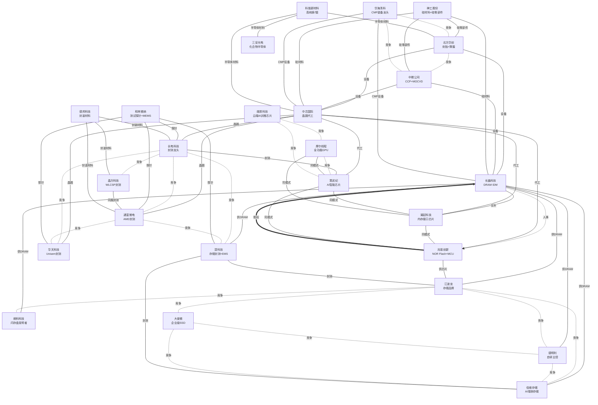
```mermaid
%%{init: {'themeVariables': {'fontSize': '10px'}}}%%
graph TB
    长鑫科技[长鑫科技<br/>DRAM IDM]
    兆易创新[兆易创新<br/>NOR Flash+MCU]
    江波龙[江波龙<br/>存储品牌]
    佰维存储[佰维存储<br/>AI端侧存储]
    德明利[德明利<br/>自研主控]
    朗科科技[朗科科技<br/>闪存盘发明者]
    大普微[大普微<br/>企业级SSD]
    澜起科技[澜起科技<br/>内存接口芯片]
    北方华创[北方华创<br/>刻蚀+薄膜]
    中微公司[中微公司<br/>CCP+MOCVD]
    中芯国际[中芯国际<br/>晶圆代工]
    长电科技[长电科技<br/>封测龙头]
    通富微电[通富微电<br/>AMD封测]
    华天科技[华天科技<br/>Unisem封测]
    深科技[深科技<br/>存储封测+EMS]
    寒武纪[寒武纪<br/>AI智能芯片]
    摩尔线程[摩尔线程<br/>全功能GPU]
    晶方科技[晶方科技<br/>WLCSP封测]
    德邦科技[德邦科技<br/>封装材料]
    华海清科[华海清科<br/>CMP装备龙头]

    长鑫科技 -.->|人事| 兆易创新
    兆易创新 ==>|股权| 长鑫科技
    长鑫科技 ---|互补| 澜起科技
    长鑫科技 ---|供DRAM| 江波龙
    长鑫科技 ---|供DRAM| 佰维存储
    长鑫科技 ---|供DRAM| 德明利
    长鑫科技 ---|供DRAM| 朗科科技
    兆易创新 ---|供芯片| 江波龙
    北方华创 ---|设备| 长鑫科技
    中微公司 ---|设备| 长鑫科技
    北方华创 ---|设备| 中芯国际
    中微公司 ---|设备| 中芯国际
    中芯国际 ---|代工| 兆易创新
    中芯国际 ---|代工| 澜起科技
    中芯国际 ---|晶圆| 长电科技
    中芯国际 ---|晶圆| 通富微电
    中芯国际 ---|晶圆| 华天科技
    长电科技 -.-|竞争| 通富微电
    长电科技 -.-|竞争| 华天科技
    通富微电 -.-|竞争| 华天科技
    澜起科技 ---|同模式| 兆易创新
    北方华创 -.-|竞争| 中微公司
    江波龙 -.-|竞争| 佰维存储
    江波龙 -.-|竞争| 德明利
    德明利 -.-|竞争| 佰维存储
    江波龙 -.-|竞争| 朗科科技
    江波龙 -.-|竞争| 大普微
    大普微 -.-|竞争| 佰维存储
    大普微 -.-|竞争| 德明利
    长鑫科技 ---|供DRAM| 深科技
    深科技 ---|封测| 江波龙
    深科技 ---|封测| 佰维存储
    神工股份[神工股份<br/>硅材料+硅零部件]
    和林微纳[和林微纳<br/>测试探针+MEMS]
    长电科技 -.-|竞争| 深科技
    通富微电 -.-|竞争| 深科技
    神工股份 ---|硅材料| 长鑫科技
    神工股份 ---|硅材料| 中芯国际
    神工股份 ---|硅零部件| 北方华创
    神工股份 ---|硅零部件| 中微公司
    和林微纳 ---|探针| 长电科技
    和林微纳 ---|探针| 通富微电
    和林微纳 ---|探针| 华天科技
    和林微纳 ---|探针| 深科技
    中芯国际 ---|代工| 寒武纪
    长电科技 ---|封测| 寒武纪
    长电科技 -.-|竞争| 晶方科技
    晶方科技 ---|同属封测| 通富微电
    德邦科技 ---|封装材料| 长电科技
    德邦科技 ---|封装材料| 通富微电
    德邦科技 ---|封装材料| 晶方科技
    华海清科 ---|CMP设备| 中芯国际
    华海清科 ---|CMP设备| 长鑫科技
    华海清科 -.-|竞争| 北方华创
    华海清科 -.-|竞争| 中微公司
    寒武纪 ---|同模式| 澜起科技
    寒武纪 ---|同模式| 兆易创新
    摩尔线程 -.-|竞争| 寒武纪
    摩尔线程 ---|同模式| 寒武纪
    摩尔线程 ---|同模式| 澜起科技
    燧原科技[燧原科技<br/>云端AI训推芯片]
    燧原科技 -.-|竞争| 寒武纪
    燧原科技 -.-|竞争| 摩尔线程
    科能新材料[科能新材料<br/>高纯镓/铟]
    科能新材料 ---|半导体材料| 三安光电[三安光电<br/>化合物半导体]
    科能新材料 ---|半导体材料| 中芯国际
    科能新材料 ---|半导体材料| 北方华创

    classDef personnel fill:#ff6b6b,color:#fff,stroke:#c92a2a
    classDef equity fill:#f06595,color:#fff,stroke:#a61e4d
    classDef business fill:#4dabf7,color:#fff,stroke:#1971c2
    classDef competition fill:#ffd43b,color:#333,stroke:#fab005
```

## 光通信产业

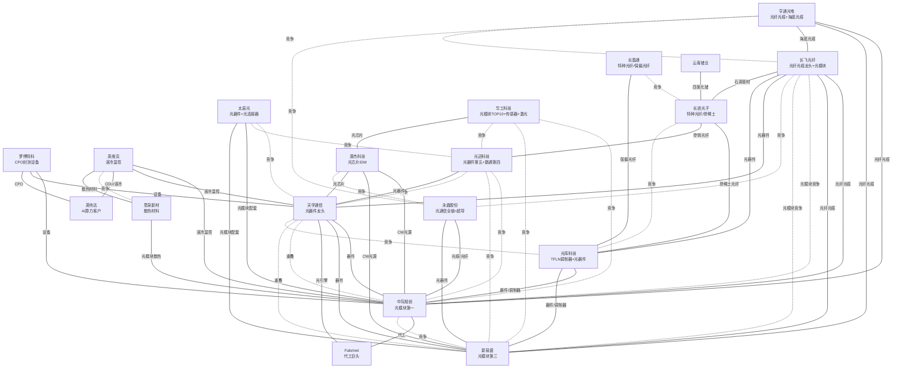
```mermaid
%%{init: {'themeVariables': {'fontSize': '10px'}}}%%
graph TB
    天孚通信[天孚通信<br/>光器件龙头]
    光库科技[光库科技<br/>TFLN调制器+光器件]
    中际旭创[中际旭创<br/>光模块第一]
    新易盛[新易盛<br/>光模块第三]
    罗博特科[罗博特科<br/>CPO封测设备]
    Fabrinet[Fabrinet<br/>代工巨头]
    英伟达[英伟达<br/>AI算力客户]
    英维克[英维克<br/>液冷温控]
    源杰科技[源杰科技<br/>光芯片IDM]
    思泉新材[思泉新材<br/>散热材料]
    永鼎股份[永鼎股份<br/>光通信全链+超导]
    长飞光纤[长飞光纤<br/>光纤光缆龙头+光模块]
    亨通光电[亨通光电<br/>光纤光缆+海底光缆]
    光迅科技[光迅科技<br/>光器件第五+数通第四]
    太辰光[太辰光<br/>光器件+光连接器]
    长进光子[长进光子<br/>特种光纤/掺稀土]
    长盈通[长盈通<br/>特种光纤/保偏光纤]
    华工科技[华工科技<br/>光模块TOP10+传感器+激光]

    天孚通信 ---|器件| 中际旭创
    天孚通信 ---|器件| 新易盛
    天孚通信 ---|光引擎| Fabrinet
    光库科技 ---|器件/调制器| 中际旭创
    光库科技 ---|器件/调制器| 新易盛
    中际旭创 ---|代工| Fabrinet
    光迅科技 -.-|竞争| 中际旭创
    光迅科技 -.-|竞争| 新易盛
    光迅科技 -.-|竞争| 天孚通信
    光迅科技 ---|光器件| 天孚通信
    罗博特科 ---|设备| 中际旭创
    罗博特科 ---|设备| 天孚通信
    罗博特科 ---|CPO| 英伟达
    英维克 ---|液冷温控| 中际旭创
    英维克 ---|液冷温控| 天孚通信
    英维克 ---|CDU/液冷| 英伟达
    源杰科技 ---|CW光源| 中际旭创
    源杰科技 ---|CW光源| 新易盛
    源杰科技 ---|光芯片| 天孚通信
    源杰科技 -.-|竞争| 永鼎股份
    永鼎股份 ---|光缆/光纤| 中际旭创
    永鼎股份 ---|光器件| 新易盛
    中际旭创 -.-|竞争| 新易盛
    天孚通信 -.-|重叠| 中际旭创
    天孚通信 -.-|重叠| 新易盛
    天孚通信 -.-|竞争| 光库科技
    思泉新材 ---|散热材料| 英维克
    思泉新材 ---|光模块散热| 中际旭创
    英维克 -.-|竞争| 思泉新材
    长飞光纤 ---|光纤光缆| 中际旭创
    长飞光纤 ---|光纤光缆| 新易盛
    长飞光纤 -.-|光模块竞争| 中际旭创
    长飞光纤 -.-|光模块竞争| 新易盛
    长飞光纤 -.-|竞争| 永鼎股份
    长飞光纤 ---|光器件| 天孚通信
    长飞光纤 ---|光器件| 光库科技
    亨通光电 ---|光纤光缆| 中际旭创
    亨通光电 ---|光纤光缆| 新易盛
    亨通光电 ---|海底光缆| 长飞光纤
    亨通光电 -.-|竞争| 永鼎股份
    亨通光电 -.-|竞争| 长飞光纤
    太辰光 -.-|竞争| 天孚通信
    太辰光 -.-|竞争| 光迅科技
    太辰光 ---|光模块配套| 中际旭创
    太辰光 ---|光模块配套| 新易盛
    华工科技 -.-|竞争| 中际旭创
    华工科技 -.-|竞争| 新易盛
    华工科技 -.-|竞争| 光迅科技
    华工科技 ---|光芯片| 源杰科技
    长进光子 ---|掺稀土光纤| 光库科技
    长进光子 ---|掺铒光纤| 光迅科技
    长进光子 -.-|竞争| 光库科技
    长盈通 -.-|竞争| 长进光子
    长盈通 ---|保偏光纤| 光库科技
    长飞光纤 ---|石英管材| 长进光子
    云南锗业 ---|四氯化锗| 长进光子

    classDef business fill:#4dabf7,color:#fff,stroke:#1971c2
    classDef competition fill:#ffd43b,color:#333,stroke:#fab005
```

## 机器人产业

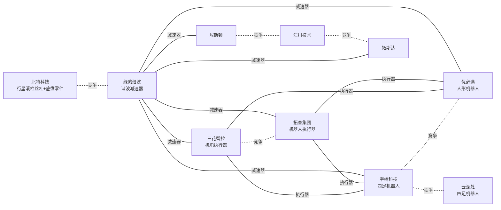
```mermaid
%%{init: {'themeVariables': {'fontSize': '10px'}}}%%
graph LR
    宇树科技[宇树科技<br/>四足机器人]
    优必选[优必选<br/>人形机器人]
    云深处[云深处<br/>四足机器人]
    三花智控[三花智控<br/>机电执行器]
    拓普集团[拓普集团<br/>机器人执行器]
    绿的谐波[绿的谐波<br/>谐波减速器]
    北特科技[北特科技<br/>行星滚柱丝杠+底盘零件]
    宇树科技 -.-|竞争| 优必选
    宇树科技 -.-|竞争| 云深处
    三花智控 ---|执行器| 宇树科技
    三花智控 ---|执行器| 优必选
    拓普集团 ---|执行器| 宇树科技
    拓普集团 ---|执行器| 优必选
    三花智控 -.-|竞争| 拓普集团
    绿的谐波 ---|减速器| 宇树科技
    绿的谐波 ---|减速器| 优必选
    绿的谐波 ---|减速器| 三花智控
    绿的谐波 ---|减速器| 拓斯达
    汇川技术 -.-|竞争| 拓斯达
    埃斯顿 -.-|竞争| 汇川技术
    绿的谐波 ---|减速器| 埃斯顿
    绿的谐波 ---|减速器| 拓普集团
    北特科技 -.-|竞争| 绿的谐波

    classDef business fill:#4dabf7,color:#fff,stroke:#1971c2
    classDef competition fill:#ffd43b,color:#333,stroke:#fab005
```

## PCB产业

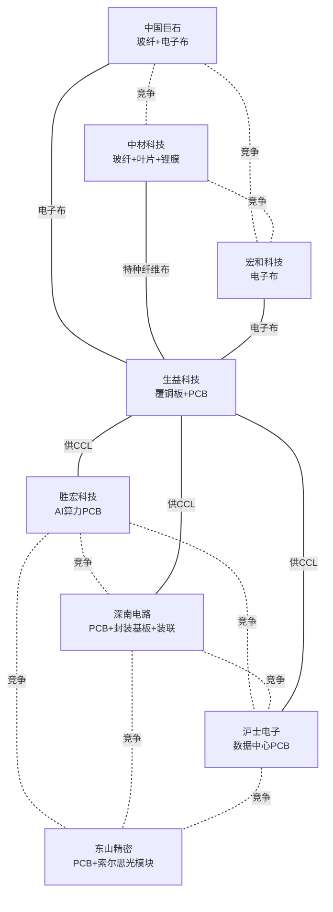
```mermaid
%%{init: {'themeVariables': {'fontSize': '10px'}}}%%
graph TB
    胜宏科技[胜宏科技<br/>AI算力PCB]
    深南电路[深南电路<br/>PCB+封装基板+装联]
    沪士电子[沪士电子<br/>数据中心PCB]
    东山精密[东山精密<br/>PCB+索尔思光模块]
    生益科技[生益科技<br/>覆铜板+PCB]
    中国巨石[中国巨石<br/>玻纤+电子布]
    中材科技[中材科技<br/>玻纤+叶片+锂膜]
    宏和科技[宏和科技<br/>电子布]

    胜宏科技 -.-|竞争| 深南电路
    胜宏科技 -.-|竞争| 沪士电子
    深南电路 -.-|竞争| 沪士电子
    胜宏科技 -.-|竞争| 东山精密
    深南电路 -.-|竞争| 东山精密
    沪士电子 -.-|竞争| 东山精密
    生益科技 ---|供CCL| 胜宏科技
    生益科技 ---|供CCL| 深南电路
    生益科技 ---|供CCL| 沪士电子
    中国巨石 ---|电子布| 生益科技
    中材科技 ---|特种纤维布| 生益科技
    宏和科技 ---|电子布| 生益科技
    中国巨石 -.-|竞争| 中材科技
    中国巨石 -.-|竞争| 宏和科技
    中材科技 -.-|竞争| 宏和科技

    classDef competition fill:#ffd43b,color:#333,stroke:#fab005
    classDef business fill:#4dabf7,color:#fff,stroke:#1971c2
```

## 玻璃纤维

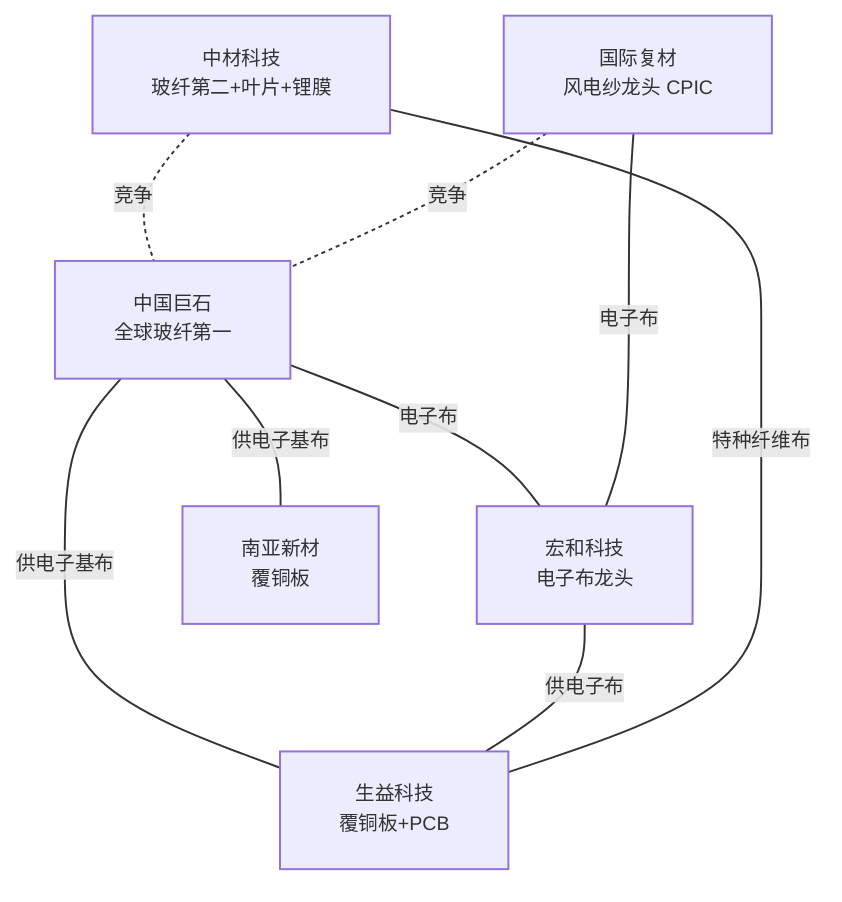
```mermaid
%%{init: {'themeVariables': {'fontSize': '10px'}}}%%
graph TB
    国际复材[国际复材<br/>风电纱龙头 CPIC]
    中国巨石[中国巨石<br/>全球玻纤第一]
    中材科技[中材科技<br/>玻纤第二+叶片+锂膜]
    宏和科技[宏和科技<br/>电子布龙头]
    生益科技[生益科技<br/>覆铜板+PCB]
    南亚新材[南亚新材<br/>覆铜板]

    国际复材 -.-|竞争| 中国巨石
    中材科技 -.-|竞争| 中国巨石
    中材科技 ---|特种纤维布| 生益科技
    国际复材 ---|电子布| 宏和科技
    中国巨石 ---|电子布| 宏和科技
    宏和科技 ---|供电子布| 生益科技
    中国巨石 ---|供电子基布| 生益科技
    中国巨石 ---|供电子基布| 南亚新材

    classDef business fill:#4dabf7,color:#fff,stroke:#1971c2
    classDef competition fill:#ffd43b,color:#333,stroke:#fab005
```

## 航天 / AI 算力（美股）

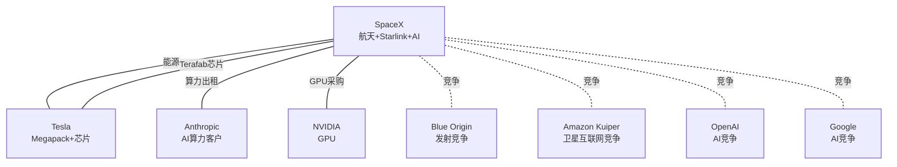
```mermaid
%%{init: {'themeVariables': {'fontSize': '10px'}}}%%
graph TB
    SpaceX[SpaceX<br/>航天+Starlink+AI]
    Tesla[Tesla<br/>Megapack+芯片]
    Anthropic[Anthropic<br/>AI算力客户]
    NVIDIA[NVIDIA<br/>GPU]
    OpenAI[OpenAI<br/>AI竞争]
    BlueOrigin[Blue Origin<br/>发射竞争]
    Amazon[Amazon Kuiper<br/>卫星互联网竞争]
    Google[Google<br/>AI竞争]

    SpaceX ---|能源| Tesla
    SpaceX ---|Terafab芯片| Tesla
    SpaceX ---|算力出租| Anthropic
    SpaceX ---|GPU采购| NVIDIA
    SpaceX -.-|竞争| BlueOrigin
    SpaceX -.-|竞争| Amazon
    SpaceX -.-|竞争| OpenAI
    SpaceX -.-|竞争| Google

    classDef business fill:#4dabf7,color:#fff,stroke:#1971c2
    classDef competition fill:#ffd43b,color:#333,stroke:#fab005
```

## 铜 / 电磁线 / 输变电

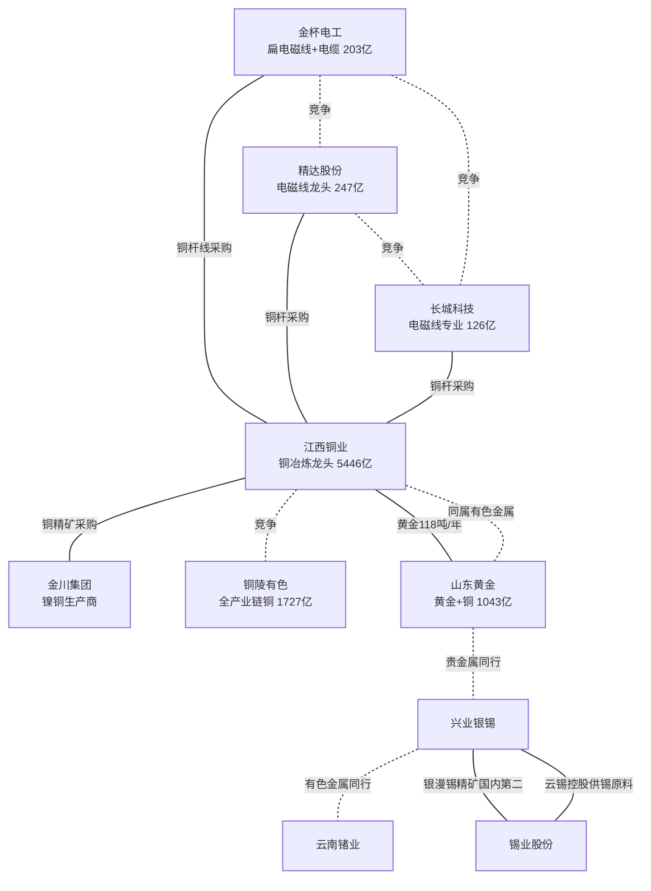
```mermaid
%%{init: {'themeVariables': {'fontSize': '10px'}}}%%
graph TB
    江西铜业[江西铜业<br/>铜冶炼龙头 5446亿]
    铜陵有色[铜陵有色<br/>全产业链铜 1727亿]
    金杯电工[金杯电工<br/>扁电磁线+电缆 203亿]
    精达股份[精达股份<br/>电磁线龙头 247亿]
    长城科技[长城科技<br/>电磁线专业 126亿]
    山东黄金[山东黄金<br/>黄金+铜 1043亿]
    金川集团[金川集团<br/>镍铜生产商]
    金杯电工 ---|铜杆线采购| 江西铜业
    精达股份 ---|铜杆采购| 江西铜业
    长城科技 ---|铜杆采购| 江西铜业
    江西铜业 ---|铜精矿采购| 金川集团
    江西铜业 -.-|竞争| 铜陵有色
    金杯电工 -.-|竞争| 精达股份
    金杯电工 -.-|竞争| 长城科技
    精达股份 -.-|竞争| 长城科技
    江西铜业 ---|黄金118吨/年| 山东黄金
    山东黄金 -.-|同属有色金属| 江西铜业
    山东黄金 -.-|贵金属同行| 兴业银锡
    兴业银锡 -.-|有色金属同行| 云南锗业
    兴业银锡 ---|银漫锡精矿国内第二| 锡业股份
    锡业股份 ---|云锡控股供锡原料| 兴业银锡

    classDef business fill:#4dabf7,color:#fff,stroke:#1971c2
    classDef competition fill:#ffd43b,color:#333,stroke:#fab005
```

## 显示面板 / 基板玻璃

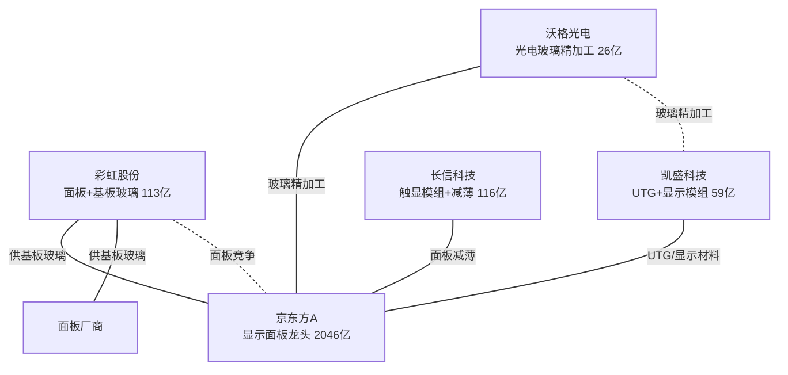
```mermaid
%%{init: {'themeVariables': {'fontSize': '10px'}}}%%
graph TB
    京东方A[京东方A<br/>显示面板龙头 2046亿]
    彩虹股份[彩虹股份<br/>面板+基板玻璃 113亿]
    沃格光电[沃格光电<br/>光电玻璃精加工 26亿]
    凯盛科技[凯盛科技<br/>UTG+显示模组 59亿]
    长信科技[长信科技<br/>触显模组+减薄 116亿]
    彩虹股份 ---|供基板玻璃| 京东方A
    彩虹股份 ---|供基板玻璃| 面板厂商
    沃格光电 ---|玻璃精加工| 京东方A
    凯盛科技 ---|UTG/显示材料| 京东方A
    长信科技 ---|面板减薄| 京东方A
    彩虹股份 -.-|面板竞争| 京东方A
    沃格光电 -.-|玻璃精加工| 凯盛科技

    classDef business fill:#4dabf7,color:#fff,stroke:#1971c2
    classDef competition fill:#ffd43b,color:#333,stroke:#fab005
```

## 软件与信创（中国电子系）

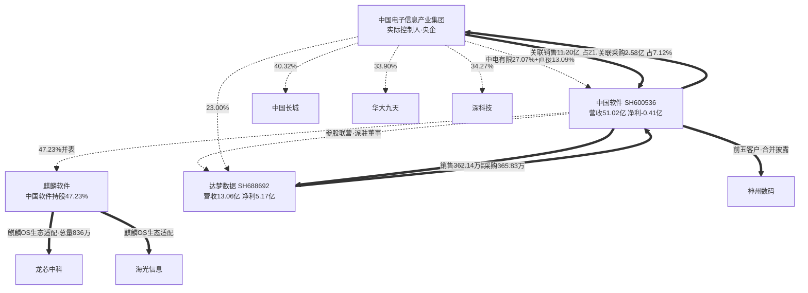
```mermaid
%%{init: {'themeVariables': {'fontSize': '10px'}}}%%
graph TB
    中国电子[中国电子信息产业集团<br/>实际控制人·央企]
    中国软件[中国软件 SH600536<br/>营收51.02亿 净利-0.41亿]
    麒麟软件[麒麟软件<br/>中国软件持股47.23%]
    达梦数据[达梦数据 SH688692<br/>营收13.06亿 净利5.17亿]
    神州数码[神州数码]
    中国长城[中国长城]
    华大九天[华大九天]
    深科技[深科技]
    龙芯中科[龙芯中科]
    海光信息[海光信息]

    中国电子 -.->|中电有限27.07%+直接13.09%| 中国软件
    中国软件 -.->|47.23%并表| 麒麟软件
    中国软件 -.->|参股联营·派驻董事| 达梦数据
    中国电子 -.->|23.00%| 达梦数据
    中国电子 -.->|40.32%| 中国长城
    中国电子 -.->|33.90%| 华大九天
    中国电子 -.->|34.27%| 深科技
    中国电子 ==>|关联销售11.20亿 占21.96%| 中国软件
    中国软件 ==>|关联采购2.58亿 占7.12%| 中国电子
    中国软件 ==>|前五客户·合并披露| 神州数码
    达梦数据 ==>|数据库采购365.83万| 中国软件
    中国软件 ==>|销售362.14万| 达梦数据
    麒麟软件 ==>|麒麟OS生态适配·总量836万| 龙芯中科
    麒麟软件 ==>|麒麟OS生态适配| 海光信息

    classDef equity fill:#b197fc,color:#fff,stroke:#7048e8
    classDef business fill:#4dabf7,color:#fff,stroke:#1971c2
```

### 人事关联

| 关联人 | 公司A | 角色 | 公司B | 角色 |
|--------|-------|------|-------|------|
| 朱一明 | [[长鑫科技]] | 董事长 | [[兆易创新]] | 创始人 |
| Elon Musk | [[SpaceX]] | CEO / 实控人 | Tesla | CEO |
| 朱双全 | [[中元股份]] | 董事长 | [[鼎龙股份]] | 董事长、共同实际控制人 |
| 朱顺全 | [[中元股份]] | 董事 | [[鼎龙股份]] | 董事、总经理、共同实际控制人 |
| 谌志华 | [[中国软件]] | 党委书记、董事长 | 达梦数据（SH688692） | 副董事长（2024年08月至今，另任麒麟软件党委书记、董事长） |
| 黄刚 | [[中国软件]] | 财务总监（主管会计工作负责人） | 达梦数据（SH688692） | 董事（2024年08月至今） |
| 张尼 | [[中国软件]] | 董事 | [[华大九天]] | 董事（2024年12月至今，另任股东单位中国电子产业规划部主任） |
| 陈刚 | [[中国船舶]] | 董事 | [[中国动力]] | 非独立董事（2026年03月至今） |
| 王瑛 | [[中国船舶]] | 独立董事 | [[中国中免]] | 独立董事（2023年06月至今） |
| 陈缨 | [[中国船舶]] | 独立董事 | 东方海外（国际）（00316.HK） | 独立非执行董事（2018年08月至今） |
| 陈缨 | [[中国船舶]] | 独立董事 | [[沪农商行]] | 独立董事（2023年11月至今） |
| 陈缨 | [[中国船舶]] | 独立董事 | 五矿资源（01208.HK） | 独立非执行董事（2024年07月至今） |
| 冷建兴 | [[中国船舶]] | 独立董事 | [[杭齿前进]] | 独立董事（2025年09月至今） |
| 李小荣 | [[中国卫星]] | 独立董事 | [[中国电影]] | 独立董事（2022年09月至今） |
| 李小荣 | [[中国卫星]] | 独立董事 | [[汉王科技]] | 独立董事（2024年05月至今） |

### 股权关联（统一表）

| 持股方 | 被持股方 | 金额/比例 | 备注 |
|--------|---------|----------|------|
| [[兆易创新]] | [[长鑫科技]] | ~8亿 | 招股书披露，分两轮投资 |
| 中国建材集团 | [[中国巨石]] | 控股 | 实际控制人（央企），通过中国建材股份控股 |
| 中国建材集团 | [[中材科技]] | 控股 | 实际控制人（央企），通过中国建材股份控股 |
| 中央汇金 + 证金 + 汇金资管 | [[中国银行]] | 61.62% | 国家队3家机构共持 |
| 中央汇金 + 证金 + 汇金资管 | [[建设银行]] | 55.64% | 国家队3家机构共持 |
| 中央汇金 + 证金 + 汇金资管 | [[农业银行]] | 41.03% | 国家队3家机构共持 |
| 中央汇金 + 证金 + 汇金资管 | [[工商银行]] | 35.76% | 国家队3家机构共持 |
| 中央汇金（独占） | [[交通银行]] | 2.14% | 仅汇金1家持有 |
| 中央汇金 + 证金 | [[申万宏源]] | 22.59% | 汇金为大股东 |
| 中央汇金 | [[中金公司]] | 40.11% | 汇金控股股东 |
| 中央汇金 | [[中信建投]] | 30.76% | 汇金第二大股东 |
|| 中国出版集团 | [[中国出版]] | 69.79% | 控股股东及实际控制人 |
|| 中国电信集团 | [[中国出版]] | 7.28% | 第二大股东 |
|| [[招商公路]] | [[中原高速]] | 15.43% | 第二大股东，招商局旗下公路投资平台 |
| 中国电子有限公司+中国电子信息产业集团+中电金投 | [[中国软件]] | 27.07%+13.09%+2.41% | 控股股东+实际控制人（央企）+其全资子公司（2025年报） |
| [[中国软件]] | 达梦数据（SH688692） | 20%以下 | 参股联营：董事会派有代表、具有重大影响；谌志华任达梦副董事长、黄刚任董事 |
| 中国电子信息产业集团 | 达梦数据（SH688692） | 23.00% | 实际控制人通过关联方及一致行动人合计持有（2025年报） |
| 中国电子信息产业集团 | [[中国长城]] | 40.32% | 同上 |
| 中国电子信息产业集团 | [[华大九天]] | 33.90% | 同上 |
| 中国电子信息产业集团 | [[深科技]] | 34.27% | 同上 |
| 中国船舶工业集团（控股股东） | [[中国船舶]] | 直接26.68%+经[[中船防务]]间接2.89%，表决权29.57% | 实控人中国船舶集团经一致行动人合计表决权49.29%；2025年换股吸收合并中国重工（中国重工成为全资子公司，2024年数据追溯调整）（2025年报） |
| 中国船舶集团（实际控制人） | [[中国船舶]] · [[中船防务]] · [[中船科技]] · [[中国动力]] · [[中国海防]] · [[中船汉光]] · [[久之洋]] · [[昆船智能]] | 同一实控人体系 | 中船集团旗下共11家上市公司，其中8家在库；未在库3家：中国应急（300527）、中船特气（688146）、中船租赁（03877.HK）（2025年报） |

### 业务关联（统一表 · 供应商-客户 / 技术互补）

| 上游 | 方向 | 下游 | 说明 |
|------|------|------|------|
| [[长鑫科技]] DRAM颗粒 | → | [[澜起科技]] 内存接口芯片 | 共同组成内存模组（MRDIMM方案） |
| [[长鑫科技]] DRAM颗粒 | → | [[江波龙]] 存储模组 | DRAM晶圆 → 品牌模组封装 |
| [[光迅科技]] 光器件/光模块 | → | 数据中心/电信运营商 | 全球光器件第五，数通光器件第四（5.9%） |
| [[天孚通信]] 光引擎 | → | [[Fabrinet]] 代工厂 | 核心客户，独占63%收入 |
| [[罗博特科]] (ficonTEC) | → | [[天孚通信]] [[中际旭创]] | 硅光/CPO封测设备 |
| [[光库科技]] 光通讯器件/铌酸锂调制器 | → | [[中际旭创]] [[新易盛]] | TFLN调制器+FAU等光器件 → 光模块集成 |
| [[罗博特科]] (ficonTEC) | → | [[英伟达]] | CPO设备核心供应商 |
| [[北方华创]] 半导体设备 | → | [[长鑫科技]] DRAM产线 | 刻蚀/薄膜/清洗设备 |
| [[中微公司]] 刻蚀/MOCVD设备 | → | [[长鑫科技]] [[中芯国际]]等晶圆厂 | CCP刻蚀设备已进入客户产线 |
| [[北方华创]] 半导体设备 | → | [[中芯国际]] 晶圆产线 | 刻蚀/薄膜/热处理/清洗设备 |
| [[中芯国际]] 晶圆代工 | → | [[兆易创新]] [[澜起科技]] | 芯片制造 → Fabless设计公司 |
| [[中芯国际]] 晶圆代工 | → | [[长电科技]] 封测 | 晶圆制造（前道）→ 封测（后道） |
| [[中芯国际]] 晶圆代工 | → | [[通富微电]] 封测 | 晶圆制造（前道）→ 封测（后道） |
| [[中芯国际]] 晶圆代工 | → | [[华天科技]] 封测 | 晶圆制造（前道）→ 封测（后道） |
| [[长鑫科技]] DRAM颗粒 | → | [[佰维存储]] 存储模组 | DRAM晶圆 → AI端侧存储/封测 |
| [[长鑫科技]] DRAM颗粒 | → | [[德明利]] 存储模组 | DRAM晶圆 → 自研主控+存储模组 |
| [[长鑫科技]] DRAM颗粒 | → | [[朗科科技]] 存储模组 | DRAM晶圆 → 存储品牌/模组 |
| [[兆易创新]] 存储芯片 | → | [[江波龙]] 存储模组 | 芯片设计商 → 品牌模组商 |
| [[拓普集团]] 机器人执行器 | → | [[宇树科技]] [[优必选]] | 直线/旋转执行器+灵巧手电机 → 机器人本体制造商 |
| [[汇川技术]] 伺服/电机/执行器 | → | [[宇树科技]] [[优必选]] | 伺服系统+无框电机+关节模组 → 机器人本体制造商 |
| [[长鑫科技]] DRAM颗粒 | → | [[深科技]] 存储封测 | DRAM晶圆 → 高端存储芯片封测（深圳沛顿+合肥沛顿双基地） |
| [[深科技]] 存储芯片封测 | → | [[江波龙]] [[佰维存储]] | 封测成品 → 存储模组品牌商 |
| [[神工股份]] 大直径硅材料/硅零部件 | → | [[长鑫科技]] [[中芯国际]] | 刻蚀用硅材料/硅零部件 → 存储芯片/晶圆厂 |
| [[神工股份]] 硅零部件 | → | [[北方华创]] [[中微公司]] | 硅零部件 → 刻蚀设备厂（耗材） |
| [[和林微纳]] 半导体测试探针 | → | [[长电科技]] [[通富微电]] [[华天科技]] [[深科技]] | 测试探针 → 封测厂 |
| [[中芯国际]] 晶圆代工 | → | [[寒武纪]] AI智能芯片 | 晶圆制造 → Fabless设计公司（云端AI芯片）⚠️ 据2020年招股书/公开资料，**2025年报未具名代工方** |
| [[长电科技]] 封装测试 | → | [[寒武纪]] AI智能芯片 | 晶圆封测 → Fabless设计公司（2025年报披露封测成本3.43亿/占成本11.80%**未具名封测厂**，长电科技据招股书/公开资料） |
| [[深南电路]] PCB板卡加工 | → | [[燧原科技]] 云端AI加速卡 | 板卡加工 → AI加速卡及模组（招股书披露2025年采购9,597.28万元/占采购10.32%） |
| [[华海清科]] CMP/减薄/离子注入装备 | → | [[中芯国际]] [[长鑫科技]] | CMP装备/减薄/离子注入 → 晶圆制造/封测厂 |
| [[中芯国际]] 晶圆代工 | → | [[晶方科技]] WLCSP | 晶圆制造 → 传感器封装（CIS封测全球领先） |
| [[英维克]] 液冷温控设备 | → | [[中际旭创]] [[天孚通信]] [[寒武纪]] | 数据中心液冷散热 → AI算力设备/光模块 |
| [[英维克]] CDU/液冷方案 | → | [[英伟达]] | MGX生态合作伙伴，为Google定制Deschutes 5 CDU |
| [[三花智控]] 热管理 | → | [[英维克]] | 同属热管理赛道（不同应用领域：汽车/机器人 vs 数据中心/储能） |
| [[源杰科技]] CW激光器芯片 | → | [[中际旭创]] [[新易盛]] 光模块 | 硅光模块核心光源（70mW/100mW大功率DFB） → 光模块制造商 |
| [[源杰科技]] CW激光器芯片 | → | [[华工科技]] 光模块 | 光芯片 → 光模块（华工自研硅光+薄膜铌酸锂芯片，同时外购CW光源） |
| [[思泉新材]] 散热材料 | → | [[英维克]] 温控设备 | 散热材料（石墨膜/VC/热管）→ 温控设备集成 |
| [[思泉新材]] 散热方案 | → | [[中际旭创]] [[新易盛]] 光模块 | 光模块散热材料/模组（样品阶段） |
| [[绿的谐波]] 谐波减速器 | → | [[拓斯达]] [[埃斯顿]] 工业机器人 | 机器人核心零部件 → 机器人本体制造商（埃斯顿出货量中国第一） |
| [[永鼎股份]] 光纤光缆/光器件 | → | [[中际旭创]] [[新易盛]] | 光纤光缆/光器件 → 光模块制造 |
| [[永鼎股份]] 光芯片 | → | [[中际旭创]] [[新易盛]] | IDM激光器芯片（CW-DFB/EML）→ 光模块 |
| [[顺络电子]] 电源管理电感/TLVR | → | [[寒武纪]] AI芯片 | AI服务器GPU/CPU/ASIC供电模组核心器件 |
| [[顺络电子]] 车规电感/陶瓷 | → | [[拓普集团]] [[三花智控]] | 汽车电子元器件 → 汽车零部件供应商 |
| [[SpaceX]] COLOSSUS 算力集群 | → | Anthropic | $12.5亿/月云算力合同，租用 AI 训练集群（2029年到期） |
| [[SpaceX]] Starlink 卫星互联网 | → | 全球用户 | ~740万月活设备，覆盖 ~30 个国家 |
| Teslagapack 储能 | → | [[SpaceX]] 发射场/数据中心 | 发射场及 AI 数据中心储能系统 |
| [[SpaceX]] Falcon/Starship 发射 | → | NASA / NRO / SES 等 | 商业+政府发射服务（NASA 载人/货运合同） |
| [[思必驰]] 对话式AI技术 | → | [[智元]] / 银河通用 / 魔法原子 | AI语音交互 → 具身机器人（人机交互入口） |
| [[国仪量子]] 电镜/科学仪器 | → | [[中芯国际]] / [[长鑫科技]] | 高端科学仪器（SEM/EPR）→ 半导体制造检测 |
| [[国际复材]] 玻纤电子布 | → | [[生益科技]] [[南亚新材]] 覆铜板 | 玻纤电子布 → 覆铜板增强材料 |
| [[中国巨石]] 电子基布 | → | [[生益科技]] [[南亚新材]] 覆铜板 | 玻纤电子基布 → 覆铜板增强材料 |
| [[国际复材]] 玻纤细纱/电子布 | → | [[宏和科技]] | 同属电子布赛道，国际复材为玻纤纱→布一体化，宏和科技聚焦高端特种电子布 |
| [[太辰光]] 光模块配套产品 | → | [[中际旭创]] [[新易盛]] 光模块 | MTP/MPO连接器、光模块内部连接器 → 光模块厂商 |
| [[云南锗业]] 磷化铟晶片 | → | [[中际旭创]] [[新易盛]] 光模块 | 化合物半导体衬底 → 光通讯激光器/探测器 → 光模块 |
| [[云南锗业]] 光纤级四氯化锗 | → | [[长飞光纤]] [[亨通光电]] | 光纤预制棒关键原材料 → 光纤光缆制造 |
| [[中材科技]] 泰山玻纤特种纤维布 | → | [[生益科技]] 覆铜板 | 低介电/低膨胀特种纤维布 → 覆铜板核心材料 |
| [[长进光子]] 掺稀土光纤 | → | [[光库科技]] 光纤激光器件 | 掺稀土光纤 → 光纤激光器核心器件 |
| [[光库科技]] 光纤激光器件 | → | [[锐科激光]] 光纤激光器 | 光纤激光器件（泵浦源/隔离器/合束器） → 光纤激光器整机 |
| [[长进光子]] 掺铒光纤 | → | [[光迅科技]] 光放大器 | 掺铒光纤 → EDFA光放大器核心材料 |
| [[长飞光纤]] 石英管材（长飞石英） | → | [[长进光子]] 特种光纤 | 石英管材 → 特种光纤预制棒制备 |
| [[云南锗业]] 四氯化锗 | → | [[长进光子]] 特种光纤 | 光纤预制棒关键原材料 → 特种光纤制造 |
| [[江西铜业]] 铜精矿 | → | [[金川集团]] 铜镍生产 | 江西铜业第一大供应商 |
| [[彩虹股份]] G8.5+基板玻璃 | → | [[京东方A]] 液晶面板 | 基板玻璃 → 面板制造核心材料 |
| [[彩虹股份]] 基板玻璃 | → | 面板厂商 | 基板玻璃广泛供应知名面板厂商 |
| [[沃格光电]] 玻璃精加工 | → | [[京东方A]] 面板 | 薄化/镀膜/切割 → 面板制造 |
| [[凯盛科技]] UTG/显示材料 | → | [[京东方A]] 面板 | UTG超薄柔性玻璃 → 显示终端 |
| [[长信科技]] 面板减薄 | → | [[京东方A]] 面板 | 超薄液晶面板减薄 → 苹果认证供应商 |
| [[一彬科技]] 塑料件/金属件 | → | [[比亚迪]] · [[吉利]] · [[广汽丰田]] | 一级配套供应商 → 整车厂 |
| [[潍柴动力]] 发动机 | → | [[一汽解放]] | 动力总成供应商（间接） |
| [[一汽解放]] 中重卡 | → | 物流/工程/出口 | 整车制造 → 终端客户 |
| [[恒立液压]] 液压件 | → | [[三一重工]] | 核心零部件供应商 |
| [[潍柴动力]] 发动机 | → | [[三一重工]] · [[中联重科]] · [[徐工机械]] · [[柳工]] | 动力总成供应商 |
| [[金风科技]] 风机 | → | [[上海电气]] | 风电设备供应商 |
| [[上海电气]] 发电设备 | → | [[三峡能源]] | 新能源项目设备供应 |
| [[金风科技]] 风机 | → | [[三峡能源]] | 风电设备供应商 |
| [[运达股份]] 风机 | → | [[三峡能源]] | 风电设备供应商 |
| 隆基绿能 光伏组件 | → | [[三峡能源]] | 光伏设备供应商 |
| [[中国神华]] 煤炭 | → | [[上海电气]] 发电设备 | 煤电产业链 |
| [[中国神华]] 发电 | → | 国家电网 | 电力供应 |
| [[上海建工]] 建筑施工服务 | → | [[中华企业]] 房地产开发 | 中华企业第一大供应商（采购额1.77亿元，占采购总额19.00%）
| [[中国软件]] 党政解决方案/基础软件 | → | 中国电子信息产业集团及其子公司 | 关联销售112,025.83万元（占年度销售总额21.96%），计入前五名客户（合并披露） |
| 中国电子信息产业集团及其子公司 | → | [[中国软件]] | 关联采购25,769.34万元（占年度采购总额7.12%），计入前五名供应商（合并披露） |
| [[中国软件]] | → | [[神州数码]] | 神州数码列入2025年前五名客户（合并披露） |
| 达梦数据（SH688692）数据库 | ↔ | [[中国软件]] 麒麟OS/解决方案 | 参股联营+双向购销：2025年公司向达梦采购365.83万元、向达梦销售362.14万元 |
| 麒麟OS（[[中国软件]]子公司麒麟软件） | ↔ | [[龙芯中科]] [[海光信息]] 国产CPU | 技术互补：麒麟操作系统适配兼容飞腾、鲲鹏、龙芯、申威、兆芯、海光等国产CPU；生态软硬件兼容适配总量达836万 |
| [[中国船舶]] | ↔ | 中船集团及下属公司（含[[中国动力]]·[[中国海防]]等在库上市公司） | 集团内双向购销：前五名供应商采购额占47.37%（其中关联方采购占42.49%）/前五名客户销售额占35.40%（其中关联方销售占7.05%），同一控制口径合并列示（2025年报） |
| 中国远洋海运集团（[[中远海控]]·[[中远海能]]·[[中远海特]]等在库上市航运公司控股股东） | → | [[中国船舶]] | 2025年12月新造船合作：各型船舶87艘（含意向订单）、约500亿元（跨境人民币结算约470亿元），均由公司下属相关子公司承建（实控人中船集团与中远海运集团签约）（2025年报） |
| [[中国船舶]] | ↔ | [[鞍钢股份]] | 合营企业：鞍钢股份-大船重工大连钢材加工配送有限公司（船用钢材加工配送）（2025年报） |

### 竞争关联（统一表 · 同一赛道）

| 公司A | 公司B | 竞争领域 |
|-------|-------|---------|
| [[中际旭创]] | [[新易盛]]            | 光模块（800G/1.6T） |
| [[光迅科技]] | [[中际旭创]] / [[新易盛]] | 光器件/光模块（数通光器件第四 vs 第一/第三） |
| [[江波龙]]   | [[佰维存储]]           | 存储品牌/模组（国内双龙头） |
| [[江波龙]]   | [[德明利]]             | 存储品牌/模组 |
| [[德明利]]   | [[佰维存储]]           | 存储品牌/模组 |
| [[江波龙]]   | [[朗科科技]]           | 存储品牌/模组 |
| [[江波龙]]   | [[大普微]]            | 企业级SSD（重叠） |
| [[大普微]]   | [[佰维存储]]           | 企业级SSD（重叠） |
| [[大普微]]   | [[德明利]]             | SSD+自研主控 |
| [[宇树科技]] | [[优必选]]            | 人形机器人          |
| [[长电科技]] | [[通富微电]]           | 半导体封测（国内双雄） |
| [[长电科技]] | [[华天科技]]           | 半导体封测 |
| [[通富微电]] | [[华天科技]]           | 半导体封测 |
| [[北方华创]] | [[中微公司]]           | 半导体刻蚀设备        |
| [[天孚通信]] | [[中际旭创]] / [[新易盛]] | 有源光器件（局部重叠）    |
| [[三花智控]] | [[拓普集团]] | 机器人执行器 |
| [[长电科技]] | [[深科技]] | 存储封测（通用封测龙头 vs 存储封测专注） |
| [[通富微电]] | [[深科技]] | 存储封测 |
| [[三花智控]] | [[汇川技术]] | 机器人执行器/伺服 |
| [[拓普集团]] | [[汇川技术]] | 机器人执行器 |
| [[胜宏科技]] | [[深南电路]] | PCB（AI算力/通信） |
| [[胜宏科技]] | [[沪士电子]] | PCB（AI数据中心） |
| [[深南电路]] | [[沪士电子]] | PCB（数据中心/通信） |
| [[胜宏科技]] | [[东山精密]] | PCB（AI算力/HDI） |
| [[深南电路]] | [[东山精密]] | PCB（数据中心/通信） |
| [[沪士电子]] | [[东山精密]] | PCB（AI数据中心） |
| [[华海清科]] | [[北方华创]] / [[中微公司]] | 半导体设备（技术路径不同，CMP vs 刻蚀/薄膜，局部重叠） |
| [[寒武纪]] | [[澜起科技]] | 芯片设计（Fabless，同属AI算力产业链） |
| [[摩尔线程]] | [[寒武纪]] | GPU/AI芯片（全功能GPU vs AI智能芯片，同属国产GPU赛道） |
| [[寒武纪]] | [[兆易创新]] | 芯片设计（Fabless模式） |
| [[燧原科技]] | [[寒武纪]] | 国产云端AI芯片（训推一体 vs 思元系列，腾讯系 vs 中科系） |
| [[燧原科技]] | [[摩尔线程]] | 国产AI芯片（云端DSA训推 vs 全功能GPU） |
| [[燧原科技]] | [[海光信息]] | 国产AI训练/推理芯片（云端ASIC vs GPGPU/CPU） |
| [[英维克]] | [[三花智控]] | 热管理（数据中心液冷 vs 汽车/机器人热管理） |
| [[晶方科技]] | [[长电科技]] | 半导体封装（WLCSP vs 传统封测+先进封装） |
| [[晶方科技]] | [[通富微电]] | 半导体封装测试 |
| [[拓斯达]] | [[汇川技术]] | 工业自动化/机器人 |
| [[埃斯顿]] | [[汇川技术]] | 工业自动化/机器人 |
| [[埃斯顿]] | [[拓斯达]] | 工业机器人 |
| [[天孚通信]] | [[光库科技]] | 光器件（光引擎龙头 vs TFLN调制器+多元光器件） |
| [[太辰光]] | [[天孚通信]] / [[光迅科技]] | 光器件（光连接器/高密度连接器 vs 光引擎/光器件，同一赛道差异化竞争） |
| [[太辰光]] | [[光库科技]] | 光器件（光连接器 vs TFLN调制器+多元器件，局部重叠） |
| [[国际复材]] | [[中国巨石]] | 玻璃纤维（全球风电纱龙头 vs 全球玻纤龙头） |
| [[英维克]] | [[思泉新材]] | 热管理（温控设备龙头 vs 散热材料供应商，材料端 vs 设备端） |
| [[源杰科技]] | [[永鼎股份]] | 光芯片IDM（CW激光器芯片） |
| [[永鼎股份]] | [[中际旭创]] [[新易盛]] | 光通信（光缆/光器件/光芯片，部分重叠） |
| [[SpaceX]] | Blue Origin / ULA / Arianespace | 商业发射（全球唯一可复用火箭 vs 传统一次性火箭） |
| [[SpaceX]] Starlink | Amazon Kuiper / Eutelsat OneWeb | 卫星互联网（LEO 宽带星座竞争） |
| [[SpaceX]] Grok | OpenAI / Anthropic / Google | AI 大模型（同时 Anthropic 也是 SpaceX 算力客户） |
| [[中材科技]] | [[中国巨石]] | 玻璃纤维（全球第二 vs 全球第一，同属中国建材集团） |
| [[中材科技]] | [[宏和科技]] | 特种纤维布/电子布（低介电/低膨胀特种纤维布） |
| [[思必驰]] | [[科大讯飞]] / 赛轮思(Cerence) | 对话式AI/车载语音（22.0% vs 41.9% vs 12.8%） |
| [[MiniMax]] | [[智谱华章]] | 大语言模型/AI产品（海外C端 vs 国内B端） |
| [[长进光子]] | [[光库科技]] / [[长盈通]] | 特种光纤（掺稀土光纤 vs TFLN调制器+光器件 vs 保偏光纤） |
| [[锐科激光]] | [[频准激光]] | 激光器（工业光纤激光器 vs 量子/半导体科研用精准激光器，不同细分） |
| [[华工科技]] | [[中际旭创]] / [[新易盛]] / [[光迅科技]] | 光模块（全球TOP10，自研硅光芯片+薄膜铌酸锂，联接+感知+激光多业务） |
| [[江西铜业]] | [[铜陵有色]] | 铜冶炼加工（中国最大 vs 全产业链铜企） |
| [[金杯电工]] | [[精达股份]] | 电磁线（扁电磁线全球龙头 vs 电磁线行业龙头） |
| [[金杯电工]] | [[长城科技]] | 电磁线（扁电磁线+电缆 vs 100%电磁线） |
| [[精达股份]] | [[长城科技]] | 电磁线（漆包线+特种导体 vs 纯电磁线） |
| [[彩虹股份]] | [[京东方A]] | 显示面板（面板+基板一体化 vs 全球面板龙头） |
| [[沃格光电]] | [[凯盛科技]] | 光电玻璃精加工（玻璃基MiniLED/MicroLED vs UTG+显示模组） |
| [[江西铜业]] | [[山东黄金]] | 有色金属（铜+黄金 vs 黄金+铜，产量规模相当） |
| [[山东黄金]] | [[兴业银锡]] | 贵金属（黄金开采 vs 银锡多金属采选） |
| [[兴业银锡]] | [[云南锗业]] | 有色金属同行（银锡 vs 锗） |
| [[兴业银锡]] | [[锡业股份]] | 锡产业链（银漫锡精矿国内第二 vs 全球锡业霸主，云锡控股是兴业银锡第三大客户） |
| [[锡业股份]] | [[江西铜业]] | 有色金属同行（锡+铜 vs 铜） |
| [[一汽解放]] | [[潍柴动力]]（陕重汽） | 商用车/重卡 |
| [[中国重汽]] | [[一汽解放]] | 重卡整车（同属 L3 重卡赛道，2025年报营收577.37亿/重卡整车龙头） |
| [[一彬科技]] | [[万向钱潮]] | 汽车零部件 |
| [[一彬科技]] | [[拓普集团]] | 汽车零部件 |
| [[一心堂]] | 大参林 · 老百姓 · 益丰药房 | 连锁药房 |
| [[一鸣食品]] | 光明乳业 · 新希望乳业 | 区域乳品 |
| [[七匹狼]] | 海澜之家 · 报喜鸟 | 男装品牌 |
| [[上海医药]] | 国药控股 · 华润医药 | 医药分销 |
| [[上海医药]] | [[恒瑞医药]] | 创新药 |
| [[中国中免]] | 王府井 | 免税零售 |
| [[三一重工]] | [[中联重科]] | 挖掘机/起重机/混凝土机械 |
| [[三一重工]] | [[徐工机械]] | 起重机/挖掘机 |
| [[三一重工]] | [[柳工]] | 装载机/挖掘机 |
| [[三安光电]] | 华灿光电 | LED外延芯片 |
| [[三安光电]] | 兆驰股份 | LED芯片 |
| [[三七互娱]] | 完美世界 · 世纪华通 | MMORPG/SLG手游 |
| [[三七互娱]] | 巨人网络 | SLG品类 |
| [[上海电气]] | 东方电气 | 燃煤发电/核电/风电设备 |
| [[上海电气]] | 哈尔滨电气 | 发电设备 |
| [[三全食品]] | 安井食品 | 速冻食品 |
| [[三全食品]] | 海欣食品 | 速冻调制食品 |
| [[东方财富]] | 同花顺 | 金融数据/互联网券商 |
| [[东方财富]] | 指南针 | 金融数据服务 |
| [[东方财富]] | 中信证券 · 华泰证券 | 证券经纪 |
| [[中国神华]] | 陕西煤业 | 煤炭开采 |
| [[中国神华]] | 中煤能源 | 煤炭产销 |
| [[工商银行]] | [[建设银行]] · [[农业银行]] · [[中国银行]] · [[交通银行]] | 国有大行同业 |
| [[中国船舶]] | 中国重工（已换股合并） | 军民船舶建造——同业竞争已通过2025年换股吸收合并解决（2025年报） |
| [[中国船舶]] | 沪东中华/黄埔文冲/重庆川东/天津新港（中船集团下属非上市船企） | 船舶建造——中船集团已出具避免同业竞争承诺函（2025年报） |
| [[中国船舶]] | 日韩船厂 | 全球新船订单：2025年中日韩合计占全球载重吨96.67%，中国占68.98%居首（行业竞争格局，2025年报） |
| [[中信证券]] | [[申万宏源]] · [[中信建投]] · [[中金公司]] · [[国泰海通]] · [[兴业证券]] | 综合券商同业 |
| [[中国建筑]] | [[中国交建]] · [[中国中铁]] · [[中国中冶]] | 建筑央企 |

## 产业群组

```
半导体设备/材料群组                 半导体设备群组
┌─────────────────────┐
│  华海清科（CMP龙头）   │
│  北方华创（刻蚀/薄膜）  │
│  中微公司（CCP/MOCVD） │
│     ↕ 竞争 ↓ 设备      │
│  中芯国际（晶圆代工）    │
│  长鑫科技（DRAM IDM）  │
│     ↓ 耗材              │
│  安集科技（CMP抛光液）   │
│  上海新阳（半导体材料）    │
│  德邦科技（封装材料）    │
│  神工股份（硅材料）     │
│  菲利华（石英玻璃材料）  │
│   → TEL/Lam/AMAT认证   │
│  石英股份（高纯石英砂）  │
│   → 光伏周期底部转型半导体│
│  国仪量子（科学仪器）    │
│   → 电镜/EPR检测       │
└─────────────────────┘

存储芯片群组                      光通信群组
┌─────────────────────┐      ┌─────────────────────────┐
│  北方华创（设备）      │      │  罗博特科（封测设备）      │
│      ↓ 设备           │      │      ↓ 设备              │
│  长鑫科技（DRAM）      │      │  天孚通信（光器件）        │
│  光库科技（TFLN+光器件）   │      │                           │
│  ↙ 互补 ↓ 模组 ↘      │      │   ↙ 供应商  ↘ 供应商      │
│ 澜起科技 江波龙 佰维存储 │      │ 中际旭创 ←→ 新易盛        │
│    ↖ Fabless       │      │     ↓ 竞争              │
│  兆易创新（存储/MCU）   │      │  Fabrinet（代工）         │
│                     │      │  英维克（液冷温控）        │
│                     │      │  亨通光电（光纤+海底光缆） │
│  英伟达（终端客户）        │
│ 江波龙 ←→ 佰维存储     │
│                     │      │  光迅科技（光器件第五）    │
│ 寒武纪（AI芯片Fabless）│      │   → 数通第四+传输+接入     │
│ 摩尔线程（全功能GPU）    │      └─────────────────────────┘
│    ↓ 竞争              │
│ 德明利/朗科/大普微      │
└─────────────────────┘

机器人群组
┌──────────────────────┐
│ 绿的谐波（减速器/丝杠）  │
│     ↓ 供应             │
│ 三花智控 ←→ 拓普集团   │
│     ↓ 执行器      ↓    │
│ 宇树科技 ←→ 优必选     │
│     ↓ 竞争              │
│ 智元 / 越疆 / 乐聚     │
│     ↑ AI交互           │
│ 思必驰（对话式AI）      │
│  → 智元/银河通用/魔法原子 │
│ 智谱华章（大语言模型）   │
│  → Agent赋能机器人交互   │
└──────────────────────┘


玻璃纤维/电子布群组
┌──────────────────────┐
│ 中国巨石（全球玻纤第一） │
│     ↓ 竞争              │
│ 中材科技（玻纤第二）    │
│ 泰山玻纤特种纤维布      │
│     ↓ 竞争              │
│ 国际复材（风电纱龙头）   │
│     ↓ 电子布            │
│ 宏和科技（电子布龙头）   │
│     ↓ 供应              │
│ 生益科技/南亚新材（覆铜板）│
│  同属中国建材集团：      │
│  中国巨石 ←→ 中材科技   │
└──────────────────────┘


电子元器件群组
┌──────────────────────┐
│ 顺络电子（被动元器件）   │
│ 电感/钽电容/滤波器/陶瓷  │
│     ↓ 供应              │
│ 汽车电子 → 拓普/三花     │
│ AI服务器 → 寒武纪       │
│ 数据中心 → 英维克       │
└──────────────────────┘

┌──────────────────────┐
│ 宏达电子（钽电容龙头）   │
│ 20+ 产品线 军工+航天     │
│     ↓ 竞争              │
│ 顺络电子（被动元器件）    │
│     ↓ 供应              │
│ 航天装备 · 军工系统      │
└──────────────────────┘

┌──────────────────────┐
│ 三环集团（电子陶瓷龙头） │
│ MLCC/陶瓷插芯/封装基座  │
│ 营收90.07亿 ROE 12.62% │
│     ↓ 供应              │
│ 光器件 → 光迅科技       │
│ 算力基础设施 → AI服务器  │
└──────────────────────┘


AI大模型群组
┌──────────────────────┐
│ MiniMax（全模态AI）    │
│ 海外C端+开放平台       │
│     ↓ 竞争             │
│ 智谱华章（大语言模型）   │
│ 国内B端企业服务        │
│     ↓ 竞争             │
│ DeepSeek / 百度 / 字节  │
│     ↑ 算力             │
│ 寒武纪（AI芯片）       │
└──────────────────────┘


航天/AI群组（美股）
┌──────────────────────┐
│ SpaceX（复用火箭+Starlink+Grok） │
│     ↓ 竞争              │
│ Blue Origin / ULA（发射） │
│ Amazon Kuiper（卫星网）   │
│ OpenAI / Google（AI）   │
│     ↓ 供应              │
│ NVIDIA GPU → AI训练     │
│ Tesla Megapack → 储能   │
│     ↓ 客户              │
│ Anthropic $1.25亿/月算力 │
│ NASA / NRO 发射服务     │
│ Starlink ~740万终端用户 │
└──────────────────────┘


铜 / 电磁线 / 输变电群组
┌──────────────────────────┐
│ 江西铜业（铜冶炼龙头 5446亿）  │
│     ↓ 竞争                    │
│ 铜陵有色（全产业链铜 1727亿）  │
│     ↓ 铜杆线/电解铜            │
│ 金杯电工 ←→ 精达股份 ←→ 长城科技 │
│ 扁电磁线+电缆  电磁线龙头  纯电磁线 │
│     ↓ 竞争（电磁线三巨头）     │
│ 同供铜杆：江西铜业            │
│ 同属有色金属：山东黄金（黄金+铜） │
│   贵金属同行：兴业银锡（银+锡）  │
│ 有色金属同行：云南锗业（锗产品）  │
│ 江西铜业第一大供应商：金川集团   │
└──────────────────────────┘

显示面板 / 基板玻璃群组
┌──────────────────────────┐
│ 京东方A（显示面板龙头 2046亿）  │
│ LCD全球第一 + OLED增长         │
│     ↑ 基板玻璃                 │
│ 彩虹股份（面板+基板 113亿）     │
│ G8.5+基板玻璃国产化             │
│     ↑ 玻璃精加工               │
│ 沃格光电 ←→ 凯盛科技           │
│ 玻璃基MiniLED  UTG+显示模组     │
│     ↑ 面板减薄/触显模组         │
│ 长信科技（车载触显 116亿）      │
│ 面板减薄苹果认证 + VR模组       │
└──────────────────────────┘
```

## 汽车与商用车

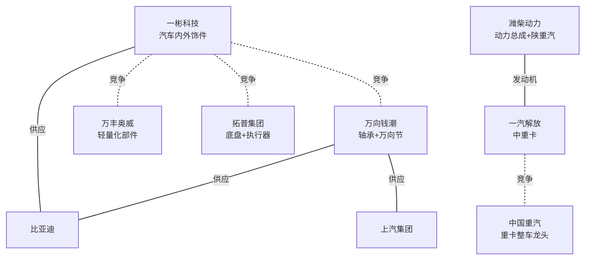
```mermaid
%%{init: {'themeVariables': {'fontSize': '10px'}}}%%
graph TB
    一彬科技[一彬科技<br/>汽车内外饰件]
    万向钱潮[万向钱潮<br/>轴承+万向节]
    万丰奥威[万丰奥威<br/>轻量化部件]
    拓普集团[拓普集团<br/>底盘+执行器]
    一汽解放[一汽解放<br/>中重卡]
    潍柴动力[潍柴动力<br/>动力总成+陕重汽]
    中国重汽[中国重汽<br/>重卡整车龙头]
    比亚迪[比亚迪]
    上汽[上汽集团]

    一彬科技 -.-|竞争| 万向钱潮
    一彬科技 -.-|竞争| 万丰奥威
    一彬科技 -.-|竞争| 拓普集团
    一彬科技 ---|供应| 比亚迪
    万向钱潮 ---|供应| 比亚迪
    万向钱潮 ---|供应| 上汽
    潍柴动力 ---|发动机| 一汽解放
    一汽解放 -.-|竞争| 中国重汽

    classDef business fill:#4dabf7,color:#fff,stroke:#1971c2
    classDef competition fill:#ffd43b,color:#333,stroke:#fab005
```


```
汽车零部件群组
┌──────────────────────────┐
│ 一彬科技（汽车塑料件+金属件） │
│ 前五客户占52.84%          │
│ 吉利15.4% 广汽丰田13.0%   │
│ 比亚迪11.1% 东风7.1%     │
│     ↓ 竞争                │
│ 万向钱潮（轴承+万向节）     │
│ → 比亚迪13.05%（第一大客户）│
│ → 上汽7.03%（第二大客户）  │
│ 万丰奥威（轻量化零部件）    │
│ 拓普集团（底盘+执行器）     │
└──────────────────────────┘

商用车群组
┌──────────────────────────┐
│ 一汽解放（中重卡 626.8亿）  │
│ 中重卡25.5万辆+19%        │
│ 新能源4.5万辆+184%        │
│ 出口6.0万辆+5.2%          │
│     ↓ 竞争                │
│ 中国重汽（重卡整车 577.4亿）  │
│ 柴油快递牵引车市占率行业第一  │
│     ↑ 动力总成             │
│ 潍柴动力（发动机+陕重汽）   │
│ → 中联重科/徐工/柳工       │
│ （发动机供应商→整机制造商）  │
└──────────────────────────┘
```

## 医药与消费

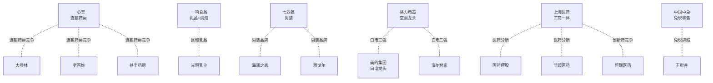
```mermaid
%%{init: {'themeVariables': {'fontSize': '10px'}}}%%
graph TB
    一心堂[一心堂<br/>连锁药房]
    一鸣食品[一鸣食品<br/>乳品+烘焙]
    七匹狼[七匹狼<br/>男装]
    格力电器[格力电器<br/>空调龙头]
    上海医药[上海医药<br/>工商一体]
    中国中免[中国中免<br/>免税零售]
    美的集团[美的集团<br/>白电龙头]

    一心堂 -.-|连锁药房竞争| 大参林
    一心堂 -.-|连锁药房竞争| 老百姓
    一心堂 -.-|连锁药房竞争| 益丰药房
    一鸣食品 -.-|区域乳品| 光明乳业
    七匹狼 -.-|男装品牌| 海澜之家
    七匹狼 -.-|男装品牌| 雅戈尔
    格力电器 -.-|白电三强| 美的集团
    格力电器 -.-|白电三强| 海尔智家
    上海医药 -.-|医药分销| 国药控股
    上海医药 -.-|医药分销| 华润医药
    上海医药 -.-|创新药竞争| 恒瑞医药
    中国中免 -.-|免税牌照| 王府井

    classDef competition fill:#ffd43b,color:#333,stroke:#fab005
```


```
医药零售群组
┌──────────────────────────┐
│ 一心堂（连锁药房 173.4亿）  │
│ 零售129.5亿(74.7%)/批发    │
│ 西南134.5亿(77.6%)        │
│     ↓ 竞争                │
│ 大参林 · 老百姓 · 益丰药房  │
└──────────────────────────┘

食品群组
┌──────────────────────────┐
│ 一鸣食品（乳品+烘焙 29.0亿）│
│ 直营门店毛利率54.63%       │
│ 华东24.9亿(85.6%)         │
│     ↓ 竞争                │
│ 光明乳业 · 新希望乳业      │
└──────────────────────────┘

服装群组
┌──────────────────────────┐
│ 七匹狼（男装 30.0亿）       │
│ 服装毛利率56.06%           │
│ 线上10.6亿(35.4%)         │
│     ↓ 竞争                │
│ 海澜之家 · 报喜鸟 · 雅戈尔  │
└──────────────────────────┘

白电群组
```
┌──────────────────────────┐
│ 格力电器（1,704.5亿 空调龙头）│
│ 消费电器1,330.5亿(78.1%)   │
│ 综合毛利率32.75% ROE 20.3%│
│     ↓ 竞争                 │
│ 美的集团 · 海尔智家         │
└──────────────────────────┘
```
医药工商群组
┌──────────────────────────┐
│ 上海医药（2,835.8亿 工商一体）│
│ 工业245亿 毛利率57.13%      │
│ 分销2,588亿 毛利率5.79%     │
│     ↓ 竞争                  │
│ 国药控股 · 华润医药          │
│     ↓ 工业竞争               │
│ 恒瑞医药（创新药）· 云南白药  │
└──────────────────────────┘

免税零售群组
┌──────────────────────────┐
│ 中国中免（536.9亿 全球最大） │
│ 免税391.7亿 毛利率36.97%    │
│ 海南285.4亿 占比54.3%       │
│     ↓ 竞争                  │
│ 王府井（免税牌照）            │
│     ↓ 机场渠道               │
│ 上海机场 · 海南机场          │
└──────────────────────────┘
```

## 工程机械

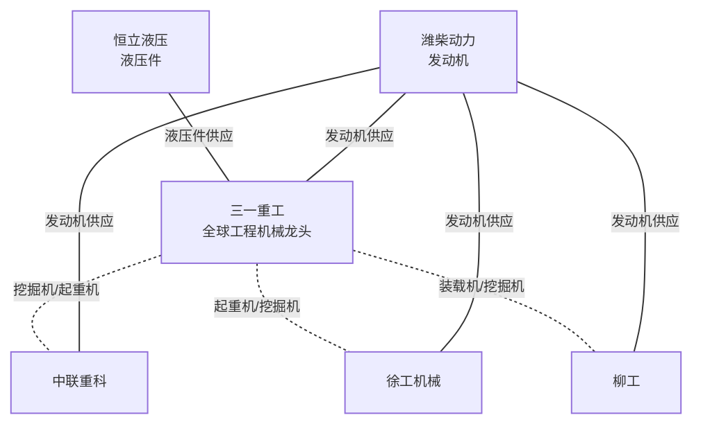
```mermaid
%%{init: {'themeVariables': {'fontSize': '10px'}}}%%
graph TB
    三一重工[三一重工<br/>全球工程机械龙头]
    中联重科[中联重科]
    徐工机械[徐工机械]
    柳工[柳工]
    恒立液压[恒立液压<br/>液压件]
    潍柴动力[潍柴动力<br/>发动机]

    三一重工 -.-|挖掘机/起重机| 中联重科
    三一重工 -.-|起重机/挖掘机| 徐工机械
    三一重工 -.-|装载机/挖掘机| 柳工
    恒立液压 ---|液压件供应| 三一重工
    潍柴动力 ---|发动机供应| 三一重工
    潍柴动力 ---|发动机供应| 中联重科
    潍柴动力 ---|发动机供应| 徐工机械
    潍柴动力 ---|发动机供应| 柳工

    classDef business fill:#4dabf7,color:#fff,stroke:#1971c2
    classDef competition fill:#ffd43b,color:#333,stroke:#fab005
```


```
工程机械群组
┌──────────────────────────┐
│ 三一重工（892.3亿 全球龙头） │
│ 挖掘机345亿 连续15年第一     │
│ 国际558.6亿占比64%          │
│     ↓ 竞争                  │
│ 中联重科 · 徐工机械 · 柳工   │
│     ↑ 液压件                 │
│ 恒立液压                    │
│     ↑ 发动机                │
│ 潍柴动力                    │
└──────────────────────────┘
```

## LED与化合物半导体

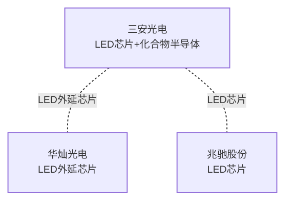
```mermaid
%%{init: {'themeVariables': {'fontSize': '10px'}}}%%
graph TB
    三安光电[三安光电<br/>LED芯片+化合物半导体]
    华灿光电[华灿光电<br/>LED外延芯片]
    兆驰股份[兆驰股份<br/>LED芯片]

    三安光电 -.-|LED外延芯片| 华灿光电
    三安光电 -.-|LED芯片| 兆驰股份

    classDef competition fill:#ffd43b,color:#333,stroke:#fab005
```


```
LED芯片群组
┌──────────────────────────┐
│ 三安光电（179.5亿 LED龙头）│
│ LED外延芯片58.6亿 毛利率22%│
│ 集成电路29.2亿(射频/碳化硅) │
│     ↓ 竞争                 │
│ 华灿光电 · 兆驰股份         │
│     ↓ 下游                 │
│ 显示/照明/车灯/背光         │
└──────────────────────────┘
```

## 游戏与传媒

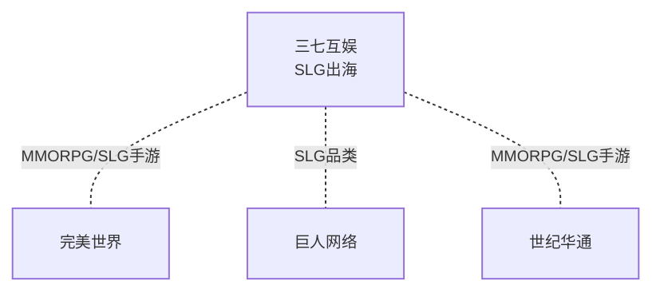
```mermaid
%%{init: {'themeVariables': {'fontSize': '10px'}}}%%
graph TB
    三七互娱[三七互娱<br/>SLG出海]
    完美世界[完美世界]
    巨人网络[巨人网络]
    世纪华通[世纪华通]

    三七互娱 -.-|MMORPG/SLG手游| 完美世界
    三七互娱 -.-|SLG品类| 巨人网络
    三七互娱 -.-|MMORPG/SLG手游| 世纪华通

    classDef competition fill:#ffd43b,color:#333,stroke:#fab005
```


```
游戏群组
┌──────────────────────────┐
│ 三七互娱（159.7亿 SLG出海） │
│ 手游155.3亿 毛利率76.4%     │
│ 境外53.8亿占比33.7%         │
│     ↓ 竞争                  │
│ 完美世界 · 巨人网络          │
│     · 世纪华通               │
└──────────────────────────┘
```

## 能源装备

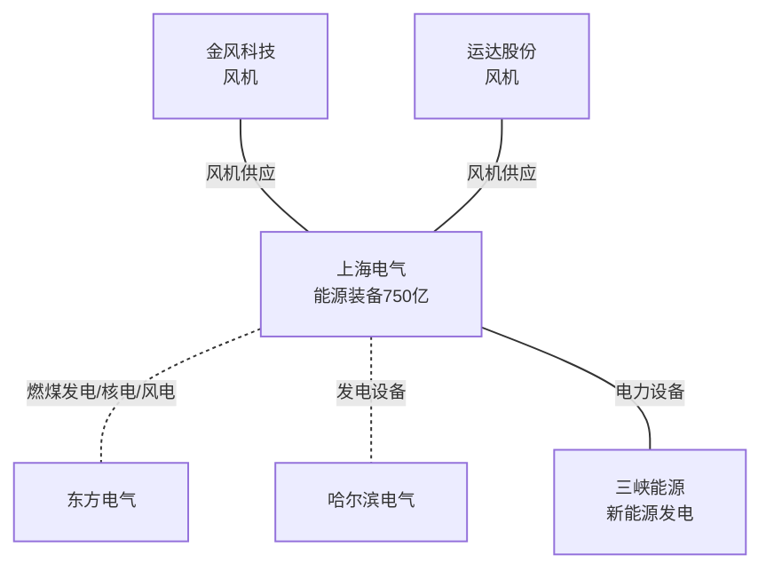
```mermaid
%%{init: {'themeVariables': {'fontSize': '10px'}}}%%
graph TB
    上海电气[上海电气<br/>能源装备750亿]
    东方电气[东方电气]
    哈尔滨电气[哈尔滨电气]
    金风科技[金风科技<br/>风机]
    运达股份[运达股份<br/>风机]
    三峡能源[三峡能源<br/>新能源发电]

    上海电气 -.-|燃煤发电/核电/风电| 东方电气
    上海电气 -.-|发电设备| 哈尔滨电气
    金风科技 ---|风机供应| 上海电气
    运达股份 ---|风机供应| 上海电气
    上海电气 ---|电力设备| 三峡能源

    classDef business fill:#4dabf7,color:#fff,stroke:#1971c2
    classDef competition fill:#ffd43b,color:#333,stroke:#fab005
```


```
能源装备群组
┌──────────────────────────┐
│ 上海电气（1,259.6亿 央企）  │
│ 能源装备750亿+21.5%        │
│ 新增订单1,728亿             │
│     ↓ 竞争                  │
│ 东方电气 · 哈尔滨电气        │
│     ↑ 风机/零部件           │
│ 金风科技 · 运达股份          │
│     ↓ 电力设备供应           │
│ 三峡能源 · 各大火电厂        │
└──────────────────────────┘
```

## 新能源发电

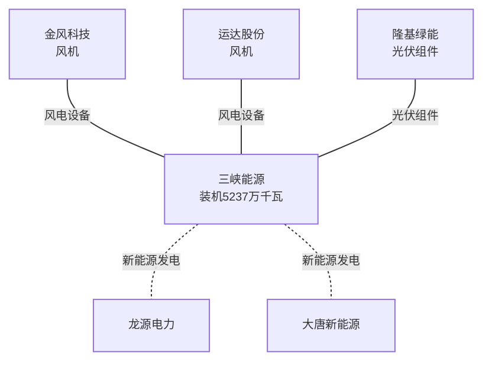
```mermaid
%%{init: {'themeVariables': {'fontSize': '10px'}}}%%
graph TB
    三峡能源[三峡能源<br/>装机5237万千瓦]
    龙源电力[龙源电力]
    大唐新能源[大唐新能源]
    金风科技[金风科技<br/>风机]
    运达股份[运达股份<br/>风机]
    隆基绿能[隆基绿能<br/>光伏组件]

    三峡能源 -.-|新能源发电| 龙源电力
    三峡能源 -.-|新能源发电| 大唐新能源
    金风科技 ---|风电设备| 三峡能源
    运达股份 ---|风电设备| 三峡能源
    隆基绿能 ---|光伏组件| 三峡能源

    classDef business fill:#4dabf7,color:#fff,stroke:#1971c2
    classDef competition fill:#ffd43b,color:#333,stroke:#fab005
```


```
新能源发电群组
┌──────────────────────────┐
│ 三峡能源（284.0亿 央企）    │
│ 装机5,237万千瓦             │
│ 海上风电755万千瓦 全国16%   │
│ 发电量763亿千瓦时+6%        │
│     ↓ 竞争                  │
│ 龙源电力 · 大唐新能源       │
│     ↑ 设备供应商            │
│ 金风科技 · 运达股份（风机）  │
│ 隆基绿能（光伏组件）         │
└──────────────────────────┘
```

## 速冻食品

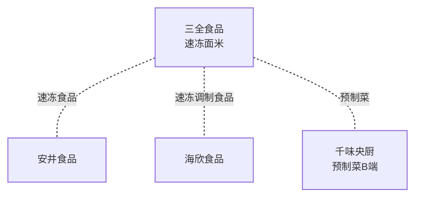
```mermaid
%%{init: {'themeVariables': {'fontSize': '10px'}}}%%
graph TB
    三全食品[三全食品<br/>速冻面米]
    安井食品[安井食品]
    海欣食品[海欣食品]
    千味央厨[千味央厨<br/>预制菜B端]

    三全食品 -.-|速冻食品| 安井食品
    三全食品 -.-|速冻调制食品| 海欣食品
    三全食品 -.-|预制菜| 千味央厨

    classDef competition fill:#ffd43b,color:#333,stroke:#fab005
```


```
速冻食品群组
┌──────────────────────────┐
│ 三全食品（65.4亿 行业龙头） │
│ 速冻面米54.0亿 毛利率26.5% │
│ 汤圆水饺粽子34.1亿          │
│     ↓ 竞争                  │
│ 安井食品 · 海欣食品          │
│     · 千味央厨（预制菜/B端）│
└──────────────────────────┘
```

## 金融科技

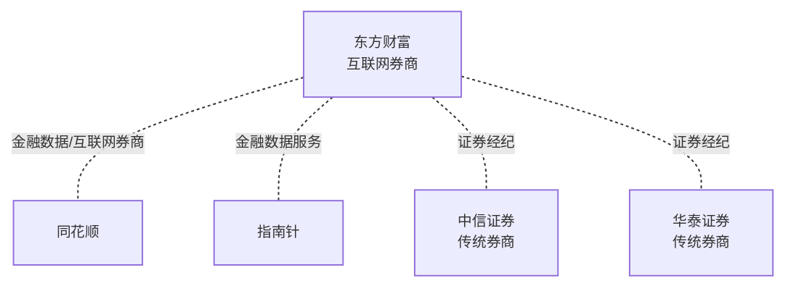
```mermaid
%%{init: {'themeVariables': {'fontSize': '10px'}}}%%
graph TB
    东方财富[东方财富<br/>互联网券商]
    同花顺[同花顺]
    指南针[指南针]
    中信证券[中信证券<br/>传统券商]
    华泰证券[华泰证券<br/>传统券商]

    东方财富 -.-|金融数据/互联网券商| 同花顺
    东方财富 -.-|金融数据服务| 指南针
    东方财富 -.-|证券经纪| 中信证券
    东方财富 -.-|证券经纪| 华泰证券

    classDef competition fill:#ffd43b,color:#333,stroke:#fab005
```


```
金融科技群组
┌──────────────────────────┐
│ 东方财富（160.7亿 互联网券商）│
│ 证券服务125.4亿+47.6%       │
│ 基金销售31.8亿 毛利率93%    │
│     ↓ 竞争                  │
│ 同花顺 · 指南针              │
│     ↓ 传统券商对比           │
│ 中信证券 · 华泰证券          │
└──────────────────────────┘
```

## 煤炭与能源

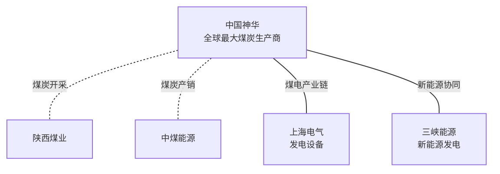
```mermaid
%%{init: {'themeVariables': {'fontSize': '10px'}}}%%
graph TB
    中国神华[中国神华<br/>全球最大煤炭生产商]
    陕西煤业[陕西煤业]
    中煤能源[中煤能源]
    上海电气[上海电气<br/>发电设备]
    三峡能源[三峡能源<br/>新能源发电]

    中国神华 -.-|煤炭开采| 陕西煤业
    中国神华 -.-|煤炭产销| 中煤能源
    中国神华 ---|煤电产业链| 上海电气
    中国神华 ---|新能源协同| 三峡能源

    classDef business fill:#4dabf7,color:#fff,stroke:#1971c2
    classDef competition fill:#ffd43b,color:#333,stroke:#fab005
```


```
煤炭群组
┌──────────────────────────┐
│ 中国神华（2,949.2亿 央企）  │
│ 煤炭利润占62%               │
│ 经营现金流750.6亿            │
│ 一体化：煤→电→运→化          │
│     ↓ 竞争                  │
│ 陕西煤业 · 中煤能源          │
│     ↓ 煤电协同               │
│ 上海电气（发电设备）          │
│ 三峡能源（新能源发电）        │
└──────────────────────────┘
```

## 国有大行（2025Q4 国家队持仓 Top 5）

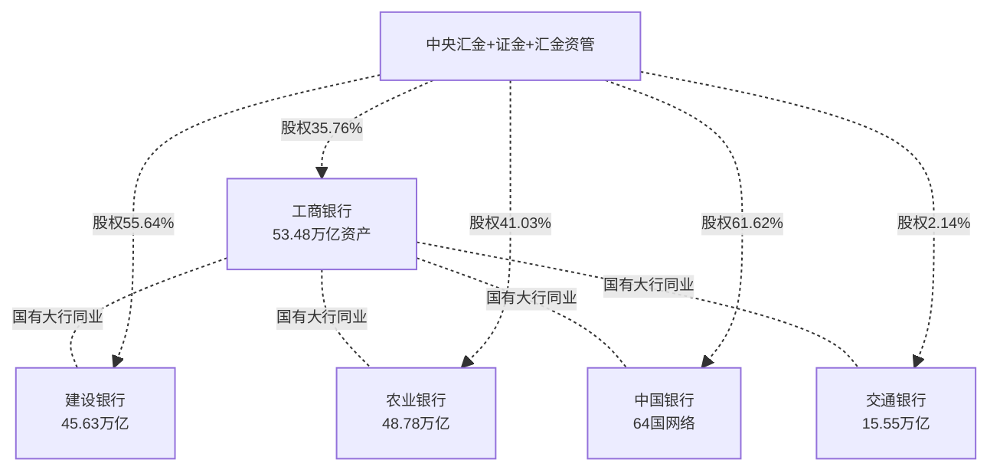
```mermaid
%%{init: {'themeVariables': {'fontSize': '10px'}}}%%
graph TB
    工商银行[工商银行<br/>53.48万亿资产]
    建设银行[建设银行<br/>45.63万亿]
    农业银行[农业银行<br/>48.78万亿]
    中国银行[中国银行<br/>64国网络]
    交通银行[交通银行<br/>15.55万亿]
    国家队[中央汇金+证金+汇金资管]

    工商银行 -.-|国有大行同业| 建设银行
    工商银行 -.-|国有大行同业| 农业银行
    工商银行 -.-|国有大行同业| 中国银行
    工商银行 -.-|国有大行同业| 交通银行
    国家队 -.->|股权35.76%| 工商银行
    国家队 -.->|股权55.64%| 建设银行
    国家队 -.->|股权41.03%| 农业银行
    国家队 -.->|股权61.62%| 中国银行
    国家队 -.->|股权2.14%| 交通银行

    classDef personnel fill:#ff6b6b,color:#fff,stroke:#c92a2a
    classDef competition fill:#ffd43b,color:#333,stroke:#fab005
```


```
国有大行群组（A+H 上市）
┌──────────────────────────┐
│ 工商银行（53.48万亿资产）    │
│ 营收8,383亿 净利3,686亿     │
│     ↓ 竞争（同业）           │
│ 建设银行 · 农业银行 · 中国银行│
│ 交通银行                    │
│     ↑ 控股                   │
│ 中央汇金 + 证金 + 汇金资管   │
│ （5家均被国家队持有）         │
└──────────────────────────┘
```

## 券商（2025Q4 国家队持仓）

```mermaid
%%{init: {'themeVariables': {'fontSize': '10px'}}}%%
graph TB
    中信证券[中信证券<br/>国内最大券商]
    国泰海通[国泰海通]
    华泰证券[华泰证券]
    招商证券[招商证券]
    申万宏源[申万宏源<br/>汇金控股22.59%]
    中信建投[中信建投<br/>汇金30.76%]
    中金公司[中金公司<br/>汇金40.11%]
    汇金[中央汇金]

    中信证券 -.-|综合券商同业| 国泰海通
    中信证券 -.-|综合券商同业| 华泰证券
    中信证券 -.-|综合券商同业| 招商证券
    中信证券 -.-|综合券商同业| 申万宏源
    中信证券 -.-|综合券商同业| 中信建投
    中信证券 -.-|综合券商同业| 中金公司
    汇金 -.->|控股40.11%| 中金公司
    汇金 -.->|控股30.76%| 中信建投
    汇金 -.->|大股东22.59%| 申万宏源

    classDef personnel fill:#ff6b6b,color:#fff,stroke:#c92a2a
    classDef competition fill:#ffd43b,color:#333,stroke:#fab005
```


```
券商群组（汇金控股）
┌──────────────────────────┐
│ 中信证券（748.54亿 央企背景）│
│     ↓ 竞争                  │
│ 国泰海通 · 华泰证券 · 招商证券│
│ 申万宏源 · 中信建投 · 中金   │
│     ↑ 大股东                │
│ 中央汇金 → 申万宏源/中信建投/│
│           中金公司           │
└──────────────────────────┘
```

## 石油石化

```mermaid
%%{init: {'themeVariables': {'fontSize': '10px'}}}%%
graph TB
    中国石油[中国石油<br/>上游原油优势]
    中国石化[中国石化<br/>下游炼化销售]
    国家队[中央汇金+证金]

    中国石油 -.-|油气勘探+炼化| 中国石化
    国家队 -.->|持股| 中国石油
    国家队 -.->|持股2.18%| 中国石化

    classDef personnel fill:#ff6b6b,color:#fff,stroke:#c92a2a
    classDef competition fill:#ffd43b,color:#333,stroke:#fab005
```


```
石油石化群组（央企双雄）
┌──────────────────────────┐
│ 中国石油（29,379.81亿）     │
│ 上游优势（原油生产）         │
│     ↓ 竞争                  │
│ 中国石化（27,835.83亿）     │
│ 下游优势（炼化+加油站网络）  │
│     ↑ 国家队（汇金+证金）     │
└──────────────────────────┘
```

## 建筑央企

```mermaid
%%{init: {'themeVariables': {'fontSize': '10px'}}}%%
graph TB
    中国建筑[中国建筑<br/>2.08万亿营收]
    中国中铁[中国中铁]
    中国交建[中国交建]
    中国中冶[中国中冶]
    中国铁建[中国铁建]
    国家队[中央汇金+证金]

    中国建筑 -.-|建筑央企| 中国中铁
    中国建筑 -.-|建筑央企| 中国交建
    中国建筑 -.-|建筑央企| 中国中冶
    中国建筑 -.-|建筑央企| 中国铁建
    国家队 -.->|持股4.46%| 中国建筑

    classDef personnel fill:#ff6b6b,color:#fff,stroke:#c92a2a
    classDef competition fill:#ffd43b,color:#333,stroke:#fab005
```


```
建筑央企群组
┌──────────────────────────┐
│ 中国建筑（2.08万亿营收）    │
│ 全球最大建筑承包商           │
│ 新签合同4.55万亿             │
│     ↓ 竞争                  │
│ 中国中铁 · 中国交建 · 中国中冶│
│ 中国铁建                    │
│     ↑ 国家队（汇金+证金）     │
└──────────────────────────┘
```

## 2026Q1 国家队新进持仓 Top 10

```mermaid
%%{init: {'themeVariables': {'fontSize': '10px'}}}%%
graph TB
    国家队[中央汇金+证金+汇金资管<br/>2026Q1新进]
    浙江龙盛[浙江龙盛<br/>染料龙头]
    永泰能源[永泰能源<br/>山西焦煤]
    招商轮船[招商轮船<br/>油轮/VLCC]
    山西焦煤[山西焦煤<br/>焦煤龙头]
    兖矿能源[兖矿能源<br/>商品煤1.82亿吨]
    节能风电[节能风电<br/>风电运营]
    福田汽车[福田汽车<br/>商用车销量龙头]
    特变电工[特变电工<br/>变压器+多晶硅]
    潞安环能[潞安环能<br/>喷吹煤]

    国家队 -.->|3.24%| 浙江龙盛
    国家队 -.->|0.40%| 永泰能源
    国家队 -.->|0.73%| 招商轮船
    国家队 -.->|0.88%| 山西焦煤
    国家队 -.->|0.42%| 兖矿能源
    国家队 -.->|0.61%| 节能风电
    国家队 -.->|0.46%| 福田汽车
    国家队 -.->|0.65%| 特变电工
    国家队 -.->|1.09%| 潞安环能

    山西焦煤 -.-|煤炭同业| 兖矿能源
    山西焦煤 -.-|煤炭同业| 潞安环能
    山西焦煤 -.-|煤炭同业| 永泰能源

    classDef personnel fill:#ff6b6b,color:#fff,stroke:#c92a2a
    classDef competition fill:#ffd43b,color:#333,stroke:#fab005
```

```
2026Q1 国家队新进 Top 10
┌──────────────────────────┐
│ 浙江龙盛（持仓1.05亿/3.24%）│
│ 全球染料龙头                │
│     ↓ 持仓降序               │
│ 永泰能源（0.87亿/0.40%）    │
│ 招商轮船（0.59亿/0.73%）    │
│ 山西焦煤（0.50亿/0.88%）    │
│ 兖矿能源（0.42亿/0.42%）    │
│ 节能风电（0.40亿/0.61%）    │
│ 中集集团（0.39亿/0.72%）    │
│ 福田汽车（0.36亿/0.46%）    │
│ 特变电工（0.33亿/0.65%）    │
│ 潞安环能（0.33亿/1.09%）    │
└──────────────────────────┘
```

## Related Pages

- [[光模块三强对比]] — 光通信公司竞争分析
- [[DRAM产业]] — 存储芯片产业链
- [[互连芯片]] — 澜起科技所在赛道
- [[芯片设计产业]] — 兆易创新/澜起科技所在赛道
- [[光通信产业链]] — 光通信全产业链
- [[半导体材料与设备]] — 北方华创所在赛道
